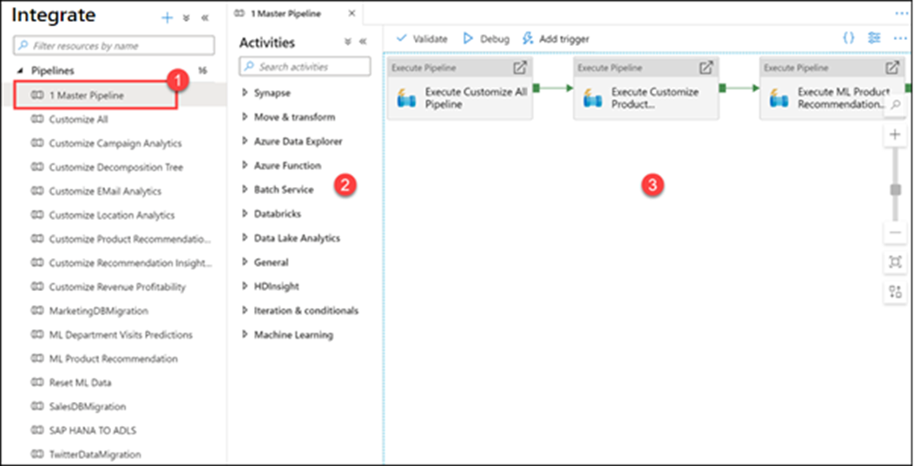
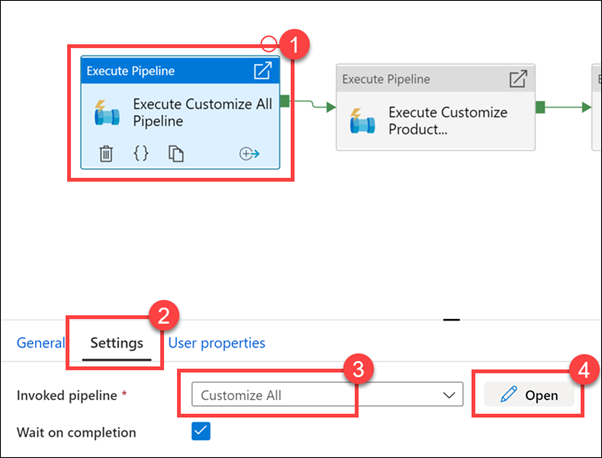
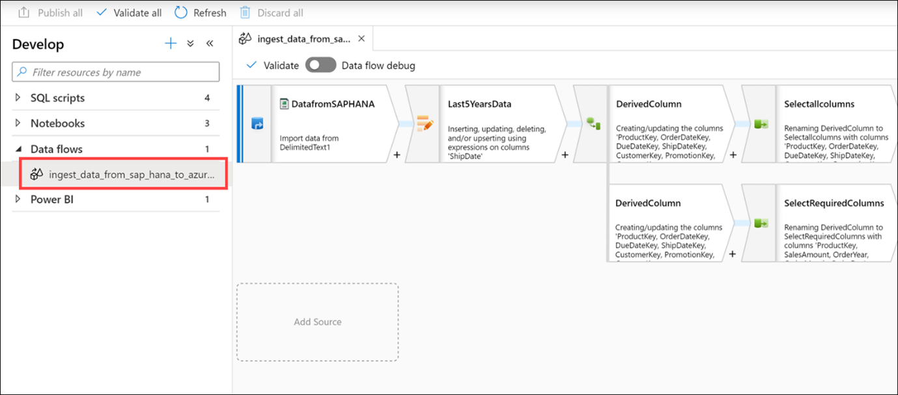

Data Ingestion can occur in several different ways. The primary component of Azure Synapse Analytics to ingest data is to use the Copy Data activity within Azure Synapse Pipelines. This type of activity is usual held within an Execute Pipeline activity with other features such as a lookup operation, or a split data activity. 

Alternatively, you can create a connection within a Data Flow that points to a source database that used is the starting point for ingesting data and using the data within additional transformation activities. 

The following shows an example of both.

## Data ingest

1.	Select the **Integrate** hub.
 
    

2.	Expand Pipelines and select **1 Master Pipeline (1)**. Point out the **Activities (2)** that can be added to the pipeline, and show the **pipeline canvas (3)** on the right.
 
    

    Our Synapse workspace contains 16 pipelines that enable us to orchestrate data movement and transformation steps over data from several sources.

    The **Activities** list contains a large number of activities that you can drag and drop onto the pipeline canvas on the right.

    Here we see that we have three execute (child) pipelines:
 
    

3.	Select the **Execute Customize All Pipeline** activity **(1)**. Select the **Settings (2)** tab. Show that the invoked pipeline is **Customize All (3)**, then select **Open (4)**.
 
    

    As you can see, there are five child pipelines. This **first execute pipeline activity** cleans and ingests new Manufacturer campaign data for the Campaign Analytics report.

4.	Select the **Campaign Analytics** activity **(1)**, select the **Settings** tab **(2)**, observe the invoked pipeline is set to **Customize All (3)**, then select **Open (4)**.
 
    

5.	Observe how cleaning and ingesting happens in the pipeline by clicking on each activity.
 
    

6.	Select the **Develop** hub.
 
    

7.	Expand Data flows, then select the **ingest_data_from_sap_hana_to_azure_synapse** data flow.
 
    

    As stated earlier, data flows are powerful data transformation workflows that use the power of Apache Spark, but are authored using a code-free GUI. The work you do in the UI gets transformed into code executed by a managed Spark cluster, automatically, without having to write any code or manage the cluster.

    The data flow performs the following functions:

    - Extracts data from the SAP HANA data source (**Select DatafromSAPHANA step**).
    - Retrieves only those rows for an upsert activity, where the ShipDate value is greater than 2014-01-01 (**Select Last5YearsData step**).
    - Performs data type transformations on the source columns, using a Derived Column activity (**Select the top DerivedColumn activity**).
    - In the top path of the data flow, we select all columns, then load the data into the AggregatedSales_SAPHANANew Synapse pool table (**Select the Selectallcolumns activity and the LoadtoAzureSynapse activity**).
    - In the bottom path of the data flow, we select a subset of the columns (**Select the SelectRequiredColumns activity**).
    - Then we group by four of the columns (**Select the TotalSalesByYearMonthDay activity**) and create sum and average aggregates on the SalesAmount column (**Select the Aggregates option**).
    - Finally, the aggregated data is loaded into the AggregatedSales_SAPHANA Synapse pool table (**Select the LoadtoSynapse activity**).
