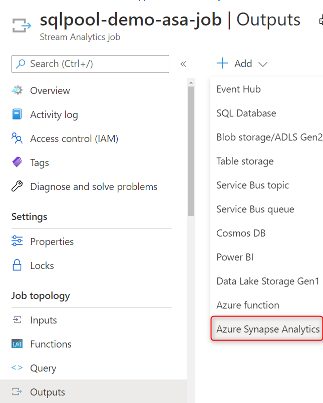
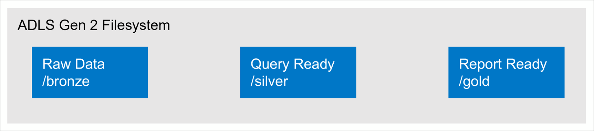

When you load data into your data warehouse, the file types and methods to ingest the data vary by source. For example, loading data from on-premises file systems, relational data stores, or streaming data sources require different approaches from ingestion into the data lake or intermediate data store, to landing refined data into the serving layer. It is important to understand the different file types and which to use for raw storage versus refined versions for analytical queries. Other design considerations include hierarchical structures to optimize queries and data loading activities. This unit describes the file types and their optimal use cases, and how best to organize them in your data lake.

## Supported file formats for ingesting raw data in batch

In data engineering, we tend to describe data loading velocity as one of three latencies:

- **Batch**: Queries or programs that take tens of minutes, hours, or days to complete. Activities could include initial data wrangling, complete ETL pipeline, or preparation for downstream analytics.
- **Interactive query**: Querying batch data at "human" interactive speeds, which with the current generation of technologies means results are ready in time frames measured in seconds to minutes.
- **Real-time / near real-time**: Processing of a typically infinite stream of input data (stream), whose time until results ready is short—measured in milliseconds or seconds in the longest of cases.

When it comes to ingesting raw data in batch from new data sources, these data formats are natively supported by Synapse:

- CSV
- Parquet
- ORC
- JSON

However, if you use Apache Spark with Synapse Notebooks, you can explore and process more file types for your raw data.

## Ingest streaming data into Synapse dedicated SQL pools

Processing data that arrives at the third latency (real-time / near real-time) is also referred to as streaming data processing. Streaming data sources can include IoT devices and sensors, financial transactions, web clickstream data, factories, and medical devices, to name a few.

Azure offers purpose-built stream ingestion services such as [Azure IoT Hub](/azure/iot-hub/about-iot-hub) and [Azure Event Hubs](/azure/event-hubs/event-hubs-about) (with or without Kafka support) that are robust, proven, and performant. In your data pipeline, you need to collect messages from these or similar services, and process them using [Azure Stream Analytics](/azure/stream-analytics/stream-analytics-introduction), Azure Functions, Azure Databricks, or other services that enable you to ingest and process streaming data.

Your goal may be to land this data into your data lake, such as the Azure Data Lake Storage (ADLS) Gen2 account associated with your Synapse Analytics workspace, then use Synapse Spark notebooks or T-SQL queries with a serverless SQL pool to explore and transform the data. In this case, you will most likely save that data in one of the raw formats, such as CSV or JSON. Azure Stream Analytics simplifies this task by connecting to IoT Hub or Event Hubs as an input source, and outputting files to the ADLS Gen2 storage account as an output. You can specify a path pattern that helps you structure your data for optimal analytical workloads through path-based data pruning. For example, you can set the following **path pattern** on the ADLS Gen2 output: `tran/sensor/{datetime:yyyy}/{datetime:MM}/{datetime:dd}`. Further options let you set the serialization, such as JSON, encoding, such as UTF-8, minimum number of rows per file, such as 100, etc.

However, if you want to land the streaming data in a dedicated SQL pool, a couple of options you can take are to first process and store the data into your data lake, as described above. Then load the data into a dedicated SQL pool through one of the various data loading techniques, such as Synapse Pipelines, Synapse Spark pools, or COPY statements. This lets you use the data lake as a staging area, or maintain the raw format in the data lake in addition to a more refined version of the data in the dedicated SQL pool.

Another option is to use Azure Stream Analytics with an Azure Synapse Analytics (dedicated SQL pool) as an output sink for high throughput data ingestion with Azure Stream Analytics jobs.

> [!div class="mx-imgBorder"]
> 

Once you create the Synapse Analytics output, you can set it as the target in the Stream Analytics query. In the example below, we have an Event Hubs input named `CallStream`, and a Synapse Analytics output named `sqlpool-demo-asaoutput`. The SQL query simply writes all the incoming data directly into the dedicated SQL pool. Alternatively, you could select only specific properties and transform the data types from the incoming stream, and use one of the windowing functions to aggregate data before writing it to the dedicated SQL pool.

Using Stream Analytics with Synapse Analytics in this way allows you to select your dedicated SQL pool database and table into which the Stream Analytics query will write the streaming data. This native stream ingestion is optimized to quickly write the data directly to the dedicated SQL pool without having to first land the data somewhere else.

## Recommended file types

### Raw data

For raw data, it is recommended that data be stored in its native format. Data from relational databases should typically be stored in CSV format. This is the format supported by the most systems, so it provides the greatest flexibility.

For data from web APIs and NoSQL databases, JSON is the recommended format.

### Refined versions for data

When it comes to storing refined versions of the data for possible querying, the recommended data format is **Parquet**.

There is industry alignment around the Parquet format for sharing data at the storage layer (for example, across Hadoop, Databricks, and SQL engine scenarios). Parquet is a high-performance, column-oriented format optimized for big data scenarios.

Columnar formats like Parquet have storage and performance benefits. The values are clustered by column so the compression is more efficient (to shrink the storage footprint), and a query engine can push down column projections (to reduce read I/O from network and disk by skipping unwanted columns), otherwise known as column pruning. Similar data types (for a column) are stored together in Parquet files, leading to efficient data compression and encoding schemes.

Parquet stores the file schema in the file metadata. CSV files don't store file metadata, so readers need to either be supplied with the schema or the schema needs to be inferred. Supplying a schema is tedious and inferring a schema is error prone / expensive.

## Organize file structure for analytical queries

The first thing you should consider when ingesting data into the data lake is how to structure or organize data within the data lake. You should use Azure Data Lake Storage (ADLS) Gen2 (Within the Azure portal, this is an Azure Storage account with a hierarchical namespace enabled).

A key mechanism that ADLS Gen2 to provide file system performance at object storage scale and prices in addition to a hierarchical namespace. This allows the collection of objects/files within an account to be organized into a hierarchy of directories and nested subdirectories in the same way that the file system on your computer is organized. With a hierarchical namespace enabled, a storage account becomes capable of providing the scalability and cost-effectiveness of object storage, with file system semantics that are familiar to analytics engines and frameworks.

In ADLS Gen2, it is a best practice to have a dedicated Storage Account for production, and a separate Storage Account for dev and test workloads. This will ensure that dev or test workloads never interfere with production.

A common method for structuring folders within a data lake is to organize data in separate folders by the degree of refinement. For example, a **bronze** folder might contain raw data, **silver** contains the cleaned, prepared, and integrated data, and **gold** contains data ready to support analytics, which might include final refinements such as pre-computed aggregates. If more levels of refinement are required, this structure can be modified, as needed, to include more folders.

When working with Data Lake Storage Gen2, the following should be considered:

- When data is stored in Data Lake Storage Gen2, the file size, number of files, and folder structure have an impact on performance.
- If you store your data as many small files, this can negatively affect performance. In general, organize your data into larger-sized files for better performance (256 MB to 100 GB in size).
- Some engines and applications might have trouble efficiently processing files that are greater than 100GB in size.
- Sometimes, data pipelines have limited control over the raw data, which has lots of small files. It is recommended to have a "cooking" process that generates larger files to use for downstream applications.
