You can natively perform data transformations with Azure Synapse pipelines code free using the Mapping Data Flow task. Mapping Data Flows provide a fully visual experience with no coding required. Your data flows will run on your own execution cluster for scaled-out data processing. Data flow activities can be operationalized via existing Data Factory scheduling, control, flow, and monitoring capabilities.

When building data flows, you can enable debug mode, which turns on a small interactive Spark cluster. Turn on debug mode by toggling the slider at the top of the authoring module. Debug clusters take a few minutes to warm up, but can be used to interactively preview the output of your transformation logic.

> [!div class="mx-imgBorder"]
> 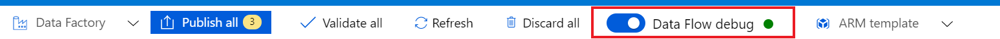

With the Mapping Data Flow added, and the Spark cluster running, this will enable you to perform the transformation, and run and preview the data. No coding is required as Azure Data Factory handles all the code translation, path optimization, and execution of your data flow jobs.

## Add source data to the Mapping Data Flow

Open the Mapping Data Flow canvas. Click on the Add Source button in the Data Flow canvas. In the source dataset dropdown, select your data source, n this case the ADLS Gen2 dataset is used in this example

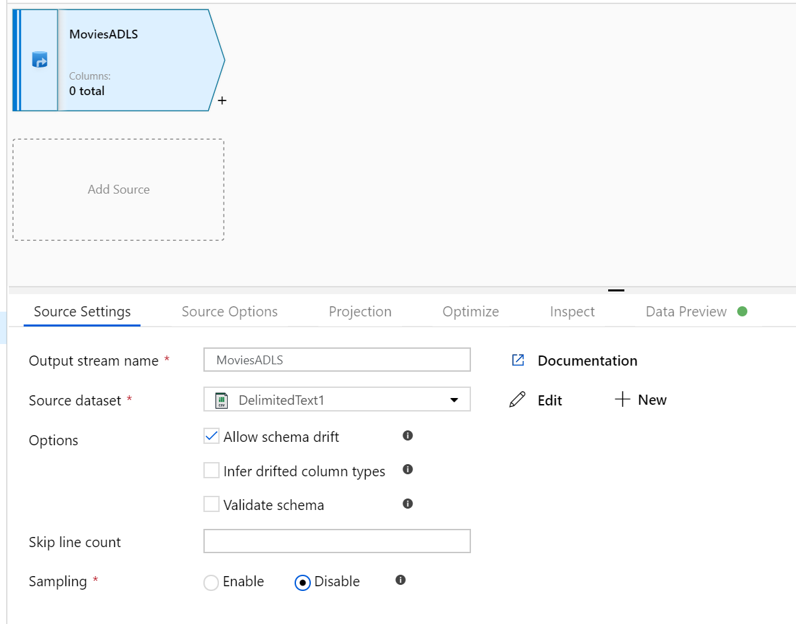

There are a couple of points to note:   

- If your dataset is pointing at a folder with other files and you only want to use one file, you may need to create another dataset or utilize parameterization to make sure only a specific file is read
- If you have not imported your schema in your ADLS, but have already ingested your data, go to the dataset's 'Schema' tab and click 'Import schema' so that your data flow knows the schema projection.

Mapping Data Flow follows an extract, load, transform (ELT) approach and works with staging datasets that are all in Azure. Currently the following datasets can be used in a source transformation:

- Azure Blob Storage (JSON, Avro, Text, Parquet)
- Azure Data Lake Storage Gen1 (JSON, Avro, Text, Parquet)
- Azure Data Lake Storage Gen2 (JSON, Avro, Text, Parquet)
- Azure Synapse Analytics
- Azure SQL Database
- Azure CosmosDB

Azure Data Factory has access to over 80 native connectors. To include data from those other sources in your data flow, use the Copy Activity to load that data into one of the supported staging areas.

Once your debug cluster is warmed up, verify your data is loaded correctly via the Data Preview tab. Once you click the refresh button, Mapping Data Flow will show a snapshot of what your data looks like when it is at each transformation. 

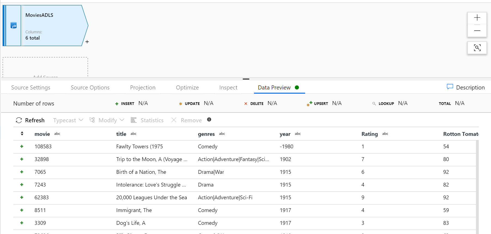

## Use transformations in the Mapping Data Flow

Now that you have moved the data into Azure Data Lake Store Gen2, you are ready to build a Mapping Data Flow that will transform your data at scale via a spark cluster and then load it into a Data Warehouse. 
  
The main tasks for this are as follows:

1. Preparing the environment

1. Adding a Data Source

1. Using Mapping Data Flow transformation

1. Writing to a Data Sink

### Task 1: Preparing the environment

1. **Turn on Data Flow Debug** Turn the **Data Flow Debug** slider located at the top of the authoring module on. 

    > [!NOTE]
    > Data Flow clusters take 5-7 minutes to warm up.

1. **Add a Data Flow activity**. In the Activities pane, open the Move and Transform accordion and drag the **Data Flow** activity onto the pipeline canvas. In the blade that pops up, click **Create new Data Flow** and select **Mapping Data Flow** and then click **OK**. Click on the  **pipeline1** tab and drag the green box from your Copy activity to the Data Flow Activity to create an on success condition. You will see the following in the canvass:

    > [!div class="mx-imgBorder"]
    > 

### Task 2: Adding a Data Source

1. **Add an ADLS source**. Double-click on the Mapping Data Flow object in the canvas. Click on the Add Source button in the Data Flow canvas. In the **Source dataset** dropdown, select your **ADLSG2** dataset used in your Copy activity

    

    * If your dataset is pointing at a folder with other files, you may need to create another dataset or utilize parameterization to make sure only the moviesDB.csv file is read
    * If you have not imported your schema in your ADLS, but have already ingested your data, go to the dataset's 'Schema' tab and click 'Import schema' so that your data flow knows the schema projection.

    Once your debug cluster is warmed up, verify your data is loaded correctly via the Data Preview tab. Once you click the refresh button, Mapping Data Flow will show a snapshot of what your data looks like when it is at each transformation.
  
### Task 3: Using Mapping Data Flow transformation

1. **Add a Select transformation to rename and drop a column**. In the preview of the data, you may have noticed that the "Rotton Tomatoes" column is misspelled. To correctly name it and drop the unused Rating column, you can add a [Select transformation](https://docs.microsoft.com/azure/data-factory/data-flow-select) by clicking on the + icon next to your ADLS source node and choosing Select under Schema modifier.
    
    > [!div class="mx-imgBorder"]
    > 

    In the **Name** as field, change 'Rotton' to 'Rotten'. To drop the Rating column, hover over it and click on the trash can icon.

    > [!div class="mx-imgBorder"]
    > 

1. **Add a Filter Transformation to filter out unwanted years**. Say you are only interested in movies made after 1951. You can add a [Filter transformation](https://docs.microsoft.com/azure/data-factory/data-flow-filter) to specify a filter condition by clicking on the **+ icon** next to your Select transformation and choosing **Filter** under Row Modifier. Click on the **expression box** to open up the [Expression builder](https://docs.microsoft.com/azure/data-factory/concepts-data-flow-expression-builder) and enter in your filter condition. Using the syntax of the [Mapping Data Flow expression language](https://docs.microsoft.com/azure/data-factory/data-flow-expression-functions), **toInteger(year) > 1950** will convert the string year value to an integer and filter rows if that value is above 1950.

    > [!div class="mx-imgBorder"]
    > 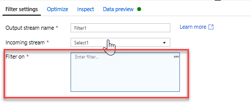

    You can use the expression builder's embedded Data preview pane to verify your condition is working properly

    > [!div class="mx-imgBorder"]
    > 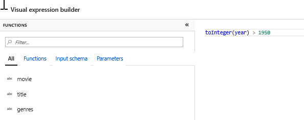

1. **Add a Derive Transformation to calculate primary genre**. As you may have noticed, the genres column is a string delimited by a '|' character. If you only care about the *first* genre in each column, you can derive a new column named **PrimaryGenre** via the [Derived Column](https://docs.microsoft.com/azure/data-factory/data-flow-derived-column) transformation by clicking on the **+ icon** next to your Filter transformation and choosing Derived under Schema Modifier. Similar to the filter transformation, the derived column uses the Mapping Data Flow expression builder to specify the values of the new column.

    > [!div class="mx-imgBorder"]
    > 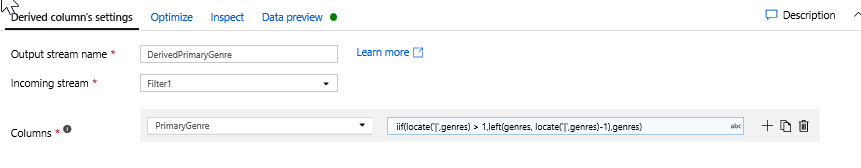

    In this scenario, you are trying to extract the first genre from the genres column, which is formatted as 'genre1|genre2|...|genreN'. Use the **locate** function to get the first 1-based index of the '|' in the genres string. Using the **iif** function, if this index is greater than 1, the primary genre can be calculated via the **left** function, which returns all characters in a string to the left of an index. Otherwise, the PrimaryGenre value is equal to the genres field. You can verify the output via the expression builder's Data preview pane.

   
1. **Rank movies via a Window Transformation**. Say you are interested in how a movie ranks within its year for its specific genre. You can add a [Window transformation](https://docs.microsoft.com/azure/data-factory/data-flow-window) to define window-based aggregations by clicking on the **+ icon** next to your Derived Column transformation and clicking Window under Schema modifier. To accomplish this, specify what you are windowing over, what you are sorting by, what the range is, and how to calculate your new window columns. In this example, we will window over PrimaryGenre and year with an unbounded range, sort by Rotten Tomato descending, and calculate a new column called RatingsRank that is equal to the rank each movie has within its specific genre-year.

    > [!div class="mx-imgBorder"]
    > 

    > [!div class="mx-imgBorder"]
    > 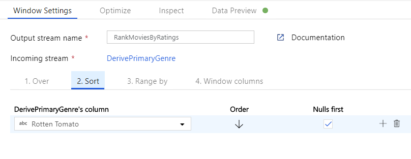

    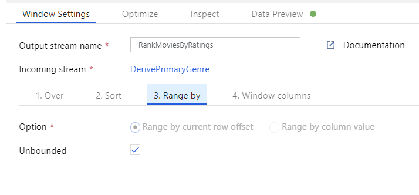

    

1. **Aggregate ratings with an Aggregate Transformation**. Now that you have gathered and derived all your required data, we can add an [Aggregate transformation](https://docs.microsoft.com/azure/data-factory/data-flow-aggregate) to calculate metrics based on a desired group by clicking on the **+ icon** next to your Window transformation and clicking Aggregate under Schema modifier. As you did in the window transformation, lets group movies by PrimaryGenre and year

    > [!div class="mx-imgBorder"]
    > 

    In the Aggregates tab, you can aggregations calculated over the specified group by columns. For every genre and year, lets get the average Rotten Tomatoes rating, the highest and lowest rated movie (utilizing the windowing function) and the number of movies that are in each group. Aggregation significantly reduces the number of rows in your transformation stream and only propagates the group by and aggregate columns specified in the transformation.

    > [!div class="mx-imgBorder"]
    > 

    * To see how the aggregate transformation changes your data, use the Data Preview tab
   

1. **Specify Upsert condition via an Alter Row Transformation**. If you are writing to a tabular sink, you can specify insert, delete, update and upsert policies on rows using the [Alter Row transformation](https://docs.microsoft.com/azure/data-factory/data-flow-alter-row) by clicking on the + icon next to your Aggregate transformation and clicking Alter Row under Row modifier. Since you are always inserting and updating, you can specify that all rows will always be upserted.

    > [!div class="mx-imgBorder"]
    > 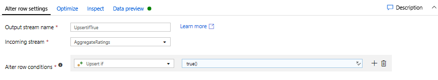

    

### Task 4: Writing to a Data Sink

1. **Write to a Azure Synapse Analytics Sink**. Now that you have finished all your transformation logic, you are ready to write to a Sink.
    1. Add a **Sink** by clicking on the **+ icon** next to your Upsert transformation and clicking Sink under Destination.
    1. In the Sink tab, create a new data warehouse dataset via the **+ New button**.
    1. Select **Azure Synapse Analytics** from the tile list.
    1. Select a new linked service and configure your Azure Synapse Analytics connection to connect to the DWDB database created in Module 5. Click **Create** when finished.
    
        > [!div class="mx-imgBorder"]
        > 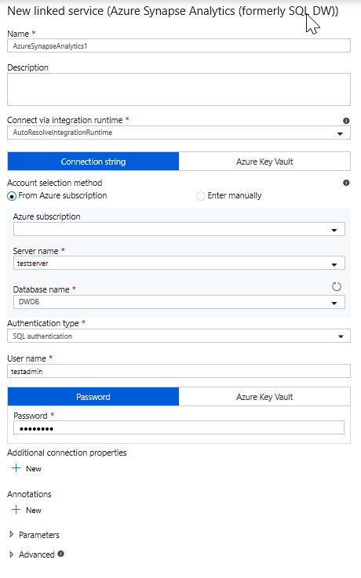
    
    1. In the dataset configuration, select **Create new table** and enter in the schema of **dbo** and the  table name of **Ratings**. Click **OK** once completed.
    
        > [!div class="mx-imgBorder"]
        > 
    
    1. Since an upsert condition was specified, you need to go to the Settings tab and select 'Allow upsert' based on key columns PrimaryGenre and year.
    
        > [!div class="mx-imgBorder"]
        > 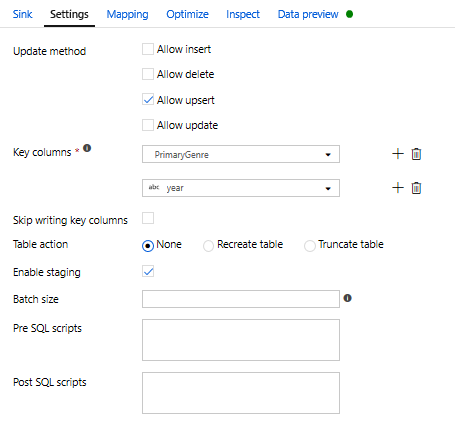

At this point, You have finished building your 8 transformation Mapping Data Flow. It's time to run the pipeline and see the results!

[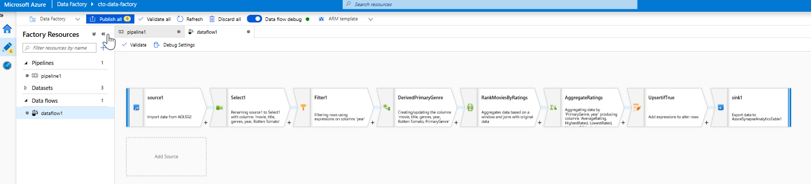](../media/completed-mapping-data-flow.png#lightbox)

## Task 5: Running the pipeline

1. Go to the pipeline1 tab in the canvas. Because Azure Synapse Analytics in Data Flow uses [PolyBase](https://docs.microsoft.com/sql/relational-databases/polybase/polybase-guide?view=sql-server-2017), you must specify a blob or ADLS staging folder. In the Execute Data Flow activity's settings tab, open up the PolyBase accordion and select your ADLS linked service and specify a staging folder path.

    

1. Before you publish your pipeline, run another debug run to confirm it's working as expected. Looking at the Output tab, you can monitor the status of both activities as they are running.

1. Once both activities succeeded, you can click on the eyeglasses icon next to the Data Flow activity to get a more in depth look at the Data Flow run.

1. If you used the same logic described in this lab, your Data Flow will write 737 rows to your SQL DW. You can go into [SQL Server Management Studio](https://docs.microsoft.com/sql/ssms/download-sql-server-management-studio-ssms?view=sql-server-2017) to verify the pipeline worked correctly and see what got written.

    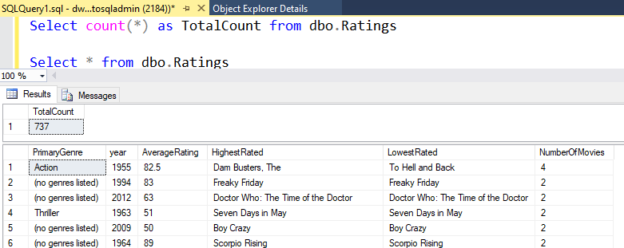
