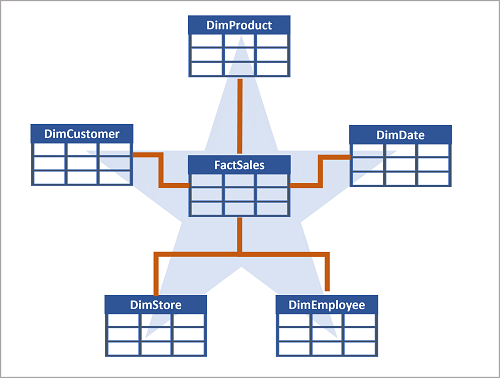
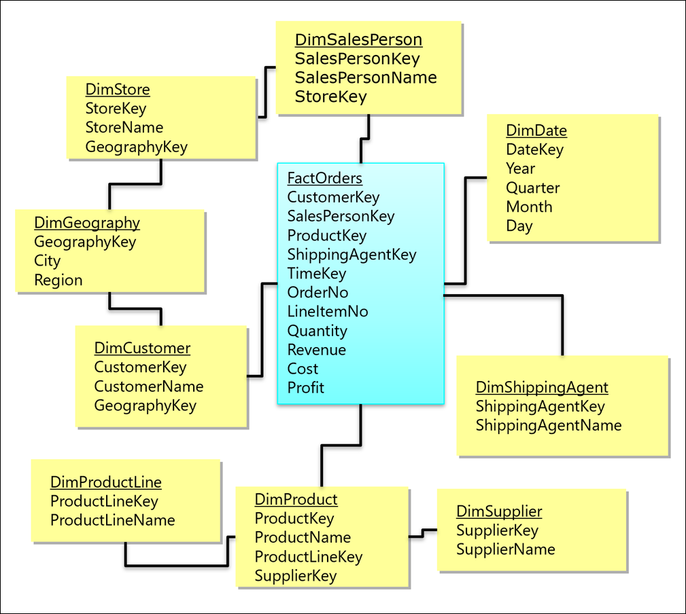

Like all relational databases, a data warehouse contains tables in which the data you want to analyze is stored. Most commonly, these tables are organized in a schema that is optimized for multidimensional modeling, in which numerical measures associated with events known as *facts* can be aggregated by the attributes of associated entities across multiple *dimensions*. For example, measures associated with a sales order (such as the amount paid or the quantity of items ordered) can be aggregated by attributes of the date on which the sale occurred, the customer, the store, and so on.

## Tables in a data warehouse

A common pattern for relational data warehouses is to define a schema that includes two kinds of table: *dimension* tables and *fact* tables.

### Dimension tables

Dimension tables describe business entities, such as products, people, places, and dates. Dimension tables contain columns for attributes of an entity. For example, a customer entity might have a first name, a last name, an email address, and a postal address (which might consist of a street address, a city, a postal code, and a country or region). In addition to attribute columns, a dimension table contains a unique key column that uniquely identifies each row in the table. In fact, it's common for a dimension table to include ***two*** key columns:

- a *surrogate* key that is specific to the data warehouse and uniquely identifies each row in the dimension table in the data warehouse - usually an incrementing integer number.
- An *alternate* key, often a *natural* or *business* key that is used to identify a specific instance of an entity in the transactional source system from which the entity record originated - such as a product code or a customer ID.

> [!NOTE]
> Why have two keys? There are a few good reasons:
>
> - The data warehouse may be populated with data from multiple source systems, which can lead to the risk of duplicate or incompatible business keys.
> - Simple numeric keys generally perform better in queries that join lots of tables - a common pattern in data warehouses.
> - Attributes of entities may change over time - for example, a customer might change their address. Since the data warehouse is used to support historic reporting, you may want to retain a record for each instance of an entity at multiple points in time; so that, for example, sales orders for a specific customer are counted for the city where they lived at the time the order was placed. In this case, multiple customer records would have the same business key associated with the customer, but different surrogate keys for each discrete address where the customer lived at various times.

An example of a dimension table for customer might contain the following data:

| CustomerKey | CustomerAltKey | Name | Email | Street | City | PostalCode | CountryRegion |
|--|--|--|--|--|--|--|--|
| 123 | I-543 | Navin Jones | navin1@contoso.com | 1 Main St. | Seattle | 90000 | United States |
| 124 | R-589 | Mary Smith | mary2@contoso.com | 234 190th Ave | Buffalo | 50001 | United States |
| 125 | I-321 | Antoine Dubois | antoine1@contoso.com | 2 Rue Jolie | Paris | 20098 | France |
| 126 | I-543 | Navin Jones | navin1@contoso.com | 24 125th Ave. | New York | 50000 | United States |
| ... | ... | ... | ... | ... | ... | ... | ... |

> [!NOTE]
> Observe that the table contains two records for *Navin Jones*. Both records use the same alternate key to identify this person (*I-543*), but each record has a different surrogate key. From this, you can surmise that the customer moved from Seattle to New York. Sales made to the customer while living in Seattle are associated with the key *123*, while purchases made after moving to New York are recorded against record *126*.

In addition to dimension tables that represent business entities, it's common for a data warehouse to include a dimension table that represents *time*. This table enables data analysts to aggregate data over temporal intervals. Depending on the type of data you need to analyze, the lowest granularity (referred to as the *grain*) of a time dimension could represent times (to the hour, second, millisecond, nanosecond, or even lower), or dates.

An example of a time dimension table with a grain at the date level might contain the following data:

| DateKey | DateAltKey | DayOfWeek | DayOfMonth | Weekday | Month | MonthName | Quarter | Year |
|--|--|--|--|--|--|--|--|--|
| 19990101 | 01-01-1999 | 6 | 1 | Friday | 1 | January | 1 | 1999 |
| ... | ... | ... | ... | ... | ... | ... | ... | ... |
| 20220101 | 01-01-2022 | 7 | 1 | Saturday | 1 | January | 1 | 2022 |
| 20220102 | 02-01-2022 | 1 | 2 | Sunday | 1 | January | 1 | 2022 |
| ... | ... | ... | ... | ... | ... | ... | ... | ... |
| 20301231 | 31-12-2030 | 3 | 31 | Tuesday | 12 | December | 4 | 2030 |

The timespan covered by the records in the table must include the earliest and latest points in time for any associated events recorded in a related fact table. Usually there's a record for every interval at the appropriate grain in between.

### Fact tables

Fact tables store details of observations or events; for example, sales orders, stock balances, exchange rates, or recorded temperatures. A fact table contains columns for numeric values that can be aggregated by dimensions. In addition to the numeric columns, a fact table contains key columns that reference unique keys in related dimension tables.

For example, a fact table containing details of sales orders might contain the following data:

| OrderDateKey | CustomerKey | StoreKey | ProductKey | OrderNo | LineItemNo | Quantity | UnitPrice | Tax | ItemTotal |
|--|--|--|--|--|--|--|--|--|--|
| 20220101 | 123 | 5 | 701 | 1001 | 1 | 2 | 2.50 | 0.50 | 5.50 |
| 20220101 | 123 | 5 | 765 | 1001 | 2 | 1 | 2.00 | 0.20 | 2.20 |
| 20220102 | 125 | 2 | 723 | 1002 | 1 | 1 | 4.99 | 0.49 | 5.48 |
| 20220103 | 126 | 1 | 823 | 1003 | 1 | 1 | 7.99 | 0.80 | 8.79 |
| ... | ... | ... | ... | ... | ... | ... | ... | ... | ... | 

A fact table's dimension key columns determine its grain. For example, the sales orders fact table includes keys for dates, customers, stores, and products. An order might include multiple products, so the grain represents line items for individual products sold in stores to customers on specific days.

## Data warehouse schema designs

In most transactional databases that are used in business applications, the data is *normalized* to reduce duplication. In a data warehouse however, the dimension data is generally *de-normalized* to reduce the number of joins required to query the data.

Often, a data warehouse is organized as a *star* schema, in which a fact table is directly related to the dimension tables, as shown in this example:

The attributes of an entity can be used to aggregate measures in fact tables over multiple hierarchical levels - for example, to find total sales revenue by country or region, city, postal code, or individual customer. The attributes for each level can be stored in the same dimension table. However, when an entity has a large number of hierarchical attribute levels, or when some attributes can be shared by multiple dimensions (for example, both customers and stores have a geographical address), it can make sense to apply some normalization to the dimension tables and create a *snowflake* schema, as shown in the following example:

In this case, the **DimProduct** table has been normalized to create separate dimension tables for product categories and suppliers, and a **DimGeography** table has been added to represent geographical attributes for both customers and stores. Each row in the **DimProduct** table contains key values for the corresponding rows in the **DimCategory** and **DimSupplier** tables; and each row in the **DimCustomer** and **DimStore** tables contains a key value for the corresponding row in the **DimGeography** table.
