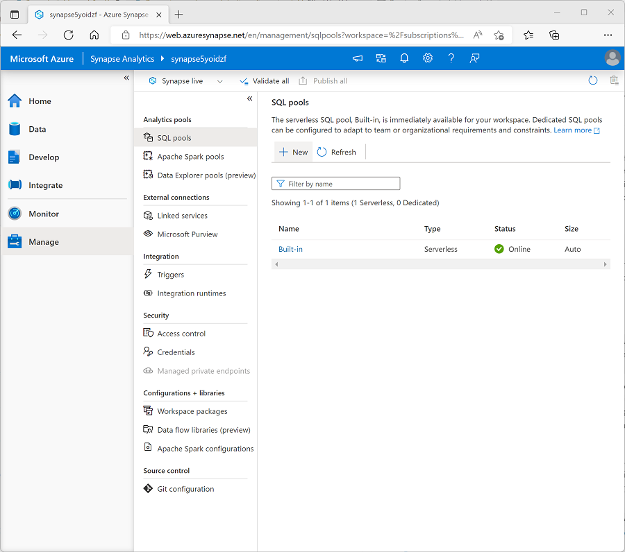

Now that you understand the basic architectural principles for a relational data warehouse schema, let's explore how to create a data warehouse.

## Creating a dedicated SQL pool

To create a relational data warehouse in Azure Synapse Analytics, you must create a dedicated SQL Pool. The simplest way to do this in an existing Azure Synapse Analytics workspace is to use the **Manage** page in Azure Synapse Studio, as shown here:



When provisioning a dedicated SQL pool, you can specify the following configuration settings:

- A unique name for the dedicated SQL pool.
- A performance level for the SQL pool, which can range from *DW100c* to *DW30000c* and which determines the cost per hour for the pool when it's running.
- Whether to start with an empty pool or restore an existing database from a backup.
- The *collation* of the SQL pool, which determines sort order and string comparison rules for the database. (*You can't change the collation after creation*).

After creating a dedicated SQL pool, you can control its running state in the **Manage** page of Synapse Studio; pausing it when not required to prevent unnecessary costs.

When the pool is running, you can explore it on the **Data** page, and create SQL scripts to run in it.

## Considerations for creating tables

To create tables in the dedicated SQL pool, you use the `CREATE TABLE` (or sometimes the `CREATE EXTERNAL TABLE`) Transact-SQL statement. The specific options used in the statement depend on the type of table you're creating, which can include:

- Fact tables
- Dimension tables
- Staging tables

> [!NOTE]
> The data warehouse is composed of *fact* and *dimension* tables as discussed previously. *Staging* tables are often used as part of the data warehousing loading process to ingest data from source systems.

When designing a star schema model for small or medium sized datasets you can use your preferred database, such as Azure SQL. For larger data sets you may benefit from implementing your data warehouse in Azure Synapse Analytics instead of SQL Server. It's important to understand some key differences when creating tables in Synapse Analytics.

### Data integrity constraints

Dedicated SQL pools in Synapse Analytics don't support *foreign key* and *unique* constraints as found in other relational database systems like SQL Server. This means that jobs used to load data must maintain uniqueness and referential integrity for keys, without relying on the table definitions in the database to do so.

> [!TIP]
> For more information about constraints in Azure Synapse Analytics dedicated SQL pools, see [Primary key, foreign key, and unique key using dedicated SQL pool in Azure Synapse Analytics](/azure/synapse-analytics/sql-data-warehouse/sql-data-warehouse-table-constraints).

### Indexes

While Synapse Analytics dedicated SQL pools support *clustered* indexes as found in SQL Server, the default index type is *clustered columnstore*. This index type offers a significant performance advantage when querying large quantities of data in a typical data warehouse schema and should be used where possible. However, some tables may include data types that can't be included in a clustered columnstore index (for example, VARBINARY(MAX)), in which case a clustered index can be used instead.

> [!TIP]
> For more information about indexing in Azure Synapse Analytics dedicated SQL pools, see [Indexes on dedicated SQL pool tables in Azure Synapse Analytics](/azure/synapse-analytics/sql-data-warehouse/sql-data-warehouse-tables-index).

### Distribution

Azure Synapse Analytics dedicated SQL pools use a [massively parallel processing (MPP) architecture](/azure/architecture/data-guide/relational-data/data-warehousing#data-warehousing-in-azure), as opposed to the symmetric multiprocessing (SMP) architecture used in most OLTP database systems. In an MPP system, the data in a table is distributed for processing across a pool of nodes. Synapse Analytics supports the following kinds of distribution:

- **Hash**: A deterministic hash value is calculated for the specified column and used to assign the row to a compute node.
- **Round-robin**: Rows are distributed evenly across all compute nodes.
- **Replicated**: A copy of the table is stored on each compute node.

The table type often determines which option to choose for distributing the table.

| Table type | Recommended distribution option |
|:---------------|:--------------------|
| Dimension      | Use replicated distribution for smaller tables to avoid data shuffling when joining to distributed fact tables. If tables are too large to store on each compute node, use hash distribution. |
| Fact           | Use hash distribution with clustered columnstore index to distribute fact tables across compute nodes. |
| Staging        | Use round-robin distribution for staging tables to evenly distribute data across compute nodes. |

>[!TIP]
> For more information about distribution strategies for tables in Azure Synapse Analytics, see [Guidance for designing distributed tables using dedicated SQL pool in Azure Synapse Analytics](/azure/synapse-analytics/sql-data-warehouse/sql-data-warehouse-tables-distribute).

## Creating dimension tables

When you create a dimension table, ensure that the table definition includes surrogate and alternate keys as well as columns for the attributes of the dimension that you want to use to group aggregations. It's often easiest to use an `IDENTITY` column to auto-generate an incrementing surrogate key (otherwise you need to generate unique keys every time you load data). The following example shows a `CREATE TABLE` statement for a hypothetical **DimCustomer** dimension table.

```sql
CREATE TABLE dbo.DimCustomer
(
    CustomerKey INT IDENTITY NOT NULL,
    CustomerAlternateKey NVARCHAR(15) NULL,
    CustomerName NVARCHAR(80) NOT NULL,
    EmailAddress NVARCHAR(50) NULL,
    Phone NVARCHAR(25) NULL,
    StreetAddress NVARCHAR(100),
    City NVARCHAR(20),
    PostalCode NVARCHAR(10),
    CountryRegion NVARCHAR(20)
)
WITH
(
    DISTRIBUTION = REPLICATE,
    CLUSTERED COLUMNSTORE INDEX
);
```

> [!NOTE]
> If desired, you can create a specific *schema* as a namespace for your tables. In this example, the default **dbo** schema is used.

If you intend to use a *snowflake* schema in which dimension tables are related to one another, you should include the key for the *parent* dimension in the definition of the *child* dimension table. For example, the following SQL code could be used to move the geographical address details from the **DimCustomer** table to a separate **DimGeography** dimension table:

```sql
CREATE TABLE dbo.DimGeography
(
    GeographyKey INT IDENTITY NOT NULL,
    GeographyAlternateKey NVARCHAR(10) NULL,
    StreetAddress NVARCHAR(100),
    City NVARCHAR(20),
    PostalCode NVARCHAR(10),
    CountryRegion NVARCHAR(20)
)
WITH
(
    DISTRIBUTION = REPLICATE,
    CLUSTERED COLUMNSTORE INDEX
);

CREATE TABLE dbo.DimCustomer
(
    CustomerKey INT IDENTITY NOT NULL,
    CustomerAlternateKey NVARCHAR(15) NULL,
    GeographyKey INT NULL,
    CustomerName NVARCHAR(80) NOT NULL,
    EmailAddress NVARCHAR(50) NULL,
    Phone NVARCHAR(25) NULL
)
WITH
(
    DISTRIBUTION = REPLICATE,
    CLUSTERED COLUMNSTORE INDEX
);
```

### Time dimension tables

Most data warehouses include a *time* dimension table that enables you to aggregate data by multiple hierarchical levels of time interval. For example, the following example creates a **DimDate** table with attributes that relate to specific dates.

```sql
CREATE TABLE dbo.DimDate
( 
    DateKey INT NOT NULL,
    DateAltKey DATETIME NOT NULL,
    DayOfMonth INT NOT NULL,
    DayOfWeek INT NOT NULL,
    DayName NVARCHAR(15) NOT NULL,
    MonthOfYear INT NOT NULL,
    MonthName NVARCHAR(15) NOT NULL,
    CalendarQuarter INT  NOT NULL,
    CalendarYear INT NOT NULL,
    FiscalQuarter INT NOT NULL,
    FiscalYear INT NOT NULL
)
WITH
(
    DISTRIBUTION = REPLICATE,
    CLUSTERED COLUMNSTORE INDEX
);
```

> [!TIP]
> A common pattern when creating a dimension table for dates is to use the numeric date in *DDMMYYYY* or *YYYYMMDD* format as an integer surrogate key, and the date as a `DATE` or `DATETIME` datatype as the alternate key.

## Creating fact tables

Fact tables include the keys for each dimension to which they're related, and the attributes and numeric measures for specific events or observations that you want to analyze.

The following code example creates a hypothetical fact table named **FactSales** that is related to multiple dimensions through key columns (date, customer, product, and store)

```sql
CREATE TABLE dbo.FactSales
(
    OrderDateKey INT NOT NULL,
    CustomerKey INT NOT NULL,
    ProductKey INT NOT NULL,
    StoreKey INT NOT NULL,
    OrderNumber NVARCHAR(10) NOT NULL,
    OrderLineItem INT NOT NULL,
    OrderQuantity SMALLINT NOT NULL,
    UnitPrice DECIMAL NOT NULL,
    Discount DECIMAL NOT NULL,
    Tax DECIMAL NOT NULL,
    SalesAmount DECIMAL NOT NULL
)
WITH
(
    DISTRIBUTION = HASH(OrderNumber),
    CLUSTERED COLUMNSTORE INDEX
);
```

## Creating staging tables

Staging tables are used as temporary storage for data as it's being loaded into the data warehouse. A typical pattern is to structure the table to make it as efficient as possible to ingest the data from its external source (often files in a data lake) into the relational database, and then use SQL statements to load the data from the staging tables into the dimension and fact tables.

The following code example creates a staging table for product data that will ultimately be loaded into a dimension table:

```sql
CREATE TABLE dbo.StageProduct
(
    ProductID NVARCHAR(10) NOT NULL,
    ProductName NVARCHAR(200) NOT NULL,
    ProductCategory NVARCHAR(200) NOT NULL,
    Color NVARCHAR(10),
    Size NVARCHAR(10),
    ListPrice DECIMAL NOT NULL,
    Discontinued BIT NOT NULL
)
WITH
(
    DISTRIBUTION = ROUND_ROBIN,
    CLUSTERED COLUMNSTORE INDEX
);
```

### Using external tables

In some cases, if the data to be loaded is in files with an appropriate structure, it can be more effective to create external tables that reference the file location. This way, the data can be read directly from the source files instead of being loaded into the relational store. The following example, shows how to create an external table that references files in the data lake associated with the Synapse workspace:

```sql

-- External data source links to data lake location
CREATE EXTERNAL DATA SOURCE StagedFiles
WITH (
    LOCATION = 'https://mydatalake.blob.core.windows.net/data/stagedfiles/'
);
GO

-- External format specifies file format
CREATE EXTERNAL FILE FORMAT ParquetFormat
WITH (
    FORMAT_TYPE = PARQUET,
    DATA_COMPRESSION = 'org.apache.hadoop.io.compress.SnappyCodec'
);
GO

-- External table references files in external data source
CREATE EXTERNAL TABLE dbo.ExternalStageProduct
(
    ProductID NVARCHAR(10) NOT NULL,
    ProductName NVARCHAR(200) NOT NULL,
    ProductCategory NVARCHAR(200) NOT NULL,
    Color NVARCHAR(10),
    Size NVARCHAR(10),
    ListPrice DECIMAL NOT NULL,
    Discontinued BIT NOT NULL
)
WITH
(
    DATA_SOURCE = StagedFiles,
    LOCATION = 'products/*.parquet',
    FILE_FORMAT = ParquetFormat
);
GO
```

> [!NOTE]
> For more information about using external tables, see [Use external tables with Synapse SQL](/azure/synapse-analytics/sql/develop-tables-external-tables) in the Azure Synapse Analytics documentation.
