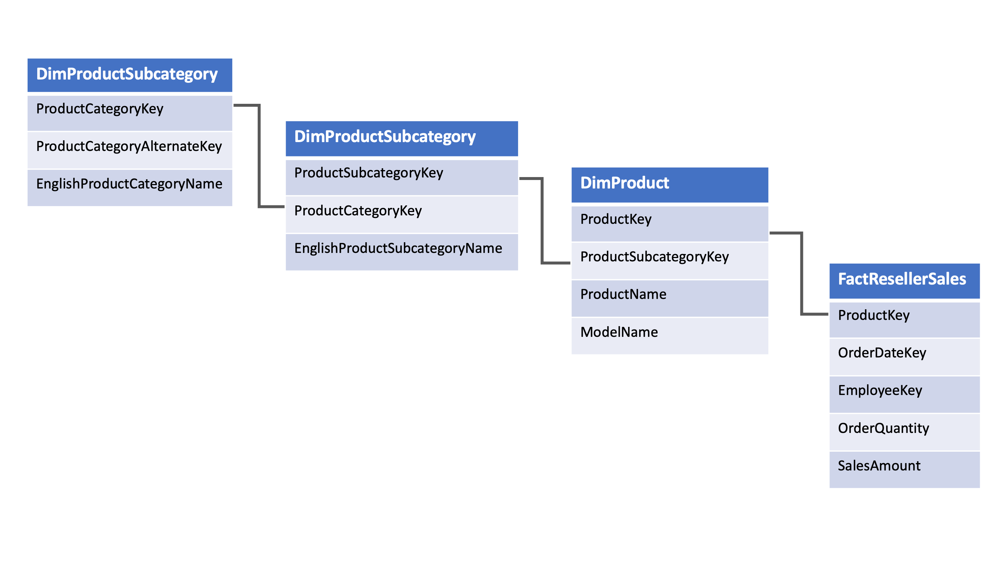

In this task, you add two new dimension tables: `DimProductCategory` and `DimProductSubcategory`. There is an implicit relationship between these two tables and the `DimProduct` table which creates a normalized product dimension, known as a snowflake dimension. Doing so updates the star schema to include the normalized product dimension, transforming it into a snowflake schema.

1. In Synapse Studio, navigate to the **Data** hub.

    

2. Select the **Workspace** tab **(1)**, expand Databases, then right-click on **SQLPool01 (2)**. Select **New SQL script (3)**, then select **Empty script (4)**.

    

3. Paste **and execute** the following into the query window to create the new dimension tables:

    ```sql
    CREATE TABLE [dbo].[DimProductCategory](
        [ProductCategoryKey] [int] NOT NULL,
        [ProductCategoryAlternateKey] [int] NULL,
        [EnglishProductCategoryName] [nvarchar](50) NOT NULL,
        [SpanishProductCategoryName] [nvarchar](50) NOT NULL,
        [FrenchProductCategoryName] [nvarchar](50) NOT NULL
    )
    WITH
    (
        DISTRIBUTION = REPLICATE,
        CLUSTERED COLUMNSTORE INDEX
    );
    GO

    CREATE TABLE [dbo].[DimProductSubcategory](
        [ProductSubcategoryKey] [int] NOT NULL,
        [ProductSubcategoryAlternateKey] [int] NULL,
        [EnglishProductSubcategoryName] [nvarchar](50) NOT NULL,
        [SpanishProductSubcategoryName] [nvarchar](50) NOT NULL,
        [FrenchProductSubcategoryName] [nvarchar](50) NOT NULL,
        [ProductCategoryKey] [int] NULL
    )
    WITH
    (
        DISTRIBUTION = REPLICATE,
        CLUSTERED COLUMNSTORE INDEX
    );
    GO
    ```

    You have created a snowflake dimension by normalizing the three product tables into a single business entity, or product dimension:

    

4. Replace **and execute** the following query to insert data into the snowflake dimension tables:

    ```sql
    COPY INTO [dbo].[DimProductCategory]
    FROM 'https://solliancepublicdata.blob.core.windows.net/dataengineering/dp-203/awdata/DimProductCategory.csv'
    WITH (
        FILE_TYPE='CSV',
        FIELDTERMINATOR='|',
        FIELDQUOTE='',
        ROWTERMINATOR='\n',
        ENCODING = 'UTF16'
    );
    GO

    COPY INTO [dbo].[DimProductSubcategory]
    FROM 'https://solliancepublicdata.blob.core.windows.net/dataengineering/dp-203/awdata/DimProductSubcategory.csv'
    WITH (
        FILE_TYPE='CSV',
        FIELDTERMINATOR='|',
        FIELDQUOTE='',
        ROWTERMINATOR='\n',
        ENCODING = 'UTF16'
    );
    GO
    ```

5. Replace **and execute** the following query to retrieve reseller sales data from the star schema at the product category, product subcategory, and month granularity:

    ```sql
    SELECT
        pc.EnglishProductCategoryName AS ProductCategory
        ,psc.EnglishProductSubcategoryName AS ProductSubcategory
        ,Year(f.OrderDate) AS CalendarYear
        ,CASE
            WHEN Month(f.OrderDate) < 7 THEN Year(f.OrderDate)
            ELSE Year(f.OrderDate) + 1
        END AS FiscalYear -- Fiscal year runs from Jul to June)
        ,Month(f.OrderDate) AS [Month]
        ,Sum(f.OrderQuantity) AS Quantity
        ,Sum(f.ExtendedAmount) AS Amount
        ,Approx_count_distinct(f.SalesOrderNumber) AS UniqueOrders  
    FROM
        [dbo].[FactResellerSales] f
    INNER JOIN [dbo].[DimProduct] p
        ON f.[ProductKey] = p.[ProductKey]
    INNER JOIN [dbo].[DimProductSubcategory] psc
        ON p.[ProductSubcategoryKey] = psc.[ProductSubcategoryKey]
    INNER JOIN [dbo].[DimProductCategory] pc
        ON psc.[ProductCategoryKey] = pc.[ProductCategoryKey]
    GROUP BY
        pc.EnglishProductCategoryName
        ,psc.EnglishProductSubcategoryName
        ,Year(f.OrderDate)
        ,CASE
            WHEN Month(f.OrderDate) < 7 THEN Year(f.OrderDate)
            ELSE Year(f.OrderDate) + 1
        END
        ,Month(f.OrderDate)
    ORDER BY Amount DESC
    ```

Remember to **pause your SQL Pool** to avoid extra cost if you are not continuing to another exercise.
