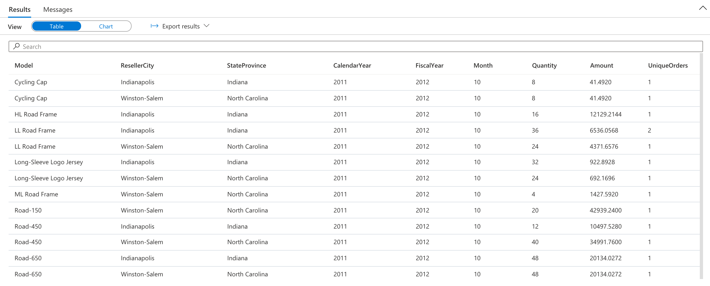

You can populate time dimension tables in one of many ways, including T-SQL scripts using date/time functions, Microsoft Excel functions, importing from a flat file, or auto-generation by BI (business intelligence) tools. In this exercise, you will review a script that could populate the time dimension table using T-SQL but can be slow on an MPP system like Synapse Analytics. Then you will load the pre-computed results from a flat file which is a much faster process.

Review this code **without running it** to see how we could generate the data directly on Synapse Analytics dedicated SQL pool:

```sql
IF OBJECT_ID('tempdb..#DateTmp') IS NOT NULL
BEGIN
    DROP TABLE #DateTmp
END

CREATE TABLE #DateTmp (DateKey datetime NOT NULL)

-- Create temp table with all the dates we will use
DECLARE @StartDate datetime
DECLARE @EndDate datetime
SET @StartDate = '01/01/2005'
SET @EndDate = getdate() 
DECLARE @LoopDate datetime
SET @LoopDate = @StartDate
WHILE @LoopDate <= @EndDate
BEGIN
INSERT INTO #DateTmp VALUES
    (
        @LoopDate
    )  		  
    SET @LoopDate = DateAdd(dd, 1, @LoopDate)
END

INSERT INTO dbo.DimDate 
SELECT
CAST(CONVERT(VARCHAR(8), DateKey, 112) AS int) , -- date key
        DateKey, -- date alt key
        Year(DateKey), -- calendar year
        datepart(qq, DateKey), -- calendar quarter
        Month(DateKey), -- month number of year
        datename(mm, DateKey), -- month name
        Day(DateKey),  -- day number of month
        datepart(dw, DateKey), -- day number of week
        datename(dw, DateKey), -- day name of week
        CASE
            WHEN Month(DateKey) < 7 THEN Year(DateKey)
            ELSE Year(DateKey) + 1
        END, -- Fiscal year (assuming fiscal year runs from Jul to June)
        CASE
            WHEN Month(DateKey) IN (1, 2, 3) THEN 3
            WHEN Month(DateKey) IN (4, 5, 6) THEN 4
            WHEN Month(DateKey) IN (7, 8, 9) THEN 1
            WHEN Month(DateKey) IN (10, 11, 12) THEN 2
        END -- fiscal quarter 
    FROM #DateTmp
GO

```
> This looping method is not efficient for Synapse. This script took about 6 minutes on the smallest size dedicated pool. It is a case that is faster to use SQL Server, but it would only need generated one time.

**Run the following** to create and populate your time dimension:

1. In Synapse Studio, navigate to the **Data** hub.

    

2. Select the **Workspace** tab **(1)**, expand Databases, then right-click on **SQLPool01 (2)**. Select **New SQL script (3)**, then select **Empty script (4)**.

    

3. Paste **and execute** the following in the query window to create the time dimension table.
    ```sql
    CREATE TABLE [dbo].[DimDate]
    ( 
        [DateKey] [int]  NOT NULL,
        [DateAltKey] [datetime]  NOT NULL,
        [CalendarYear] [int]  NOT NULL,
        [CalendarQuarter] [int]  NOT NULL,
        [MonthOfYear] [int]  NOT NULL,
        [MonthName] [nvarchar](15)  NOT NULL,
        [DayOfMonth] [int]  NOT NULL,
        [DayOfWeek] [int]  NOT NULL,
        [DayName] [nvarchar](15)  NOT NULL,
        [FiscalYear] [int]  NOT NULL,
        [FiscalQuarter] [int]  NOT NULL
    )
    WITH
    (
        DISTRIBUTION = REPLICATE,
        CLUSTERED COLUMNSTORE INDEX
    );
    GO
    ```

4. To populate the time dimension table in Azure Synapse, it is fastest to load the data from a delimited file. Replace **and execute** the following in the query window:

    ```sql
    COPY INTO [dbo].[DimDate]
    FROM 'https://solliancepublicdata.blob.core.windows.net/dataengineering/dp-203/awdata/DimDate.csv'
    WITH (
        FILE_TYPE='CSV',
        FIELDTERMINATOR='|',
        FIELDQUOTE='',
        ROWTERMINATOR='0x0a',
        ENCODING = 'UTF16'
    );
    GO
    ```

5. Now we can use temporal attributes in our query. Replace **and execute** the query with the following to limit the results to October sales between the 2012 and 2013 fiscal years:

    ```sql
    SELECT
        Coalesce(p.[ModelName], p.[EnglishProductName]) AS [Model]
        ,g.City AS ResellerCity
        ,g.StateProvinceName AS StateProvince
        ,d.[CalendarYear]
        ,d.[FiscalYear]
        ,d.[MonthOfYear] AS [Month]
        ,sum(f.OrderQuantity) AS Quantity
        ,sum(f.ExtendedAmount) AS Amount
        ,approx_count_distinct(f.SalesOrderNumber) AS UniqueOrders  
    FROM
        [dbo].[FactResellerSales] f
    INNER JOIN [dbo].[DimReseller] r
        ON f.ResellerKey = r.ResellerKey
    INNER JOIN [dbo].[DimGeography] g
        ON r.GeographyKey = g.GeographyKey
    INNER JOIN [dbo].[DimDate] d
        ON f.[OrderDateKey] = d.[DateKey]
    INNER JOIN [dbo].[DimProduct] p
        ON f.[ProductKey] = p.[ProductKey]
    WHERE d.[MonthOfYear] = 10 AND d.[FiscalYear] IN (2012, 2013)
    GROUP BY
        Coalesce(p.[ModelName], p.[EnglishProductName])
        ,g.City
        ,g.StateProvinceName
        ,d.[CalendarYear]
        ,d.[FiscalYear]
        ,d.[MonthOfYear]
    ORDER BY d.[FiscalYear]
    ```

    You should see an output similar to the following:

    [](../media/reseller-query-results-date-filter-synapse.png#lightbox)

    > Notice how using the **time dimension table** makes filtering by specific date parts and logical dates (such as fiscal year) easier and more performant than calculating date functions on the fly.