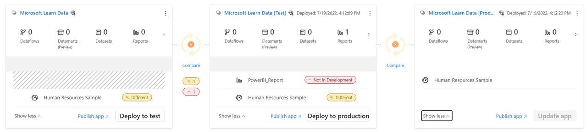

In the previous unit, we discussed how to secure your changes, and now we'll review options for deployment. In large organizations, you may have hundreds of reports and datasets. Application lifecycle management (ALM) suggests separate environments for development, test, and production, which multiplies your total files. This process can be an administrative nightmare, which is why creating a deployment strategy will reduce time and effort across the company.

## Consider the options

When you create a report through Power BI Desktop, you have a single asset - a *.pbix* file. When you publish to Power BI service, you'll have a dataset and a report. Then you can create a dashboard from the report. In small organizations, it may be sufficient to accept the published report as a "gold copy" or the "production" copy.

However, enterprises commonly implement ALM, which sets a precedence to separate for development, test, and production. In those situations, you would publish the initial *.pbix* file to the development workspace, then allow testing in test, and finally publish to production when approved.

> [!NOTE]
> We'll only reference *development (dev), test, and production (prod)* for our purposes, but we recognize your organization may have a different structure.

You can manually create separate workspaces for your specific needs, or you can use the built-in Power BI service deployment pipelines.

## Power BI service deployment pipelines

A Power BI deployment pipeline is a separate workspace for each development, test, and production. The real value with deployment pipelines is that you can see when there's a discrepancy between the different workspaces.

In the following image, there are three workspaces for development, test, and production with a single dashboard *Human Resources Sample* in each. There's another report in the test workspace that isn't in development or production. The compare feature quickly identifies the disparity, and even allows you to remediate it from the pipeline dashboard.

> [!IMPORTANT]
> Power BI deployment pipelines require a Premium or Premium Per User workspace.

We go into greater detail in the next module, [Create and manage a Power BI deployment pipeline](/learn/modules/power-bi-deployment-pipelines/).

## Combining source control and deployment pipelines

In the last unit, we discussed source control strategies. Whether your organization uses OneDrive/SharePoint or Git, you can use deployment pipelines. You can:

* Use only deployment pipelines for everything (*.pbix* files only)
* Use OneDrive/SharePoint for source control of *.pbix* files, then publish final copy to the development pipeline, and use deployment pipelines to maintain parity
* Use Git for *.bim* files, OneDrive/Sharepoint for *.pbix* files, publish final copy to the development pipeline, and finally use deployment pipelines

## Power BI service workspace planning

With large organizations, often there are many reports created from shared datasets. Instead of having duplicate datasets across several workspaces, consider creating a single workspace for a dataset, then a separate workspace for the subsequent reports and dashboards.

By separating the datasets, you can grant access to a larger audience to create reports from the dataset, and allow their specific reports to reside in their appropriate report workspaces.

## Continuous Integration/Continuous Deployment

Continuous Integration/Continuous Deployment (CI/CD) is a more recent concept focused on the automation from development to production. You may have noticed that deployment pipelines aren't able to track a *.bim* file, only the dataset that is associated with the *.pbix* file when published to Power BI service. Therefore it doesn't fully encapsulate a true CI/CD solution. However, if your organization desires more control, you can use Azure DevOps for Git, then use the Power BI Connector and XMLA endpoint to deploy from the repository to the deployment pipelines.

> [!TIP]
> To implement automated deployment pipelines, review the [Power BI reference documentation](/power-bi/create-reports/deployment-pipelines-automation).
