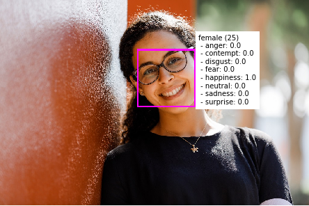

Face detection and analysis is an area of artificial intelligence (AI) in which we use algorithms to locate and analyze human faces in images or video content.

## Face detection         

Face detection involves identifying regions of an image that contain a human face, typically by returning *bounding box* coordinates that form a rectangle around the face, like this:

## Facial analysis

Moving beyond simple face detection, some algorithms can also return other information, such as facial landmarks (nose, eyes, eyebrows, lips, and others).

These facial landmarks can be used as features with which to train a machine learning model from which you can infer information about a person, such as their perceived age or perceived emotional state, like this:

## Facial recognition

A further application of facial analysis is to train a machine learning model to identify known individuals from their facial features. This usage is more generally known as *facial recognition*, and involves using multiple images of each person you want to recognize to train a model so that it can detect those individuals in new images on which it wasn't trained.

## Uses of face detection and analysis

There are many applications for face detection, analysis, and recognition. For example,

- Security - facial recognition can be used in building security applications, and increasingly it is used in smart phones operating systems for unlocking devices.
- Social media - facial recognition can be used to automatically tag known friends in photographs.
- Intelligent monitoring - for example, an automobile might include a system that monitors the driver's face to determine if the driver is looking at the road, looking at a mobile device, or shows signs of tiredness.
- Advertising - analyzing faces in an image can help direct advertisements to an appropriate demographic audience.
- Missing persons - using public cameras systems, facial recognition can be used to identify if a missing person is in the image frame.
- Identity validation - useful at ports of entry kiosks where a person holds a special entry permit.
