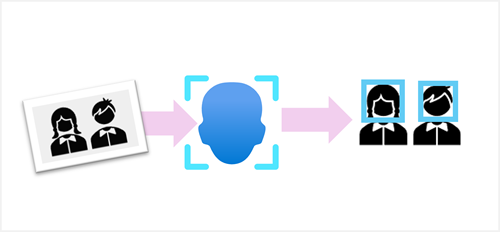

Face detection, analysis, and recognition are all common computer vision challenges for AI systems. The ability to detect when a person is present, analyze a person's facial features, or recognize an individual based on their face is a key way in which AI systems can exhibit human-like behavior and build empathy with users.

In this module, you'll explore how the Azure AI Vision *Face API* enables you to build solutions that analyze faces in images.

> [!NOTE]
> Access to the full capabilities of the Face API is restricted in accordance with Microsoft's responsible AI policies. For details, see **[Limited Access to Face API](/legal/cognitive-services/computer-vision/limited-access-identity)**. This module describes some capabilities that require explicit access. The practical exercise in the module is based on unrestricted features of the service.
