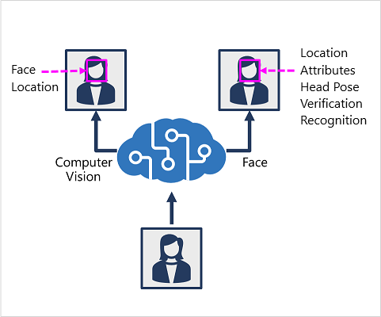

There are two Azure AI services that you can use to build solutions that detect faces in images.

## The Azure AI Vision service

The **Azure AI Vision** service enables you to detect human faces in an image, as well as returning a bounding box for its location.

## The Face service

The **Face** service offers more comprehensive facial analysis capabilities than the Azure AI Vision service, including:
- Face detection (with bounding box).
- Comprehensive facial feature analysis (including head pose, presence of spectacles, blur, facial landmarks, occlusion and others).
- Face comparison and verification.
- Facial recognition.

> [!IMPORTANT]
> Usage of facial recognition, comparison, and verification will require getting approved through a [Limited Access policy](https://aka.ms/cog-services-limited-access). You can read more about the [addition of this policy](https://azure.microsoft.com/blog/responsible-ai-investments-and-safeguards-for-facial-recognition/) to our Responsible AI standard. Facial recognition will be touched on in the rest of this module, but will be unavailable without applying for Limited Access.
