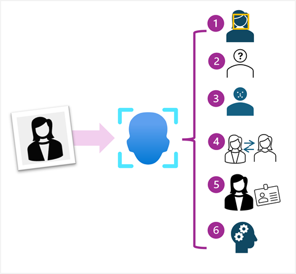

The **Face** service provides comprehensive facial detection, analysis, and recognition capabilities.

The Face service provides functionality that you can use for:

- *Face detection* - for each detected face, the results include an ID that identifies the face and the bounding box coordinates indicating its location in the image.
- *Face attribute analysis* - you can return a wide range of facial attributes, including:
    - Head pose (*pitch*, *roll*, and *yaw* orientation in 3D space)
    - Glasses (*NoGlasses*, *ReadingGlasses*, *Sunglasses*, or *Swimming Goggles*)
    - Blur (*low*, *medium*, or *high*)
    - Exposure (*underExposure*, *goodExposure*, or *overExposure*)
    - Noise (visual noise in the image)
    - Occlusion (objects obscuring the face)
- *Facial landmark location* - coordinates for key landmarks in relation to facial features (for example, eye corners, pupils, tip of nose, and so on)
- *Face comparison* - you can compare faces across multiple images for similarity (to find individuals with similar facial features) and verification (to determine that a face in one image is the same person as a face in another image)
- *Facial recognition* - you can train a model with a collection of faces belonging to specific individuals, and use the model to identify those people in new images.

You can provision **Face** as a single-service resource, or you can use the Face API in a multi-service **Azure AI Services** resource.

If you want to use the identification, recognition, and verification features of **Face**, you'll need to apply for the [Limited Access policy](https://aka.ms/cog-services-limited-access) and get approval before these features are available.
