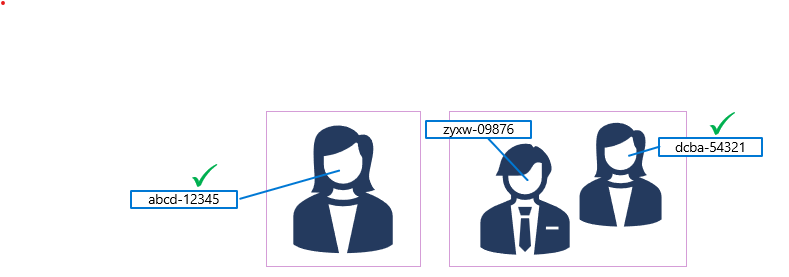

When a face is detected by the Face service, a unique ID is assigned to it and retained in the service resource for 24 hours. The ID is a GUID, with no indication of the individual's identity other than their facial features.

> [!IMPORTANT]
> Usage of facial recognition, comparison, and verification will require getting approved through a [Limited Access policy](https://aka.ms/cog-services-limited-access). You can read more about the [addition of this policy](https://azure.microsoft.com/blog/responsible-ai-investments-and-safeguards-for-facial-recognition/) to our Responsible AI standard. Facial recognition will be unavailable to new customers until they are granted the Limited Access policy.

While the detected face ID is cached, subsequent images can be used to compare the new faces to the cached identity and determine if they are *similar* (in other words, they share similar facial features) or to *verify* that the same person appears in two images.

This ability to compare faces anonymously can be useful in systems where it's important to confirm that the same person is present on two occasions, without the need to know the actual identity of the person. For example, by taking images of people as they enter and leave a secured space to verify that everyone who entered leaves.
