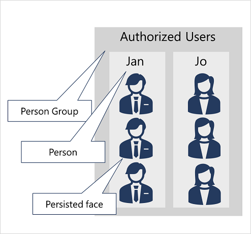

For scenarios where you need to positively identify individuals, you can train a facial recognition model using face images.

> [!NOTE]
> As mentioned in the previous unit, recognition models will require getting approved through a [Limited Access policy](https://aka.ms/cog-services-limited-access).

To train a facial recognition model with the Face service:

1. Create a **Person Group** that defines the set of individuals you want to identify (for example, *employees*).
2. Add a **Person** to the **Person Group** for each individual you want to identify.
3. Add detected faces from multiple images to each **person**, preferably in various poses. The IDs of these faces will no longer expire after 24 hours (so they're now referred to as *persisted* faces).
4. Train the model.

The trained model is stored in your Face (or Azure AI Services) resource, and can be used by client applications to:

- *Identify* individuals in images.
- *Verify* the identity of a detected face.
- Analyze new images to find faces that are *similar* to a known, persisted face.
