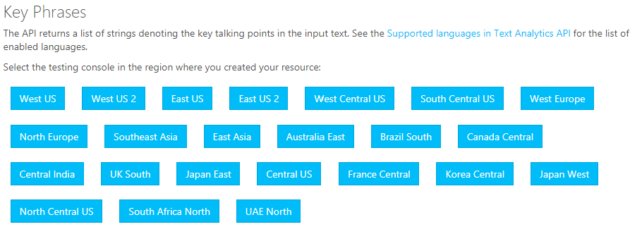

The language detection API expects a well-formed JSON input. You can create a JSON file that contains an array of *documents* in the format:

```json
{
    "documents": [
        {
            "id": "1",
            "text": "This document is in English."
        },
        {
            "id": "2",
            "text": "Este documento está en inglés."
        },
        {
            "id": "3",
            "text": "Ce document est en anglais."
        },
        {
            "id": "4",
            "text": "本文件为英文"
        },
        {
            "id": "5",
            "text": "Этот документ на английском языке."
        }
    ]
}
```

Note the entries in the JSON array consist of an ID attribute, and the text that will be evaluated.  There are other specific requirements for the data that you will pass to the service for evaluation.  Each document size must be 5,120 characters or less and you can have up to 1,000 documents per collection (1,000 IDs).  When you make the request to the service, the JSON document is passed in the body.

## Setting up your environment

1. To complete the exercises, you will require an Azure subscription and a Cognitive Services resource.
1. Sign in to the [Azure portal](https://portal.azure.com) using your Azure subscription credentials.  If you do not have an Azure subscription yet, [create the subscription](https://azure.microsoft.com/free) before proceeding.
1. Select the + Create a resource option in the left nav pane or on the Home page of the Azure portal.
1. In the text entry to search the Azure Marketplace, enter **Cognitive Services** for a multi-service resource, and press **Enter**.
1. Select **Cognitive Services** from the list presented.
1. Select the **Create** button.
1. Enter a unique name for the service, such as **myMultiCogService**.
1. Select your Azure subscription from the **Subscription** drop-down list.
1. Choose a **Location** that is closest to you.
1. For the **Pricing Tier**, select F0 if available, otherwise select S0.
1. Select an existing resource group or create a new one, if you do not already have an appropriate resource group.
1. Select the check box to confirm you understand the notice on the page.
1. Select **Create**.
1. Once the deployment succeeds, go to the newly created Cognitive Service resource.
1. Open the **Keys and Endpoint** page by selecting that option from left nav pane of the service.  You will need the key and endpoint for the exercises.

## Use the API Testing Console to test the service

1. Ensure that you have a Cognitive Services resource created in your Azure subscription.  You will need the access key.
1. Open the [Text Analytics API testing console](https://westcentralus.dev.cognitive.microsoft.com/docs/services/TextAnalytics-v2-1/operations/56f30ceeeda5650db055a3c6).
1. You can read more about the API here to understand the locations in which it is available and see samples of the request and response for the service.
1. In the left pane, select the **POST Detect Language** option.
1. Scroll down the page until you locate the service location buttons.

   > [!div class="mx-imgBorder"]
   > 

1. Select the button for the location that you chose when creating the Cognitive Service resource, such as West US.
1. A new page opens for you to test the language detection.
1. Copy this JSON document to the clipboard.

   ```json
   {
       "documents": [
           {
               "id": "1",
               "text": "This document is in English."
           },
           {
               "id": "2",
               "text": "Este documento está en inglés."
           },
           {
               "id": "3",
               "text": "Ce document est en anglais."
           },
           {
               "id": "4",
               "text": "本文件为英文"
           },
           {
               "id": "5",
               "text": "Этот документ на английском языке."
           }
       ]
   }
   ```

1. On the API testing console page, scroll to the **Request Body** section and replace the content with the JSON above.
1. Take note of the Request URL.  It is the same as your endpoint for the Cognitive Service resource you created, with the addition of */text/analytics/v2.1/languages* appended.  This URL is the complete POST request URL that applications should use when calling the REST service. It contains the version number and specific API being requested.
1. Go to your Cognitive Service page and copy one of the keys.
1. Paste that key into the **Ocp-Apim-Subscription-Key** location on the API testing console.

   > [!div class="mx-imgBorder"]
   > 

1. Scroll to the bottom of the API testing console page and select **Send**.
1. If your location matched your service location and the key is valid, you should receive a response of **200 OK** and the **Response content** text area should contain a JSON output listing each document ID along with a list of key phrases extracted from the text.

   ```json
   {
     "documents": [{
       "id": "1",
       "detectedLanguages": [{
         "name": "English",
         "iso6391Name": "en",
         "score": 1.0
       }]
     }, {
       "id": "2",
       "detectedLanguages": [{
         "name": "Spanish",
         "iso6391Name": "es",
         "score": 1.0
       }]
     }, {
       "id": "3",
       "detectedLanguages": [{
         "name": "French",
         "iso6391Name": "fr",
         "score": 1.0
       }]
     }, {
       "id": "4",
       "detectedLanguages": [{
         "name": "Chinese_Simplified",
         "iso6391Name": "zh_chs",
         "score": 1.0
       }]
     }, {
       "id": "5",
       "detectedLanguages": [{
         "name": "Russian",
         "iso6391Name": "ru",
         "score": 1.0
       }]
     }],
     "errors": []
   }
   ```

The output shows the document ID values from the input JSON.  It also contains an array for each document ID for **detectedLanguages**.  Each detected language is listed including the name, ISO two-letter code, and a confidence score.

>[!TIP]
>If you are performing language detection and there are multiple languages in a single document, the predominant language will be the one listed in the **detectedLanguages** array.  Even though the confidence score may not be **1**, it is the language that should be selected.