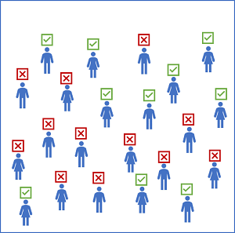
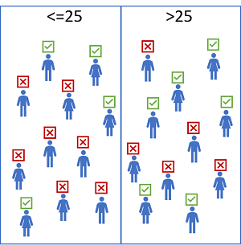
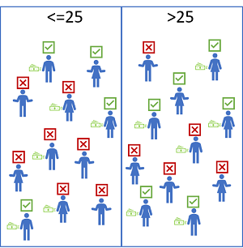

When we consider the concept of *fairness* concerning predictions made by machine learning models, it helps to be clear about what we mean by "fair".

For example, suppose a classification model is used to predict the probability of successful loan repayment and therefore influences whether or not the loan is approved. The model will likely be trained using features that reflect the characteristics of the applicant, such as:

- Age
- Employment status
- Income
- Savings
- Current debt

These features are used to train a binary classification model that predicts whether an applicant will repay a loan.

Suppose the model predicts that around 45% of applicants will successfully repay their loans. However, on reviewing loan approval records, you begin to suspect that fewer loans are approved for applicants aged 25 or younger than for applicants who are over 25. How can you be sure the model is *fair* to applicants in both age groups?

## Measuring disparity in predictions

One way to start evaluating the fairness of a model is to compare *predictions* for each group within a *sensitive feature*. For the loan approval model, *Age* is a sensitive feature that we care about, so we could split the data into subsets for each age group and compare the *selection rate* (the proportion of positive predictions) for each group.

Let's say we find that the model predicts that 36% of applicants aged 25 or younger will repay a loan, but it predicts successful repayments for 54% of applicants aged over 25. There's a disparity in predictions of 18%.

At first glance, this comparison seems to confirm that there's bias in the model that discriminates against younger applicants. However, when you consider the population as a whole, it may be that younger people generally earn less than people more established in their careers, have lower levels of savings and assets, and have a higher rate of defaulting on loans.

The important point to consider here is that just because we want to ensure fairness regarding age, it doesn't necessarily follow that age is <u>not</u> a factor in loan repayment probability. It's possible that in general, younger people are less likely to repay a loan than older people. To get the full picture, we need to look a little deeper into the predictive performance of the model for each subset of the population.

## Measuring disparity in prediction performance

When you train a machine learning model using a supervised technique, like regression or classification, you use metrics achieved against hold-out validation data to evaluate the overall predictive performance of the model. For example, you might evaluate a classification model based on *accuracy*, *precision*, or *recall*.

To evaluate the fairness of a model, you can apply the same predictive performance metric to subsets of the data, based on the sensitive features on which your population is grouped, and measure the disparity in those metrics across the subgroups.

For example, suppose the loan approval model exhibits an overall *recall* metric of 0.67 - in other words, it correctly identifies 67% of cases where the applicant repaid the loan. The question is whether or not the model provides a similar rate of correct predictions for different age groups.

To find out, we group the data based on the sensitive feature (*Age*) and measure the predictive performance metric (*recall*) for those groups. Then we can compare the metric scores to determine the disparity between them.

Let's say that we find that the recall for validation cases where the applicant is 25 or younger is 0.50, and recall for cases where the applicant is over 25 is 0.83. In other words, the model correctly identified 50% of the people in the 25 or younger age group who successfully repaid a loan (and therefore misclassified 50% of them as loan defaulters), but found 83% of loan repayers in the older age group (misclassifying only 17% of them). The disparity in prediction performance between the groups is 33%, with the model predicting significantly more false negatives for the younger age group.

## Potential causes of disparity

When you find a disparity between prediction rates or prediction performance metrics across sensitive feature groups, it's worth considering potential causes. These might include:

- Data imbalance. Some groups may be overrepresented in the training data, or the data may be skewed so that cases within a specific group aren't representative of the overall population.
- Indirect correlation. The sensitive feature itself may not be predictive of the label, but there may be a hidden correlation between the sensitive feature and some other feature that influences the prediction. For example, there's likely a correlation between age and credit history, and there's likely a correlation between credit history and loan defaults. If the credit history feature is not included in the training data, the training algorithm may assign a predictive weight to age without accounting for credit history, which might make a difference to loan repayment probability.
- Societal biases. Subconscious biases in the data collection, preparation, or modeling process may have influenced feature selection or other aspects of model design.

## Mitigating bias

Optimizing for fairness in a machine learning model is a *sociotechnical* challenge. In other words, it's not always something you can achieve purely by applying technical corrections to a training algorithm. However, there are some strategies you can adopt to mitigate bias, including:

- Balance training and validation data. You can apply over-sampling or under-sampling techniques to balance data and use stratified splitting algorithms to maintain representative proportions for training and validation.
- Perform extensive feature selection and engineering analysis. Make sure you fully explore the interconnected correlations in your data to try to differentiate features that are directly predictive from features that encapsulate more complex, nuanced relationships. You can use the [model interpretability support in Azure Machine Learning](https://docs.microsoft.com/learn/modules/explain-machine-learning-models-with-azure-machine-learning/) to understand how individual features influence predictions.
- Evaluate models for disparity based on significant features. You can't easily address the bias in a model if you can't quantify it.
- Trade-off overall predictive performance for the lower disparity in predictive performance between sensitive feature groups. A model that is 99.5% accurate with comparable performance across all groups is often more desirable than a model that is 99.9% accurate but discriminates against a particular subset of cases.

The rest of this module explores the **Fairlearn** package - a Python package that you can use to evaluate and mitigate unfairness in machine learning models.
