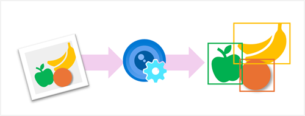

*Object detection* is a common computer vision problem that requires software to identify the location of specific classes of object in an image.

For example, an automated checkout system in a grocery store might use a camera to monitor a checkout conveyer belt on which there might be multiple different items at any one time. The system could use object detection to identify which items are on the belt, and where in the image they appear.

In this module, you'll learn how to use the Azure AI Custom Vision service to create object detection models.
