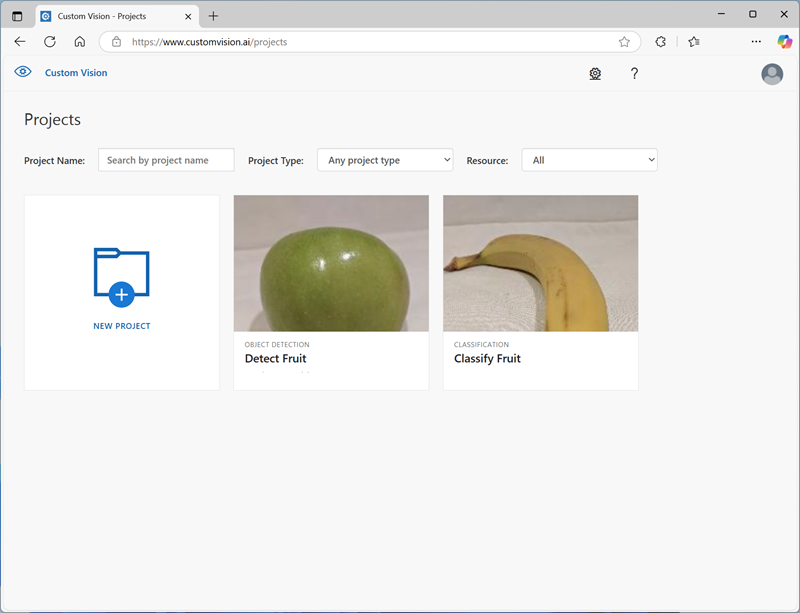

To train an object detection model, you can use the Azure AI Custom Vision portal to upload and label images before training, evaluating, testing, and publishing the model; or you can use the REST API or SDK to write code that performs the training tasks.

The most significant difference between training an *image classification* model and training an *object detection* model is the labeling of the images with tags. While image classification requires one or more tags that apply to the whole image, object detection requires that each label consists of a tag and a *region* that defines the bounding box for each object in an image. The Azure AI Custom Vision portal provides a graphical interface that you can use to label your training images.

