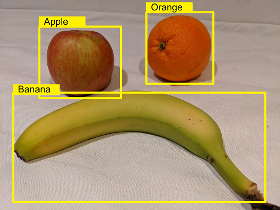
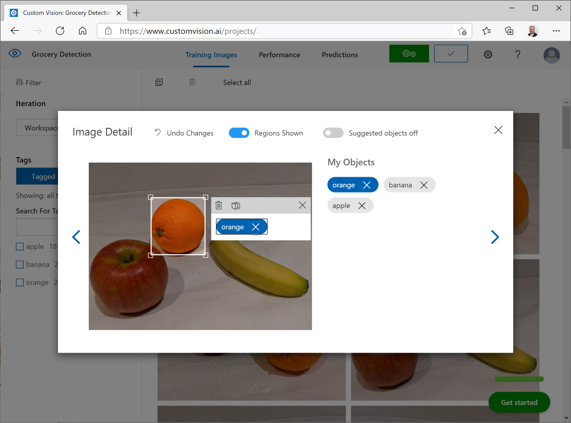

*Object detection* is a form of computer vision in which a model is trained to detect the presence and location of one or more classes of object in an image.

There are two components to an object detection prediction:

- The class label of each object detected in the image. For example, you might ascertain that an image contains an apple, an orange, and a banana.
- The location of each object within the image, indicated as coordinates of a *bounding box* that encloses the object.

To train an object detection model, you can use the Azure AI Custom Vision portal to upload and label images before training, evaluating, testing, and publishing the model; or you can use the REST API or a language-specific SDK to write code that performs the training tasks.

## Image labeling

You can use Azure AI Custom Vision to create projects for *image classification* or *object detection*. The most significant difference between training an image classification model and training an *object detection* model is the labeling of the images with tags. While image classification requires one or more tags that apply to the whole image, object detection requires that each label consists of a tag and a *region* that defines the bounding box for each object in an image.

### Labeling images in the Azure AI Custom Vision portal

The Azure AI Custom Vision portal provides a graphical interface that you can use to label your training images.

The easiest option for labeling images for object detection is to use the interactive interface in the Azure AI Custom Vision portal. This interface automatically suggests regions that contain objects, to which you can assign tags or adjust by dragging the bounding box to enclose the object you want to label.

Additionally, after tagging an initial batch of images, you can train the model. Subsequent labeling of new images can benefit from the *smart labeler* tool in the portal, which can suggest not only the regions, but the classes of object they contain.

### Alternative labeling approaches

Alternatively, you can use a custom or third-party labeling tool, or choose to label images manually, to take advantage of other features, such as assigning image labeling tasks to multiple team members.

If you choose to use a labeling tool other than the Azure AI Custom Vision portal, you may need to adjust the output to match the measurement units expected by the Azure AI Custom Vision API. Bounding boxes are defined by four values that represent the left (X) and top (Y) coordinates of the top-left corner of the bounding box, and the width and height of the bounding box. These values are expressed as *proportional* values relative to the source image size. For example, consider this bounding box:

- Left: 0.1
- Top: 0.5
- Width: 0.5
- Height: 0.25

This defines a box in which the left is located 0.1 (one tenth) from the left edge of the image, and the top is 0.5 (half the image height) from the top. The box is half the width and a quarter of the height of the overall image.

The following image shows labeling information in JSON format for objects in an image.

