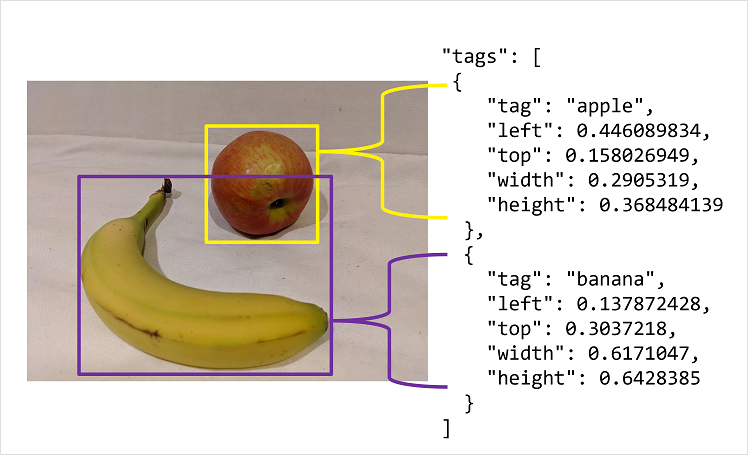

The easiest option for labeling images for object detection is to use the interactive interface in the Azure AI Custom Vision portal. This interface automatically suggests regions that contain objects, to which you can assign tags or adjust by dragging the bounding box to enclose the object you want to label.

Additionally, after tagging an initial batch of images, you can train the model. Subsequent labeling of new images can benefit from the *smart labeler* tool in the portal, which can suggest not only the regions, but the classes of object they contain.

Alternatively, you can use a labeling tool, such as the one provided in [Azure Machine Learning Studio](/azure/machine-learning/how-to-label-data) or the [Microsoft Visual Object Tagging Tool (VOTT)](https://github.com/microsoft/VoTT/blob/master/README.md), to take advantage of other features, such as assigning image labeling tasks to multiple team members.

## Bounding box measurement units

If you choose to use a labeling tool other than the Azure AI Custom Vision portal, you may need to adjust the output to match the measurement units expected by the Azure AI Custom Vision API. Bounding boxes are defined by four values that represent the left (X) and top (Y) coordinates of the top-left corner of the bounding box, and the width and height of the bounding box. These values are expressed as *proportional* values relative to the source image size. For example, consider this bounding box:

- Left: 0.1
- Top: 0.5
- Width: 0.5
- Height: 0.25

This defines a box in which the left is located 0.1 (one tenth) from the left edge of the image, and the top is 0.5 (half the image height) from the top. The box is half the width and a quarter of the height of the overall image.

The following image shows labeling information in JSON format for objects in an image.

