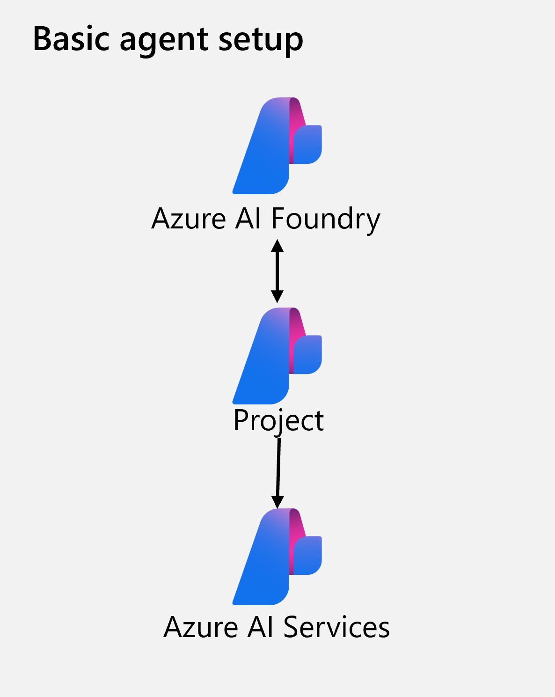

Azure AI Agent Service is a fully managed service designed to empower developers to securely build, deploy, and scale high-quality, extensible AI agents without needing to manage the underlying compute and storage resources. This unit covers the purpose, benefits, key features, and integration capabilities of Azure AI Agent Service.

## Purpose of Azure AI Agent Service

Azure AI Agent Service allows developers to create AI agents tailored to their needs through custom instructions and advanced tools like code interpreters and custom functions. These agents can answer questions, perform actions, or automate workflows by combining generative AI models with tools that interact with real-world data sources. The service simplifies the development process by reducing the amount of code required and managing the underlying infrastructure.

Previously, developers could create an agent-like experience by using standard APIs in Azure AI Foundry and connect to custom functions or other tools, but doing so would take a significant coding effort. Azure AI Agent Service handles all of that for you through AI Foundry to build agents via the portal or in your own app in fewer than 50 lines of code. The exercise in the module explores both methods of building an agent.e

Azure AI Agent Service is ideal for scenarios requiring advanced language models for workflow automation. It can be used to:

- Answer questions using real-time or proprietary data sources.
- Make decisions and perform actions based on user inputs.
- Automate complex workflows by combining generative AI models with tools that interact with real-world data.

For example, an AI agent can be created to generate reports, analyze data, or even interact with users through apps or chatbots, making it suitable for customer support, data analysis, and automated reporting.

## Key features of Azure AI Agent Service

Azure AI Agent Service offers several key features:

- **Automatic tool calling**: The service handles the entire tool-calling lifecycle, including running the model, invoking tools, and returning results.
- **Securely managed data**: Conversation states are securely managed using threads, eliminating the need for developers to handle this manually.
- **Out-of-the-box tools**: The service includes tools for file retrieval, code interpretation, and interaction with data sources like Bing, Azure AI Search, and Azure Functions.
- **Flexible model selection**: Developers can choose from various models, including Azure OpenAI models and others like Llama 3, Mistral, and Cohere.
- **Enterprise-grade security**: The service ensures data privacy and compliance with secure data handling and keyless authentication.
- **Customizable storage solutions**: Developers can use either platform-managed storage or bring their own Azure Blob storage for full visibility and control.

Azure AI Agent Service provides a more streamlined and secure way to build and deploy AI agents compared to developing with the Inference API directly.

## Azure AI Agent Service resources

Azure AI Agent Service is fully managed and designed to help developers build agents without having to worry about underlying resources. Through Azure, AI Foundry and the Agent Service will provision the necessary cloud resources. If desired, you can choose to connect your own resources when building your agent, giving you the flexibility to utilize Azure however works best for you.

At a minimum, you need to create an Azure AI hub with an Azure AI project for your agent. You can add more Azure services as required. You can create the resources using the Azure AI Foundry portal, or you can use [predefined bicep templates](https://github.com/Azure/azure-quickstart-templates/tree/master/quickstarts/microsoft.azure-ai-agent-service) to deploy the resources in your subscription. Two common architectures for Azure AI Agent Service solutions are:

- **Basic agent setup**: A minimal configuration that includes Azure AI hub,  Azure AI project, and Azure AI Services resources.

    

- **Standard agent setup**: A more comprehensive configuration that includes the basic agent setup plus Azure Key Vault, Azure AI Search, and Azure Storage.

    

