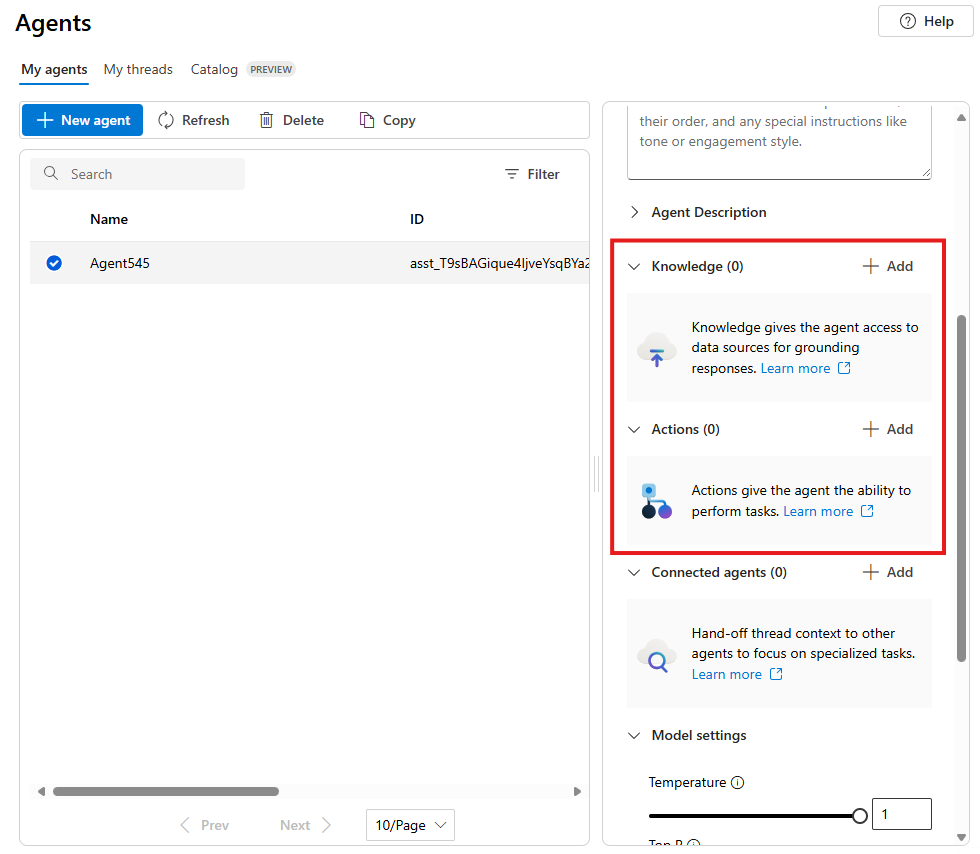
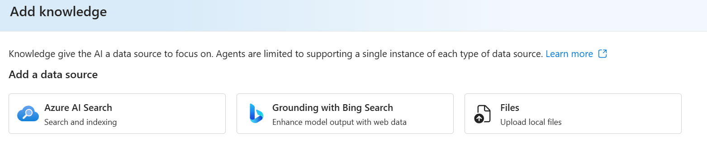

Azure AI Agent Service is a fully managed service designed to empower developers to securely build, deploy, and scale high-quality, extensible AI agents without needing to manage the underlying compute and storage resources. This unit covers the purpose, benefits, key features, and integration capabilities of Azure AI Agent Service.

## Purpose of Azure AI Agent Service

Azure AI Agent Service allows developers to create AI agents tailored to their needs through custom instructions and advanced tools like code interpreters and custom functions. These agents can answer questions, perform actions, or automate workflows by combining generative AI models with tools that interact with real-world data sources. The service simplifies the development process by reducing the amount of code required and managing the underlying infrastructure.

Previously, developers could create an agent-like experience by using standard APIs in Azure AI Foundry and connect to custom functions or other tools, but doing so would take a significant coding effort. Azure AI Agent Service handles all of that for you through AI Foundry to build agents via the portal or in your own app in less than 50 lines of code. The exercise in the module explores both methods of building an agent.

## Key features of Azure AI Agent Service

Azure AI Agent Service offers several key features:

- **Automatic tool calling**: The service handles the entire tool-calling lifecycle, including running the model, invoking tools, and returning results.
- **Securely managed data**: Conversation states are securely managed using threads, eliminating the need for developers to handle this manually.
- **Out-of-the-box tools**: The service includes tools for file retrieval, code interpretation, and interaction with data sources like Bing, Azure AI Search, and Azure Functions.
- **Flexible model selection**: Developers can choose from various models, including Azure OpenAI models and others like Llama 3, Mistral, and Cohere.
- **Enterprise-grade security**: The service ensures data privacy and compliance with secure data handling and keyless authentication.
- **Customizable storage solutions**: Developers can use either platform-managed storage or bring their own Azure Blob storage for full visibility and control.

Azure AI Agent Service provides a more streamlined and secure way to build and deploy AI agents compared to developing with the Inference API directly.

## Setting up your agent

To set up Azure AI Agent Service, follow these steps:

1. **Create an Azure AI Foundry hub and project**: Start by creating an AI hub and project in your Azure subscription.
1. **Deploy a compatible model**: Deploy a model such as GPT-4o to your project.
1. **Define parameters and instructions**: Once the model is deployed, you can define instructions for your agent and connect tools for enhanced functionality.
1. **Call your agent**: Once you're set up, you can chat with your agent in Azure AI Foundry portal or integrate it into your app.

## Tools available to your agent

A lot of the enhanced functionality of an agent comes from the agent's ability to determine when and how to use *tools*. Tools are additional functionality available to your agent, and if the conversation or task warrants the use of one or more of the tools, the agent will call that tool and handle the response.

For example, one of the tools available is the *code interpreter*. This tool enables your agent to run custom code it writes to achieve something, such as MATLAB code to create a graph or solve a data analytics problem.

Available tools are split into two categories:

- **Knowledge tools**: These tools enhance the context or knowledge of your agent. This can include things like Azure AI Search for grounding context (effectively implementing a RAG pattern), uploading files for context, or integrating with Bing to provide real-time data.

    

- **Action tools**: These tools perform an action or run a function. This includes the code interpreter to execute code as well as custom function calling through OpenAPI specifications, Azure Functions, and more.

By connecting built-in and custom tools, you can allow your agent to perform countless tasks on your behalf.

> [!NOTE]
> For more information on integrating Azure AI Agent Service with Azure Functions, refer to the [integration guide](/azure/ai-services/agents/how-to/tools/azure-functions?azure-portal=true).

## Integrating an agent in your app

Azure AI Agent Service provides several SDKs and a REST API for you to integrate agents into your app using your preferred programming language. This module focuses mostly on Python and C#, but the process will be the same for REST or other language SDKs.
