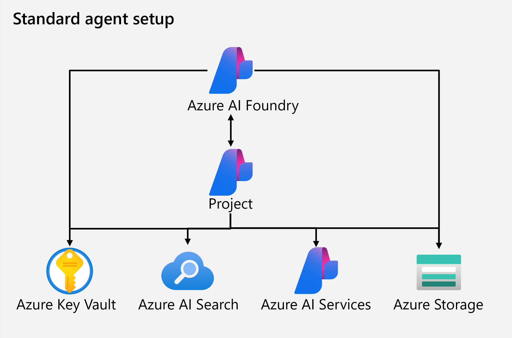

Azure AI Agent Service is a powerful tool that enables developers to create, deploy, and manage AI agents efficiently. This unit covers the scenarios where Azure AI Agent Service is applicable, the benefits of using it, and how to integrate it with other Azure services.

## Where Azure AI Agent Service is applicable

Azure AI Agent Service is ideal for scenarios requiring advanced language models for workflow automation. It can be used to:

- Answer questions using real-time or proprietary data sources.
- Make decisions and perform actions based on user inputs.
- Automate complex workflows by combining generative AI models with tools that interact with real-world data.

For example, an AI agent can be created to generate reports, analyze data, or even interact with users through apps or chatbots, making it suitable for customer support, data analysis, and automated reporting.

### Resource management

Azure AI Agent Service is fully managed and designed to help developers build agents without having to worry about underlying resources. Through Azure, AI Foundry and the Agent Service will provision the necessary cloud resources. If desired, you can choose to connect your own resources when building your agent, giving you flexibility to utilize Azure however works best for you.

### Simplified code

Previous solutions to achieve an agent-like experience took hundreds of lines of code to do things like referencing grounding data or connecting to a custom function. The Agent Service now simplifies all of that, supporting client side function calling with just a few lines of code and connections to Azure Functions or an OpenAPI defined tool.

## Agent building options

Azure AI Agent Service offers several advantages to building agents, but isn't always the best solution for your use case. For example, if you're trying to build an integration with Microsoft 365 you might choose the Copilot Studio agent builder and if you're trying to orchestrate multiple agents, you might choose the Semantic Kernel Agents Framework.

This [Fundamentals of AI Agents](/training/modules/ai-agent-fundamentals/3-agent-development) unit explores more of the options for building agents.

## Integration with other Azure services

Integrating Azure AI Agent Service with other Azure services enhances its functionality. For example, the Agent Service can connect to:

- **Azure Functions**: Azure AI Agent Service integrates with Azure Functions to create intelligent, event-driven applications. Triggers and bindings in Azure Functions allow AI agents to interact dynamically with external systems.
- **Azure Storage**: Use Azure Storage for managing user-provided grounding data files and storing data securely.
- **Azure AI Search**: Integrate with Azure AI Search to ground AI agents with relevant enterprise knowledge.

Connections to other services can be done within the agent like any other Azure connected app using each service's APIs.
