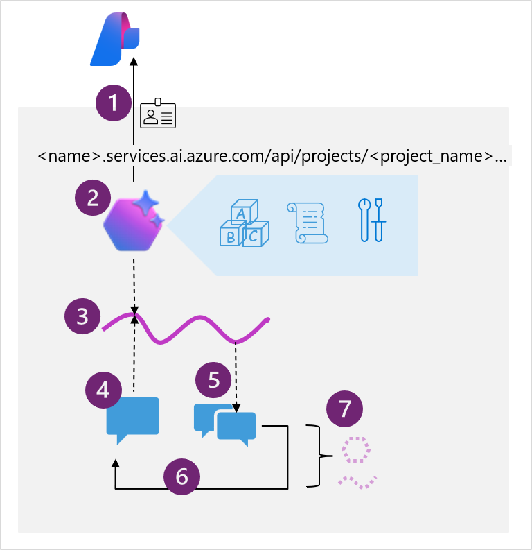

Previous solutions to achieve an agent-like experience took hundreds of lines of code to do things like referencing grounding data or connecting to a custom function. The Agent Service now simplifies all of that, supporting client-side function calling with just a few lines of code and connections to Azure Functions or an OpenAPI defined tool.

> [!NOTE]
> Azure AI Agent Service offers several advantages to building agents, but isn't always the right solution for your use case. For example, if you're trying to build an integration with Microsoft 365 you might choose the Copilot Studio agent builder and if you're trying to orchestrate multiple agents, you might choose the Semantic Kernel Agents Framework.
> 
> This [Fundamentals of AI Agents](/training/modules/ai-agent-fundamentals/3-agent-development) unit explores more of the options for building agents.

## Developing apps that use agents

Azure AI Agent Service provides several SDKs and a REST API for you to integrate agents into your app using your preferred programming language. The exercise later in this module focuses on Python, but the overall pattern is the same for REST or other language SDKs.

The diagram shows the following high-level steps that you must implement in your code:

1. Connect to the *AI Foundry project* for your agent, using the project connection string and Entra ID authentication.
2. Get a reference to an existing agent that you created in the Azure AI Foundry portal, or create a new one specifying:
    - The *model deployment* in the project that the agent should use to interpret and respond to prompts.
    - *Instructions* that determine the functionality and behavior of the agent.
    - *Tools and resources* that the agent can use to perform tasks.
3. Create a *thread* for a chat session with the agent. All conversations with an agent are conducted on a stateful thread that retains message history and data artifacts generated during the chat.
4. Add *messages* to the thread and invoke it with the agent.
5. Check the thread *status*, and when ready, retrieve the messages and data artifacts.
6. Repeat the previous two steps as a *chat loop* until the conversation can be concluded.
7. When finished, delete the agent and the thread to clean up the resources and delete data that is no longer required.

> [!NOTE]
> You'll get a chance to put this pattern into action in the exercise later in this module.

## Tools available to your agent

Much of the enhanced functionality of an agent comes from the agent's ability to determine when and how to use *tools*. Tools make additional functionality available to your agent, and if the conversation or task warrants the use of one or more of the tools, the agent calls that tool and handle the response.

You can assign tools when creating an agent in the Azure AI Foundry portal, or when defining an agent in code using the SDK.

For example, one of the tools available is the *code interpreter*. This tool enables your agent to run custom code it writes to achieve something, such as MATLAB code to create a graph or solve a data analytics problem.

Available tools are split into two categories:

### Knowledge tools

Knowledge tools enhance the context or knowledge of your agent. Available tools include:

- **Bing Search**: Uses Bing search results to ground prompts with real-time live data from the web.
- **File search**: Grounds prompts with data from files in a vector store.
- **Azure AI Search**: Grounds prompts with data from Azure AI Search query results.
- **Microsoft Fabric**: Uses the Fabric Data Agent to ground prompts with data from your Fabric data stores.

> [!TIP]
> You can also integrate third-party licensed data by using the OpenAPI Spec action tool (discussed below).

### Action tools

Action tools perform an action or run a function. Available tools include:

- **Code Interpreter**: A sandbox for model-generated Python code that can access and process uploaded files.
- **Function**: Call your custom function code – you must provide function definitions and implementations.
- **Azure Function**: Call code in serverless Azure Functions.
- **OpenAPI Spec**: Call external APIs based on the OpenAPI 3.0 spec.

By connecting built-in and custom tools, you can allow your agent to perform countless tasks on your behalf.

