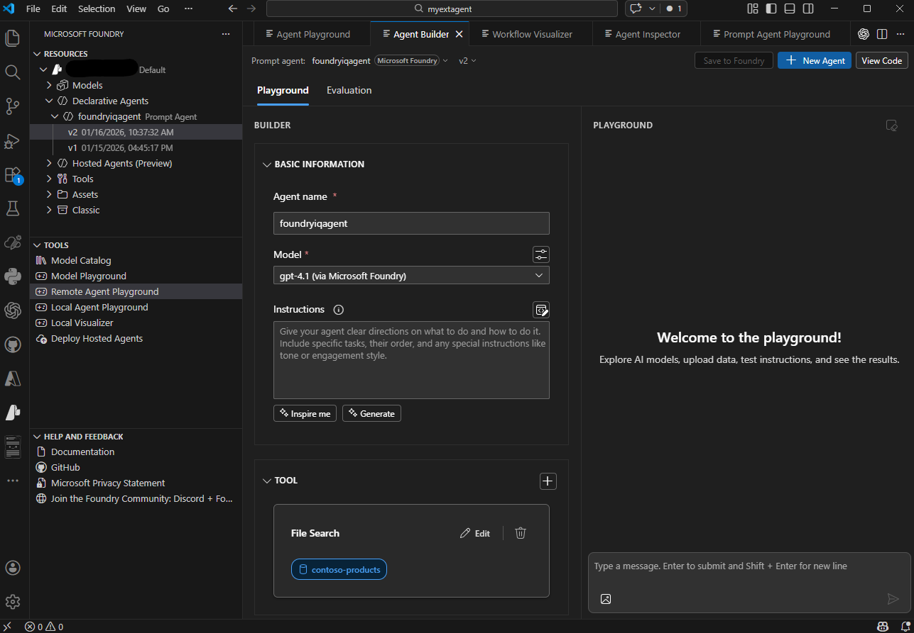

Microsoft Foundry Agent Service provides flexibility in how you develop agents, with options ranging from visual interfaces to code-centric workflows. Understanding the different development approaches helps you choose the right tools for your scenarios and team preferences.

## Foundry portal development

The Foundry portal provides a web-based interface for creating and managing AI agents without writing code. This approach is ideal when you want to quickly prototype ideas, collaborate with non-technical stakeholders, or manage agents through a centralized interface.

### When to use the Foundry portal

The portal excels in these scenarios:

- **Quick prototyping** - Rapidly test agent concepts and configurations without setting up development environments
- **Visual configuration** - Configure agents through intuitive forms and dropdowns rather than code
- **Centralized management** - View and manage all agents across projects in one place
- **Team collaboration** - Share agent configurations with stakeholders who prefer visual interfaces
- **Resource oversight** - Monitor token usage, latency, and evaluation outcomes through dashboards

The Azure portal provides immediate access to agent creation without installing additional tools. You simply navigate to your Foundry project, select the Agents section, and start building.

## Visual Studio Code development

The Microsoft Foundry extension for Visual Studio Code brings enterprise-grade AI capabilities directly into your development environment. This approach suits developers who prefer working in familiar code editors and want tight integration with their development workflows.

### Key capabilities of the VS Code extension

The extension provides comprehensive agent development features:

**Agent discovery and management** - Browse, create, and manage AI agents within your Microsoft Foundry projects directly from VS Code.

**Visual agent designer** - Use an intuitive interface to configure agent instructions, tools, and capabilities without leaving your editor.

**Integrated testing** - Test agents in real-time using the built-in playground without switching contexts or opening additional applications.

**Code generation** - Generate sample integration code to connect agents with your applications, accelerating the path from prototype to production.

**Deployment pipeline** - Deploy agents directly to Microsoft Foundry for production use through streamlined commands.

**YAML configuration** - Access and edit agent configuration files directly, providing both visual and code-based workflows.

### When to use Visual Studio Code

The VS Code extension is ideal for:

- **Developer-centric workflows** - Build agents alongside your application code in a single environment
- **Version control integration** - Track agent configurations in Git alongside your codebase
- **Rapid iteration** - Make quick changes and test immediately without switching tools
- **Code-first development** - Edit YAML configurations directly for precise control
- **Local development** - Work on agent designs offline before deploying to Azure

The extension installs directly from the Visual Studio Code Marketplace and connects to your existing Foundry projects.

### Extension installation

To get started with the Microsoft Foundry for Visual Studio Code extension:

1. Open Visual Studio Code
1. Select Extensions from the left pane, or press <kbd>Ctrl</kbd>+<kbd>Shift</kbd>+<kbd>X</kbd>
1. Search for and select **Microsoft Foundry**
1. Select **Install**
1. Verify the extension installed successfully from the status messages

## Typical development workflow

Regardless of your chosen approach, agent development follows a consistent pattern:

1. **Connect** to your Microsoft Foundry project
1. **Create** an AI agent with a descriptive name and purpose
1. **Configure** agent instructions defining its behavior and capabilities
1. **Add tools** to extend what the agent can do
1. **Test** the agent using integrated playgrounds
1. **Iterate** on the design based on test results
1. **Deploy** the agent to production
1. **Integrate** the agent into your applications

The Foundry portal and VS Code extension both support this workflow, differing primarily in interface style rather than capabilities.

## Required Azure resources

Both development approaches require the same underlying Azure resources. To develop agents with Microsoft Foundry Agent Service, you need:

- **Microsoft Foundry project** - Organizes your agents, models, and related assets in one place
- **Model deployments** - Deployed AI models (such as GPT-4.1 or Claude Sonnet 4.6) that power your agents

When you create a Microsoft Foundry project, the necessary infrastructure is provisioned automatically. As you add capabilities to your agents, such as File Search or custom tools, the service seamlessly integrates any required supporting services behind the scenes. If you choose to extend the capabilities of your agent even further, for example with Foundry IQ, you may need to deploy some addition Azure services.

### Optional Azure services

Depending on your agent's capabilities, you might integrate additional Azure services:

- **Azure AI Search** - For advanced knowledge retrieval when using Foundry IQ or File Search tools
- **Azure Storage** - For storing and managing files that agents can access
- **Azure Key Vault** - For securely managing secrets and credentials
- **Azure Functions** - For custom tool implementations and business logic

These services integrate with your Foundry project as needed, but aren't required to get started building agents.

## Choosing your development approach

Both the Foundry portal and Visual Studio Code extension provide complete agent development capabilities. Your choice depends on your workflow preferences, team composition, and integration requirements:

Choose the **Foundry portal** when you want visual configuration, centralized management, or quick prototyping without local development setup.

Choose **Visual Studio Code** when you prefer developer-centric workflows, need tight integration with application code, or want version-controlled configuration files.

Many teams use both approaches — the portal for initial exploration and stakeholder reviews, and VS Code for detailed development and production deployments. The flexibility to switch between approaches based on your immediate needs is a key strength of Microsoft Foundry Agent Service.
