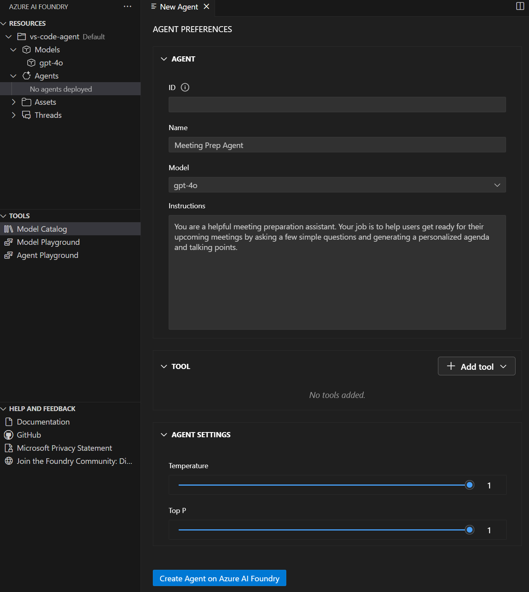

Setting up Visual Studio Code for AI agent development brings enterprise-grade capabilities directly into your familiar development environment. The Microsoft Foundry extension transforms VS Code into a comprehensive platform for building, testing, and deploying agents without leaving your editor.

## Understanding the Microsoft Foundry extension

The Microsoft Foundry for Visual Studio Code extension provides direct access to Microsoft Foundry Agent Service capabilities. This extension creates an integrated experience for agent development that combines visual design tools with code-based configuration.

### Core capabilities

The extension offers several key features that streamline agent development:

**Agent discovery and management** - Browse, create, and manage AI agents within your Microsoft Foundry projects. View all your agents in the Azure Resources explorer without opening a browser.

**Visual agent designer** - Configure agent instructions, tools, and capabilities through an intuitive interface. The designer provides the same power as the Foundry portal while keeping you in your development environment.

**Integrated testing** - Test agents in real-time using the built-in playground. Verify behavior and iterate on designs without switching contexts or tools.

**Code generation** - Generate sample integration code to connect agents with your applications. The extension creates ready-to-use code snippets that accelerate implementation.

**Deployment pipeline** - Deploy agents directly to Microsoft Foundry for production use. Simple commands handle the deployment process, providing feedback about status and results.

**Dual configuration modes** - Work with both visual interfaces and direct YAML editing. Switch between modes based on your immediate needs and preferences.


## Installing and configuring the extension

Setting up the Microsoft Foundry extension takes just a few minutes and requires minimal configuration.

### Installation steps

1. Open Visual Studio Code on your machine
1. Select **Extensions** from the left pane, or press <kbd>Ctrl</kbd>+<kbd>Shift</kbd>+<kbd>X</kbd> (Windows/Linux) or <kbd>Cmd</kbd>+<kbd>Shift</kbd>+<kbd>X</kbd> (Mac)
1. Search for **Microsoft Foundry** in the marketplace search box
1. Select the **Microsoft Foundry** extension from the results
1. Select **Install** to add the extension to VS Code
1. Wait for installation to complete (status appears in the Extensions panel)

After installation, the Microsoft Foundry icon appears in the VS Code activity bar on the left side of the window.

### Connecting to Azure

Before creating agents, connect the extension to your Azure account and project:

1. Select the **Microsoft Foundry** icon in the VS Code activity bar
1. Select **Sign in to Azure** when prompted
1. Complete authentication in your browser
1. Return to VS Code after successful authentication
1. Select your **Azure subscription** from the dropdown
1. Choose your **Microsoft Foundry project** or create a new one

The extension now displays your project resources, including existing agents, model deployments, and other assets.

## Preparing for agent development

Before creating your first agent in VS Code, ensure you have the necessary resources deployed.

### Deploying a model

Agents require deployed AI models to function. If you don't have a model deployment yet:

1. In the **Microsoft Foundry** extension, navigate to the **Resources** section
1. Expand the **Model deployments** subsection
1. Select the **+** (plus) icon to create a new deployment
1. Choose a model (such as GPT-4o or GPT-4) from the available options
1. Configure deployment settings:
   - **Deployment name**: Enter a descriptive name you'll use when configuring agents
   - **Model version**: Select the specific model version
   - **Capacity settings**: Configure throughput based on your needs
1. Select **Deploy** and wait for deployment to complete

The deployed model becomes available in dropdown menus when you create or configure agents.

## Creating your first agent in VS Code

With the extension configured and a model deployed, you're ready to create an agent.

### Agent creation process

1. In the **Microsoft Foundry** extension, navigate to the **Resources** section
1. Find the **Agents** subsection
1. Select the **+** (plus) icon next to Agents
1. The extension opens two views:
   - **Agent Designer**: A visual interface for configuration
   - **YAML file**: The agent's configuration in code format



Both views remain synchronized; changes in one automatically update the other. This dual approach lets you work with whichever format feels more natural for your current task.

## Understanding the development workflow

The Microsoft Foundry extension supports an efficient development workflow:

1. **Create or import** agents using the visual designer or existing YAML files
1. **Configure** agent properties, instructions, and capabilities
1. **Test** immediately using the integrated playground
1. **Iterate** on design based on test results
1. **Deploy** to Azure with a single command
1. **Generate integration code** for your applications
1. **Monitor** deployed agents through the Azure Resources view

This workflow eliminates context switching between tools, keeping you focused on agent development rather than infrastructure management.

## Working with agent YAML files

While the visual designer provides an accessible interface, the YAML files give you direct access to agent configuration. Understanding YAML structure helps you make precise changes and version control your agents effectively.

### Basic YAML structure

Here's a typical agent YAML file:

```yaml
# yaml-language-server: $schema=https://aka.ms/ai-foundry-vsc/agent/1.0.0
version: 1.0.0
name: customer-service-agent
description: Handles customer inquiries and appointment scheduling
id: ''
metadata:
  authors:
    - your-name
  tags:
    - customer-service
    - healthcare
model:
  id: 'gpt-4o-deployment'
  options:
    temperature: 0.7
    top_p: 1
instructions: |
  You're a helpful customer service agent for a healthcare organization.
  Assist patients with scheduling appointments and answering questions.
tools: []
```

The YAML format is straightforward, with clear sections for each aspect of your agent's configuration. You can edit this file directly or use the visual designer—both approaches modify the same underlying configuration.

### Benefits of YAML configuration

Direct YAML editing provides several advantages:

- **Version control** - Track changes in Git alongside your application code
- **Bulk updates** - Make multiple changes simultaneously with confidence
- **Templates** - Create reusable agent templates for consistent configurations
- **Code review** - Include agent configurations in your standard code review processes
- **Automation** - Build scripts that generate or modify agent configurations programmatically

The extension validates YAML syntax in real-time, highlighting errors and providing suggestions as you type.

## Managing multiple agents

As your projects grow, you'll likely manage multiple agents with different purposes. The Microsoft Foundry extension makes this straightforward:

- **Browse agents** in the Resources view organized by project
- **Switch between agents** by selecting them from the list
- **Compare configurations** by opening multiple YAML files side by side
- **Duplicate agents** to create variations without starting from scratch
- **Archive unused agents** to keep your workspace organized

The extension maintains a clear view of all your agents, making it easy to navigate between different automation projects.

Setting up Visual Studio Code for agent development provides a powerful, integrated environment that accelerates the entire development lifecycle. With the Microsoft Foundry extension, you gain enterprise-grade agent development capabilities without leaving your familiar code editor, enabling rapid iteration and seamless deployment of intelligent automation.
