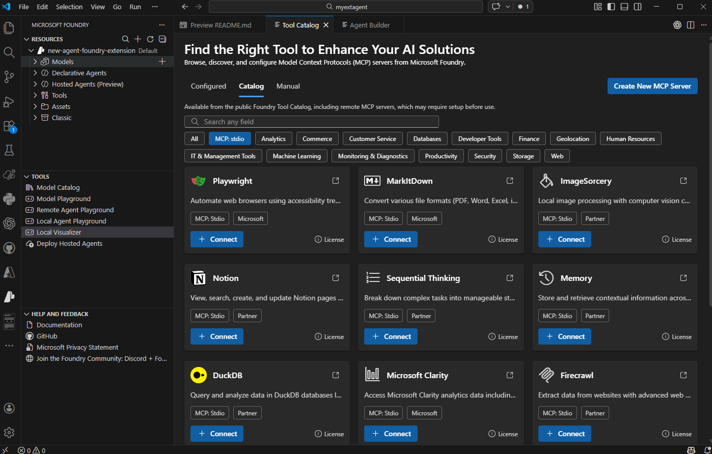

One of the most powerful features of AI agents is their ability to use tools that extend their capabilities beyond text generation. Tools enable agents to perform actions, access data, and integrate with external systems. Microsoft Foundry provides built-in tools and supports custom integrations, transforming agents from simple chat interfaces into sophisticated automation systems.

## Understanding agent tools

Tools are programmatic functions that agents can invoke to complete tasks. When an agent determines that a tool is needed to respond to a user request, it automatically calls the appropriate tool, processes the results, and incorporates them into its response. This capability enables agents to work with real-time data, execute code, search knowledge bases, and interact with external services.

The tool-calling lifecycle happens automatically:
1. User sends a message to the agent
1. Agent analyzes the request and determines which tools (if any) are needed
1. Agent invokes the appropriate tools with relevant parameters
1. Tools execute and return results
1. Agent incorporates results into a natural language response
1. Response is returned to the user

This seamless integration means you can add powerful capabilities to agents without writing complex orchestration code.

## Built-in tools overview

Microsoft Foundry provides a **tool catalog** that organizes available tools into three categories: **Configured** (ready-to-use built-in tools), **Catalog** (additional tools you can add from a registry including MCP servers), and **Custom** (your own tools via OpenAPI specifications or custom implementations). You can access the tool catalog through **Build > Tools** in the portal or through the VS Code extension.

The following are some of the most commonly used tools.

### Code Interpreter

Code Interpreter enables agents to write and execute Python code in a secure, sandboxed environment. Use it for mathematical calculations, data analysis, chart generation, file processing, and complex problem-solving. For example, if a user asks an agent to "calculate the compound interest on a $10,000 investment at 5% annual rate over 10 years," the agent writes and executes Python code to compute the exact result.

### File Search

File Search provides retrieval-augmented generation (RAG) by allowing agents to search through documents you've uploaded. The tool indexes your documents in a **vector store** and retrieves relevant information when needed, grounding agent responses in your specific knowledge base.

File Search supports PDF, Word (.docx), plain text (.txt), Markdown (.md), and other formats. When you add File Search to an agent, you create or select a vector store, upload documents, and the system automatically indexes them for semantic search.

### Bing Web Search

Bing Web Search connects your agent to real-time internet information, enabling access to current events, trending topics, and information beyond training data. It includes automatic citation generation, so agents can reference their sources.

### Azure AI Search

Azure AI Search provides advanced knowledge retrieval from your existing search indexes. Unlike File Search (which works with documents uploaded directly to the agent), Azure AI Search connects to enterprise-scale indexed data sources for structured and unstructured search scenarios.

### OpenAPI tools

OpenAPI tools allow agents to interact with external APIs defined by OpenAPI 3.0 specifications, connecting your agents to web services and enterprise systems. You provide the specification, and Microsoft Foundry handles parameter mapping and response parsing.

### Additional built-in tools

The tool catalog includes many more tools for specialized scenarios:

| Tool | Description |
|------|-------------|
| **Browser Automation** | Interact with web pages, fill forms, and extract content |
| **Computer Use** | Interact with desktop applications |
| **Image Generation** | Create images based on text descriptions |
| **SharePoint** | Access SharePoint content and document libraries |
| **Microsoft Fabric** | Connect to Fabric data agents for data analytics |
| **Deep Research** | Perform in-depth research across multiple sources |
| **Agent-to-Agent** | Delegate tasks to other agents |
| **Custom Code Interpreter** | Customizable code execution for specialized environments |

The tool catalog continues to expand. Check the Foundry portal for the latest available tools.

## Adding tools in Visual Studio Code

The Microsoft Foundry extension provides an intuitive interface for adding and configuring tools. You can add tools through either the visual designer or by editing the YAML file directly.

### Using the visual designer

To add tools through the Agent Designer:

1. Open your agent in the Agent Designer
1. Navigate to the **Tools** section in the configuration panel
1. Select **Add Tool** or the **+** icon
1. Browse the available tools in the tool library
1. Select the tool you want to add
1. Configure tool-specific settings if required
1. Save your changes



When you add certain tools, the extension prompts you to configure related assets. For example, adding File Search lets you create or select a vector store for document indexing.

### Adding tools through YAML

You can also add tools by editing the agent YAML file directly. This approach works well when you know exactly which tools you need or want to apply changes from templates.

Here's an example YAML configuration with multiple tools:

```yaml
version: 1.0.0
name: research-assistant
description: Helps with research tasks using code analysis and web search
model:
  id: 'gpt-4o-deployment'
instructions: |
  You're a research assistant helping users gather and analyze information.
  Use Code Interpreter for data analysis and Bing Search for current information.
tools:
  - type: code_interpreter
  - type: bing_grounding
    bing_grounding:
      connection_id: "your-connection-id"
  - type: file_search
    file_search:
      vector_store_ids:
        - "vectorstore-123"
```

The tools array lists each enabled tool with its configuration. Some tools require additional parameters like connection IDs or vector store references.

## Model Context Protocol (MCP) servers

Model Context Protocol (MCP) provides a standardized way to add custom tools to agents. MCP servers are available through the **Catalog** section of the tool catalog and offer reusable tool interfaces that work consistently across different agent implementations.

### Types of MCP servers

The Foundry tool catalog supports three types of MCP servers:

- **Remote MCP servers** - Hosted externally and accessed over the network. These are the most common type for production scenarios.
- **Local MCP servers** - Run on your local machine during development. Useful for testing custom tools before deploying.
- **Custom MCP servers** - Your own MCP server implementations tailored to specific needs.

### Benefits of MCP servers

MCP servers provide several advantages:

**Standardized protocol** - Consistent tool communication patterns make integration predictable and reliable.

**Reusable components** - Build tools once and use them across multiple agents and projects.

**Community-driven tools** - Access tools built by the community through MCP registries, expanding capabilities without custom development.

**Simplified integration** - Consistent interfaces reduce integration complexity and maintenance burden.

### Using MCP servers in VS Code

The Microsoft Foundry extension supports MCP server integration:

1. Browse available MCP servers through the extension's tool registry
1. Add MCP servers to your agent configuration
1. Configure server-specific settings and parameters
1. Test MCP server functionality in the integrated playground
1. Deploy agents with MCP server integrations to production

MCP servers extend your agent's capabilities with specialized functions while maintaining a consistent development experience.

## Tool configuration best practices

Effective tool management ensures reliable agent performance:

- **Start with built-in tools** before building custom solutions. Built-in tools are tested, maintained, and optimized for the platform.
- **Match tools to requirements** - List what your agent needs to do and select tools accordingly. Don't add tools without clear purposes, as each tool adds latency.
- **Provide clear instructions** - Tell your agent when and how to use each tool (for example, "Use Code Interpreter for any mathematical calculations") and when *not* to use them.
- **Keep knowledge bases current** - When using File Search, update documents regularly. Outdated information leads to incorrect responses.
- **Test tool behavior** thoroughly using the integrated playground. Send messages that should trigger tool usage, verify correct invocation, and test error scenarios.

Agents can use multiple tools together to handle complex scenarios. For example, a research agent might use Bing Web Search to gather current information, Code Interpreter to analyze data, and File Search to reference internal documentation — all orchestrated automatically based on the user's request.

Extending agent capabilities with tools transforms simple chat interfaces into powerful automation systems. By combining built-in tools with custom integrations and MCP servers, you can create agents that seamlessly interact with your data, systems, and services while maintaining enterprise-grade security and reliability.

More in-depth discussion on both tools and MCP servers can be found later modules.