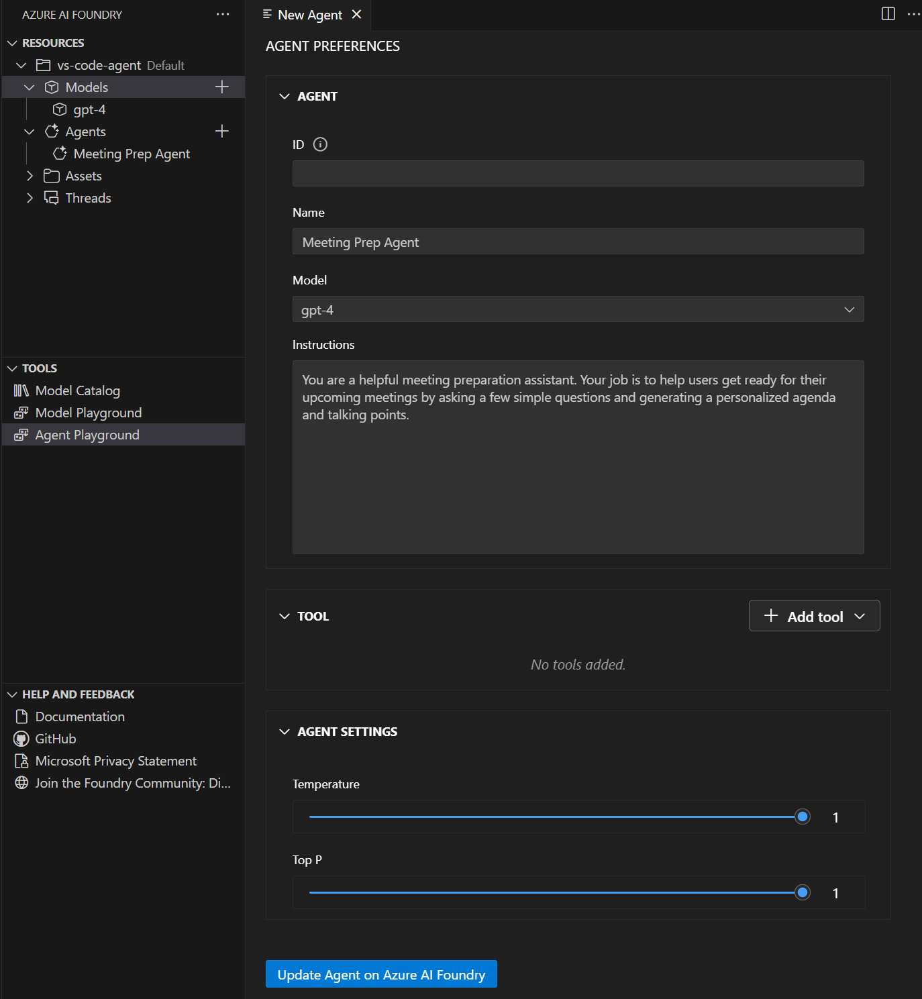

The Azure AI Foundry for Visual Studio Code extension transforms your development environment into a comprehensive platform for building, testing, and deploying AI agents. This extension provides direct access to the capabilities of Azure AI Foundry's Agent Service without leaving your code editor, streamlining the entire agent development workflow.

## What is the Azure AI Foundry for Visual Studio Code extension?

The Azure AI Foundry for Visual Studio Code extension is a powerful tool that brings enterprise-grade AI agent development capabilities directly into Visual Studio Code. It provides an integrated experience for:

- **Agent Discovery and Management** - Browse, create, and manage AI agents within your Azure AI Foundry projects
- **Visual Agent Designer** - Use an intuitive interface to configure agent instructions, tools, and capabilities
- **Integrated Testing** - Test agents in real-time using the built-in playground without switching contexts
- **Code Generation** - Generate sample integration code to connect agents with your applications
- **Deployment Pipeline** - Deploy agents directly to Azure AI Foundry for production use

## Key features and capabilities

The extension offers several key features that accelerate AI agent development:

### Agent Designer Interface
A visual designer that simplifies agent creation and configuration. You can define agent instructions, select appropriate models, and configure tools through an intuitive graphical interface.

### Built-in Playground
An integrated testing environment where you can interact with your agents in real-time, test different scenarios, and refine agent behavior before deployment.

### Tool Integration
Seamless integration with various tools including:
- **RAG (Retrieval-Augmented Generation)** for knowledge-based responses
- **Search capabilities** for information retrieval
- **Custom actions** for specific business logic
- **Model Context Protocol (MCP) servers** for extended functionality

### Project Integration
Direct connection to your Azure AI Foundry projects, allowing you to work with existing resources and deploy new agents to your established infrastructure.

## Installing the extension

To get started with the Azure AI Foundry for Visual Studio Code extension, first you need to have Visual Studio Code installed on your machine. You can download it from the [Visual Studio Code website](https://code.visualstudio.com/).

You can install the Azure AI Foundry extension directly from the Visual Studio Code Marketplace: 
1. Open Visual Studio Code.
1. Select Extensions from the left pane, or press <kbd>Ctrl</kbd>+<kbd>Shift</kbd>+<kbd>X</kbd>.
1. Search for and select Azure AI Foundry.
1. Select Install.
1. Verify the extension is installed successfully from the status messages.

## Getting started workflow

The typical workflow for using the Azure AI Foundry extension follows these steps:

1. **Install and configure** the extension in Visual Studio Code
1. **Connect** to your Azure AI Foundry project
1. **Create or import** an AI agent using the designer
1. **Configure** agent instructions and add necessary tools
1. **Test** the agent using the integrated playground
1. **Iterate** on the design based on test results
1. **Generate code** for application integration

This streamlined workflow enables rapid prototyping and deployment of AI agents, making it easier for developers to build intelligent automation solutions that can handle complex real-world tasks.

The Azure AI Foundry for Visual Studio Code extension represents a significant step forward in making AI agent development more accessible and efficient, providing developers with enterprise-grade tools in a familiar development environment.