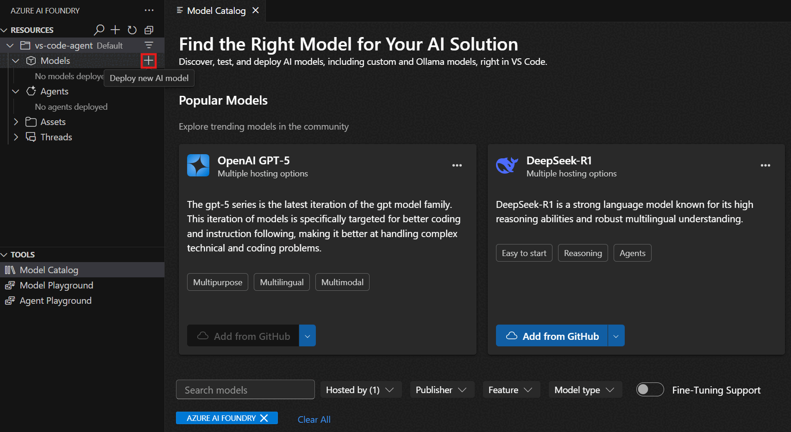
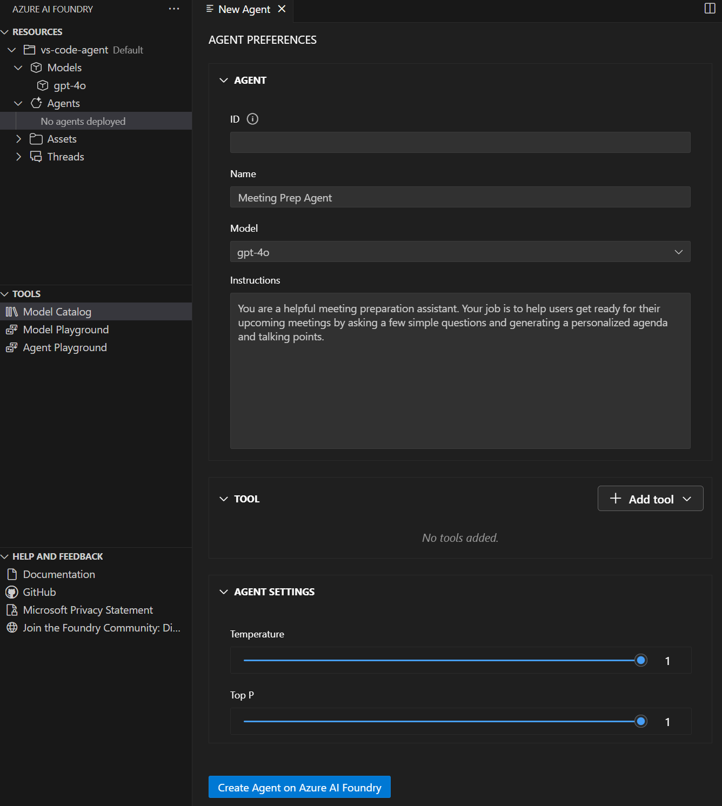

Creating and configuring AI agents in Visual Studio Code using the Azure AI Foundry extension provides a streamlined development experience that combines the power of Azure AI Foundry Agent Service with the familiar Visual Studio Code environment. This approach enables you to design, configure, and test agents without leaving your development environment.

## Understanding Azure AI Foundry Agent Service

Azure AI Foundry Agent Service is a managed service in Azure designed to provide a comprehensive framework for creating, managing, and deploying AI agents. The service builds on the OpenAI Assistants API foundation while offering enhanced capabilities including:

- **Expanded model choice** - Support for multiple AI models beyond OpenAI
- **Enterprise security** - Built-in security features for production environments
- **Advanced data integration** - Seamless connection to Azure data services
- **Tooling ecosystem** - Access to a variety of built-in and custom tools

The Visual Studio Code extension provides direct access to these capabilities through an intuitive interface that simplifies the agent development process.

## Creating agents with the extension

The Azure AI Foundry extension provides multiple ways to create AI agents, whether you're starting from scratch or building on existing work. The flexible approach accommodates different development preferences and scenarios.

### Prerequisites for agent creation

Before creating an agent, complete the following steps:

1. Complete the extension setup and sign in to your Azure account
1. Create a default Azure AI Foundry project, or select an existing one
1. Select and deploy the model your agent will use, or use an existing deployment 



### Creating a new agent

To create a new AI agent, follow these steps:

1. Open the Azure AI Foundry Extension view in Visual Studio Code
1. Navigate to the Resources section
1. Select the **+** (plus) icon next to the Agents subsection to create a new AI agent
1. Configure the agent properties in the Agent Designer view that opens

When you create an agent, the extension opens both the agent .yaml file and the Designer view, providing you with both a visual interface and direct access to the configuration file.



## Configuring agent properties

Once you've created an agent, the extension provides comprehensive configuration options to define how your agent behaves and interacts with users. The Agent Designer provides an intuitive interface for setting up these properties.

### Basic Configuration

In the Agent Designer, configure the following essential properties:

- **Agent name** - Enter a descriptive name for your agent in the prompt
- **Model selection** - Choose your model deployment from the dropdown (this is the deployment name you chose when deploying a model)
- **Description** - Add a clear description of what your agent does
- **System instructions** - Define the agent's behavior, personality, and response style
- **Agent ID** - Automatically generated by the extension

### Understanding the agent YAML file

Your AI agent is defined in a YAML file that contains all configuration details. Here's an example structure:

```yaml
# yaml-language-server: $schema=https://aka.ms/ai-foundry-vsc/agent/1.0.0
version: 1.0.0
name: my-agent
description: Description of the agent
id: ''
metadata:
  authors:
    - author1
    - author2
  tags:
    - tag1
    - tag2
model:
  id: 'gpt-4o-1'
  options:
    temperature: 1
    top_p: 1
instructions: Instructions for the agent
tools: []
```

This YAML file is opened automatically alongside the Designer view, allowing you to work with either the visual interface or edit the configuration directly.

## Agent instruction design

Well-crafted instructions are the foundation of effective AI agents. They define how your agent understands its role, responds to users, and handles various scenarios.

### Best practices for instructions

When writing system instructions for your agent:
- **Be specific and clear** - Define exactly what the agent should do and how it should behave
- **Provide context** - Explain the agent's role and the environment it operates in
- **Set boundaries** - Clearly define what the agent should and shouldn't do
- **Include examples** - Show the agent examples of desired interactions when helpful
- **Define personality** - Establish the tone and style of responses

### Instruction examples

For a customer service agent, effective instructions might include:
- The agent's role and purpose
- Guidelines for handling different types of customer inquiries
- Escalation procedures for complex issues
- Tone and communication style preferences

## Deploying agents

Once you've configured your agent, you can deploy it to Azure AI Foundry.

### Deployment process

To deploy your agent:

1. **Select the "Create on Azure AI Foundry" button** in the bottom-left of the Designer
2. **Wait for deployment completion** - The extension handles the deployment process
3. **Refresh the Azure Resources view** in the VS Code navbar
4. **Verify deployment** - The deployed agent appears under the Agents subsection

### Managing deployed agents

After deployment, you can:
- **View agent details** - Select the deployed agent to see the Agent Preferences page
- **Edit the agent** - Select "Edit Agent" to modify configuration and redeploy with the **Update on Azure AI Foundry** button
- **Generate integration code** - Select "Open Code File" to create sample code for using the agent
- **Test in playground** - Select "Open Playground" to interact with the deployed agent

## Testing and iteration

The integrated playground enables immediate testing of your agent configuration, allowing you to validate behavior and make adjustments in real-time.

### Using the playground

After configuring your agent, you can test it using the built-in playground:
- **Real-time conversations** - Chat with your agent to test responses
- **Instruction validation** - Verify the agent follows its configured instructions
- **Behavior testing** - Test how the agent handles different types of requests
- **Iterative refinement** - Make adjustments based on testing results

## Working with agent threads

When you interact with deployed agents, the system creates threads to manage conversation sessions:

- **Threads** - Conversation sessions between an agent and user that store messages and handle context management
- **Messages** - Individual interactions that can include text, images, and files
- **Runs** - Single executions of an agent that use the agent's configuration and thread messages

You can view and manage these threads through the Azure Resources view in the extension.

Creating and configuring AI agents with the Azure AI Foundry Visual Studio Code extension provides a powerful yet accessible approach to agent development. The combination of visual design tools, direct YAML editing, comprehensive configuration options, and integrated testing capabilities enables developers to rapidly prototype and deploy sophisticated AI agents that can handle complex real-world scenarios.