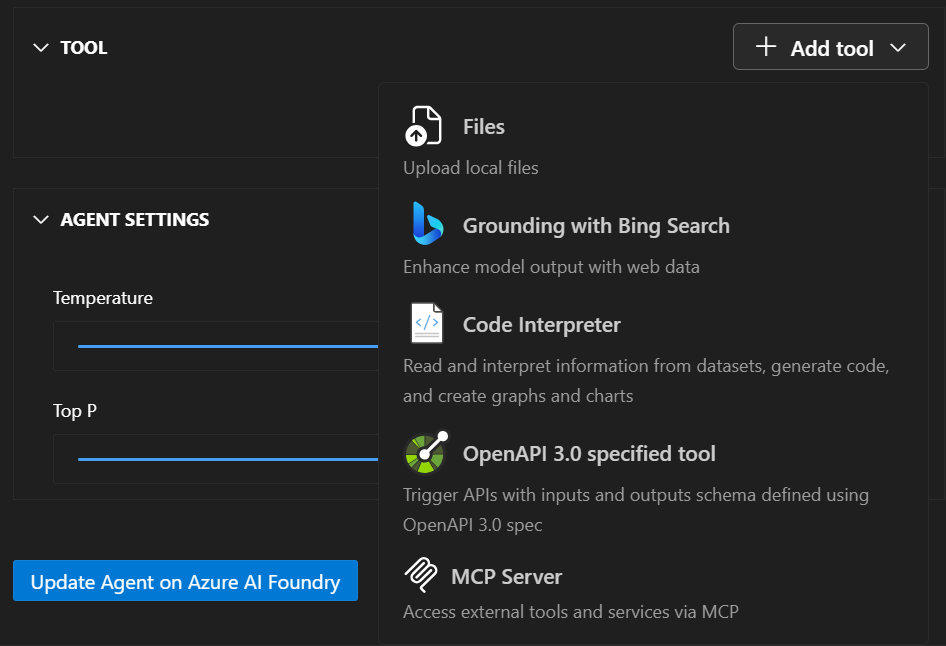

One of the most powerful features of AI agents is their ability to use tools that extend their capabilities beyond simple text generation. The Azure AI Foundry for Visual Studio Code extension provides comprehensive support for adding and configuring various types of tools that enable your agents to perform actions, access data, and integrate with external systems.

## Understanding agent tools

Tools are programmatic functions that enable agents to automate actions and access information beyond their training data. When an agent determines that a tool is needed to respond to a user request, it can automatically invoke the appropriate tool, process the results, and incorporate them into its response. This capability transforms agents from simple text generators into powerful automation systems that can interact with real-world data and services.

## Built-in tools

Azure AI Foundry provides several built-in tools that you can easily add to your agents without any additional configuration or setup. These tools are production-ready and handle common use cases that many agents require.

- **Code Interpreter** - Enables agents to write and execute Python code for mathematical calculations, data analysis, chart generation, file processing, and complex problem-solving
- **File Search** - Provides retrieval-augmented generation by uploading and indexing documents, searching knowledge bases, and supporting various file formats (PDF, Word, text files)
- **Grounding with Bing Search** - Allows agents to search the internet for real-time data, current events, and trending topics while providing citations and sources
- **OpenAPI Specified Tools** - Connects agents to external APIs and services through OpenAPI 3.0 specifications
- **Model Context Protocol (MCP)** - Standardized tool interfaces for extended functionality and community-driven tools

## Adding tools in Visual Studio Code

The Azure AI Foundry extension provides an intuitive interface for adding tools to your agents through a streamlined process. The visual interface makes it easy to browse, configure, and test tools without writing any code:

1. **Select your agent** in the extension
1. **Navigate to the Tools section** in the configuration panel
1. **Browse available tools** from the tool library
1. **Configure tool settings** as needed
1. **Test tool integration** using the playground

When you add a tool, you can also add any new assets it needs. For example, if you add a File Search tool, you can use an existing vector store asset or make a new asset for your vector store to host your uploaded files.

## Model Context Protocol (MCP) servers

MCP servers provide a standardized way to add tools to your agents using an open protocol. This approach enables you to leverage community-built tools and create reusable components that work across different agent implementations.

Key benefits include:
- **Standardized protocol** for consistent tool communication
- **Reusable components** that work across different agents
- **Community-driven tools** available through MCP registries
- **Simplified integration** with consistent interfaces

The extension supports adding MCP servers through registry browsing, custom server addition, configuration management, and testing and validation.

## Tool management and best practices

Effective tool management ensures your agents perform reliably and efficiently in production environments. Following best practices helps you avoid common pitfalls and optimize agent performance:

### Tool Selection Guidelines
- Identify what capabilities your agent requires
- Start with built-in tools before adding custom solutions
- Test thoroughly to validate tool behavior in various scenarios
- Monitor performance to track tool usage and effectiveness

Adding tools and extending agent capabilities through the Azure AI Foundry Visual Studio Code extension enables you to create sophisticated AI agents that can handle complex real-world tasks. By combining built-in tools with custom functions and MCP servers, you can build agents that seamlessly integrate with your existing systems and business processes while maintaining enterprise-grade security and performance.