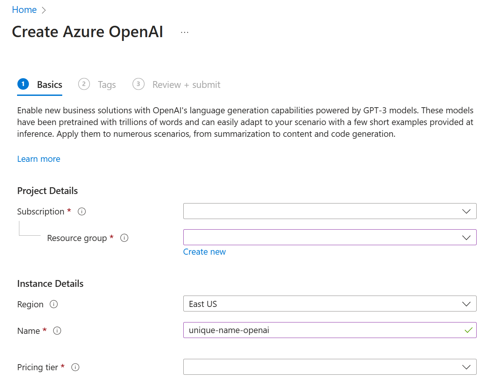
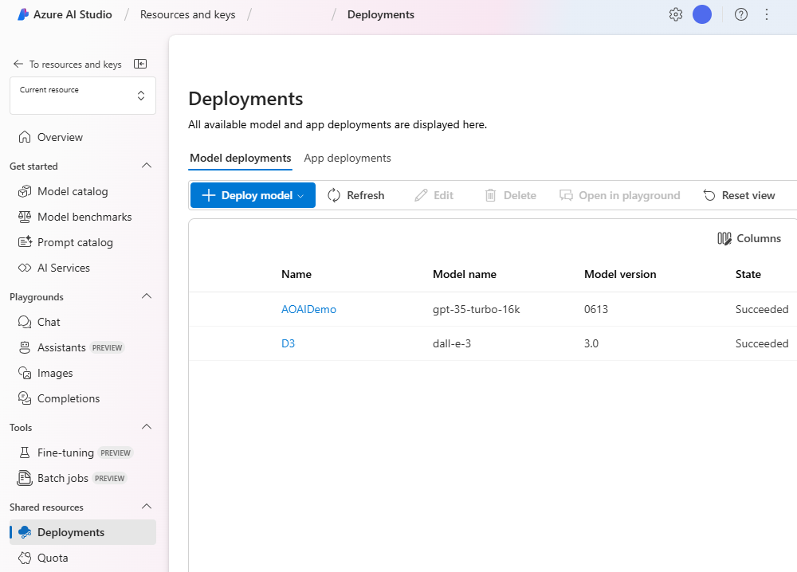
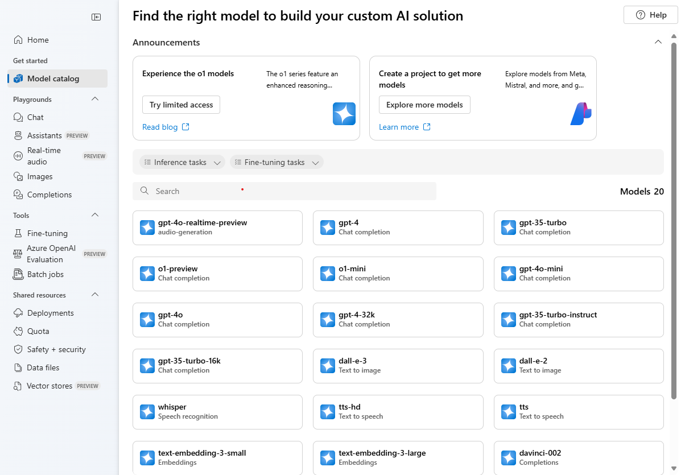
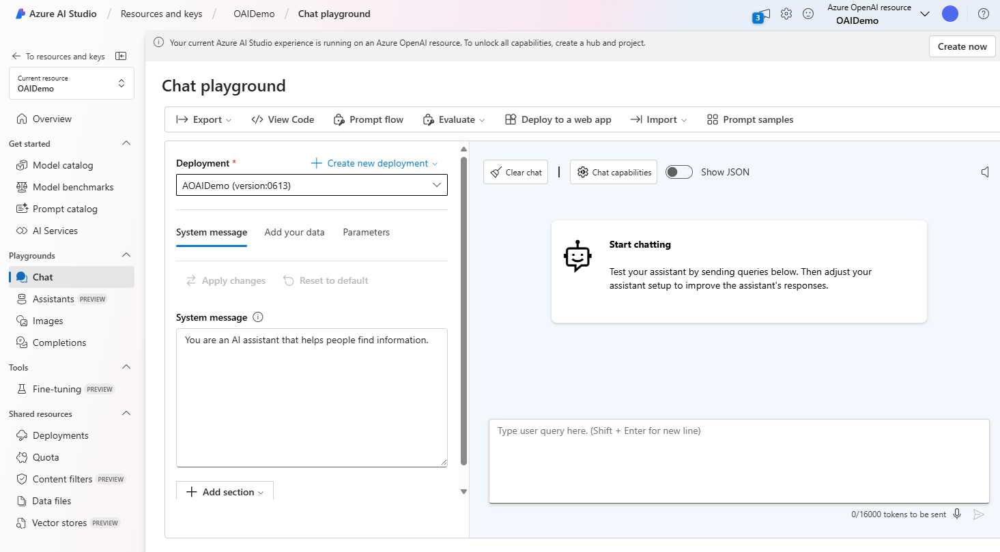

The first step in building a generative AI solution with Azure OpenAI is to provision an Azure OpenAI resource in your Azure subscription. You can get started by creating a resource in the [Azure portal](https://portal.azure.com/?azure-portal=true) or with the Azure command line interface (CLI).

## Create an Azure OpenAI Service resource in the Azure portal

When you create an Azure OpenAI Service resource, you need to provide a subscription name, resource group name, region, unique instance name, and select a pricing tier.



## Create an Azure OpenAI Service resource in Azure CLI

To create an Azure OpenAI Service resource from the CLI, refer to this example and replace the following variables with your own:

- MyOpenAIResource: *replace with a unique name for your resource*
- OAIResourceGroup: *replace with your resource group name* 
- eastus: *replace with the region to deploy your resource*
- subscriptionID: *replace with your subscription ID*

```dotnetcli
az cognitiveservices account create \
-n MyOpenAIResource \
-g OAIResourceGroup \
-l eastus \
--kind OpenAI \
--sku s0 \
--subscription subscriptionID
```

>[!NOTE]
>You can find the regions available for a service through the CLI command `az account list-locations`. To see how to sign into Azure and create an Azure group via the CLI, you can refer to the [documentation here](/azure/cognitive-services/openai/how-to/create-resource?pivots=cli#sign-in-to-the-cli?azure-portal=true). Azure OpenAI Service provides access to many types of models. Certain models are only available in select regions. Consult the [Azure OpenAI model availability guide](/azure/cognitive-services/openai/concepts/models#model-summary-table-and-region-availability/?azure-portal=true) for region availability. You can create two Azure OpenAI resources per region.

## Use Azure OpenAI Foundry

Azure AI Foundry provides access to model management, deployment, experimentation, customization, and learning resources.

You can access the Azure AI Foundry through the Azure portal after creating a resource, or at [https://ai.azure.com/](https://ai.azure.com/) by signing in to your Azure account. During the sign-in workflow, select the appropriate directory, Azure subscription, and Azure OpenAI resource.

When you first open Azure AI Foundry, you'll want to navigate to the **Azure OpenAI** page (where you focus on only Azure OpenAI Service models), select your resource if you haven't already, and deploy your first model. To do so, select the **Deployments** page, from where you can deploy a base model and start experimenting with it.

>[!NOTE]
>If you are not the resource owner, you will need the following role-based access controls: 1. *Cognitive Services OpenAI User*: This role allows viewing resources and using the chat playground. 2. *Cognitive Services OpenAI Contributor*: This role allows the user to create new deployments.



## Types of OpenAI models

To begin building with Azure OpenAI, you need to choose a base model and deploy it. Microsoft provides base models and the option to create customized base models. This unit covers the currently available base models.

Azure OpenAI includes several types of model:

- **GPT-4 models** are the latest generation of *generative pretrained* (GPT) models that can generate natural language and code completions based on natural language prompts.
- **GPT 3.5 models** can generate natural language and code completions based on natural language prompts. In particular, **GPT-35-turbo** models are optimized for chat-based interactions and work well in most generative AI scenarios.
- **Embeddings models** convert text into numeric vectors, and are useful in language analytics scenarios such as comparing text sources for similarities.
- **DALL-E models** are used to generate images based on natural language prompts. Currently, DALL-E models are in preview.
- **Whisper models** are used to convert speech to text.
- **Text to speech models** are used to convert text to speech.

>[!NOTE]
>Pricing is determined by tokens and by model type. Learn more about the latest [pricing here](https://azure.microsoft.com/pricing/details/cognitive-services/openai-service/).

In the Azure AI Foundry portal, the **Model Catalog** page lists the available base models and provides an option to create additional customized models by fine-tuning the base models. The models that have a *Succeeded* status mean they're successfully trained and can be selected for deployment.

You'll notice that there are various models beyond OpenAI available in the Model Catalog, including models from Microsoft, Meta, Mistral, and more. Azure AI Foundry enables you to deploy any of these models for your use case. This module will focus on Azure OpenAI models.



## Deploying OpenAI models

You first need to deploy a model to chat with or make API calls to receive responses to prompts. When you create a new deployment, you need to indicate which base model to deploy. You can deploy any number of deployments as long as their Tokens Per Minute (TPM) stays within the deployment quota.

### Deploy using Azure AI Foundry

In Azure AI Foundry portal's **Model catalog** page, you can create a new deployment by selecting a model name from the list.

### Deploy using Azure CLI

You can also deploy a model using the console. Using this example, replace the following variables with your own resource values:

- OAIResourceGroup: *replace with your resource group name*
- MyOpenAIResource: *replace with your resource name*
- MyModel: *replace with a unique name for your model*
- gpt-35-turbo: *replace with the base model you wish to deploy*

```dotnetcli
az cognitiveservices account deployment create \
   -g OAIResourceGroup \
   -n MyOpenAIResource \
   --deployment-name MyModel \
   --model-name gpt-35-turbo \
   --model-version "0125"  \
   --model-format OpenAI \
   --sku-name "Standard" \
   --sku-capacity 1
```

### Deploy using the REST API

You can deploy a model using the REST API. In the request body, you specify the base model you wish to deploy. See an example in the [Azure OpenAI documentation](/azure/ai-services/openai/).

## Explore OpenAI prompts

Once the model is deployed, you can test how it completes prompts. A prompt is the text portion of a request that is sent to the deployed model's completions endpoint. Responses are referred to as *completions*, which can come in form of text, code, or other formats.

### Prompt types

Prompts can be grouped into types of requests based on task.

|Task type| Prompt example | Completion example|
|:--------|:------------------------ |:-------------------------------|
|**Classifying content** | Tweet: I enjoyed the trip. <br/> Sentiment: | Positive|
|**Generating new content** | List ways of traveling|1. Bike <br/> 2. Car ...|
|**Holding a conversation** | A friendly AI assistant |[See examples](/azure/cognitive-services/openai/how-to/completions#conversation?portal=true)
|**Transformation** (translation and symbol conversion)| English: Hello <br/> French:|bonjour|
|**Summarizing content**|Provide a summary of the content <br/> {text} |The content shares methods of machine learning.|
|**Picking up where you left off** | One way to grow tomatoes |is to plant seeds.|  
|**Giving factual responses** | How many moons does Earth have? |One|

### Completion quality

Several factors affect the quality of completions you'll get from a generative AI solution.

- The way a prompt is engineered. Learn more about prompt engineering in the *Prompt engineering* unit, later in this module.
- The model parameters (covered below).
- The data the model is trained on, which can be adapted through [model fine-tuning with customization](/azure/cognitive-services/openai/how-to/fine-tuning?pivots=programming-language-studio?portal=true).

You have more control over the completions returned by training a custom model than through prompt engineering and parameter adjustment.

### Making API calls

You can start making calls to your deployed model via the REST API, Python, or C#. If your deployed model has a GPT-3.5 or GPT-4 model base, use the [Chat completions documentation](/azure/ai-services/openai/how-to/chatgpt?azure-portal=true), which has endpoints and variables required for these base models.

## Use the Azure Studio playgrounds

Playgrounds are useful interfaces in Azure AI Foundry that you can use to experiment with your deployed models without needing to develop your own client application. Azure AI Foundry portal offers multiple playgrounds with different parameter tuning options.  

### Chat playground

The Chat playground is based on a conversation-in, message-out interface. You can initialize the session with a system message to set up the chat context.

In the Chat playground, you're able to use prompt samples, adjust parameters, and add *few-shot examples*. The term few-shot refers to providing a few of examples to help the model learn what it needs to do. You can think of it in contrast to zero-shot, which refers to providing no examples.


