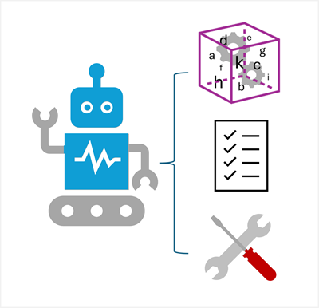
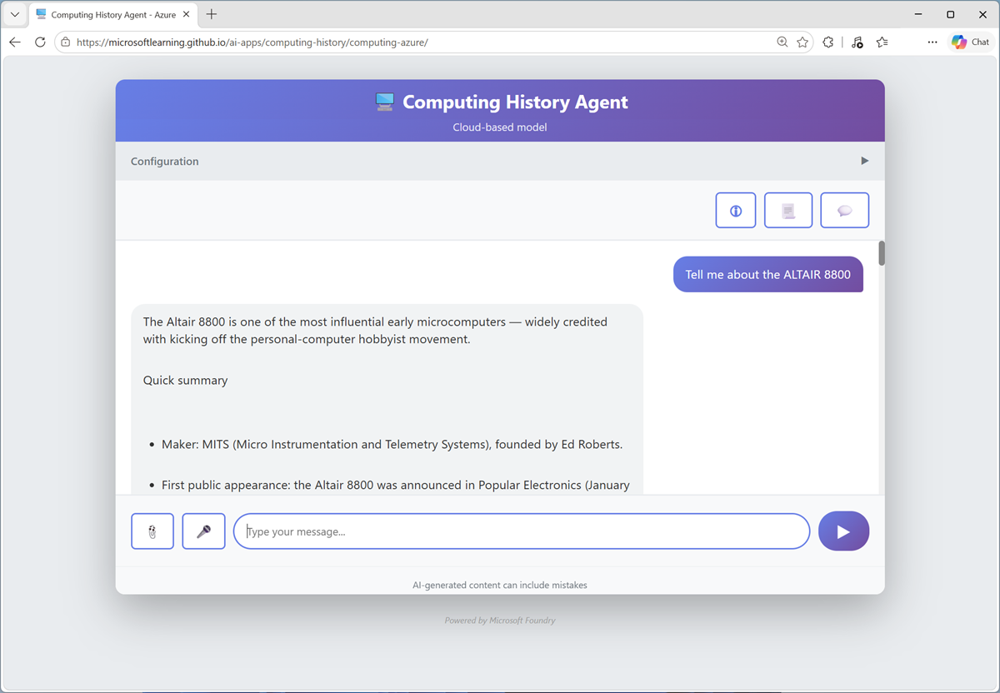

::: zone pivot="video"

>[!VIDEO https://learn-video.azurefd.net/vod/player?id=1ab35f7d-e5a8-4c78-b807-9e444a0d806a]

> [!TIP]
> See the **Text and images** tab for more details!

::: zone-end

::: zone pivot="text"

Imagine having a digital assistant that doesn’t just answer questions, but actually gets things done! Welcome to the world of AI agents.

Agents are software applications built on generative AI that can reason over and generate natural language, automate tasks by using tools, and respond to contextual conditions to take appropriate action.

## Components of an AI agent

AI agents have three key elements:

- **A large language model**: This is the agent's brain; using generative AI for language understanding and reasoning.
- **Instructions**: A system prompt that defines the agent’s role and behavior. Think of it as the agent’s job description.
- **Tools**: These are what the agent uses to interact with the world. Tools can include:
  - *Knowledge* tools that provide access to information, like search engines or databases.
  - *Action* tools that enable the agent to perform tasks, such as sending emails, updating calendars, or controlling devices.

With these capabilities, AI agents can take on the role of digital assistants that intelligently automate tasks and collaborate with you to work smarter and more efficiently.

Users interact with an agent s through *prompts* - natural language questions or statements that the agent uses its large language model to interpret and reason over. The agent can then use its instructions and skills to determine the right actions to take, and leverage tools to take them.

For example, a computing history agent could provide a chat interface into which users can enter questions about vintage computers and related topics.

The ability to chat with the site and have it generate original responses to questions creates a compelling interactive experience for users. To be even more useful, the agent can use its tools to perform tasks on the user's behalf; for example, identifying hardware components from photographs, or tracking down and ordering the required parts for a vintage computer restoration project.

::: zone-end
