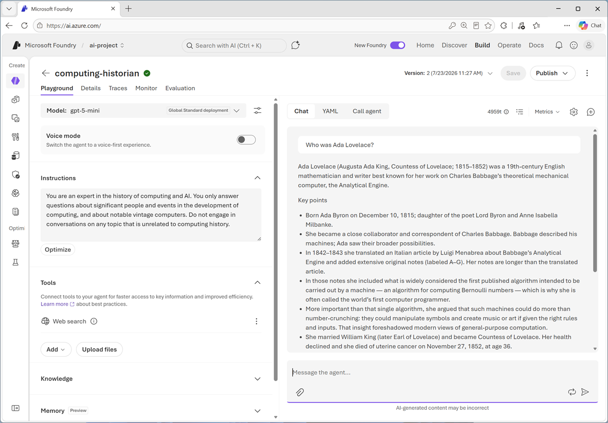
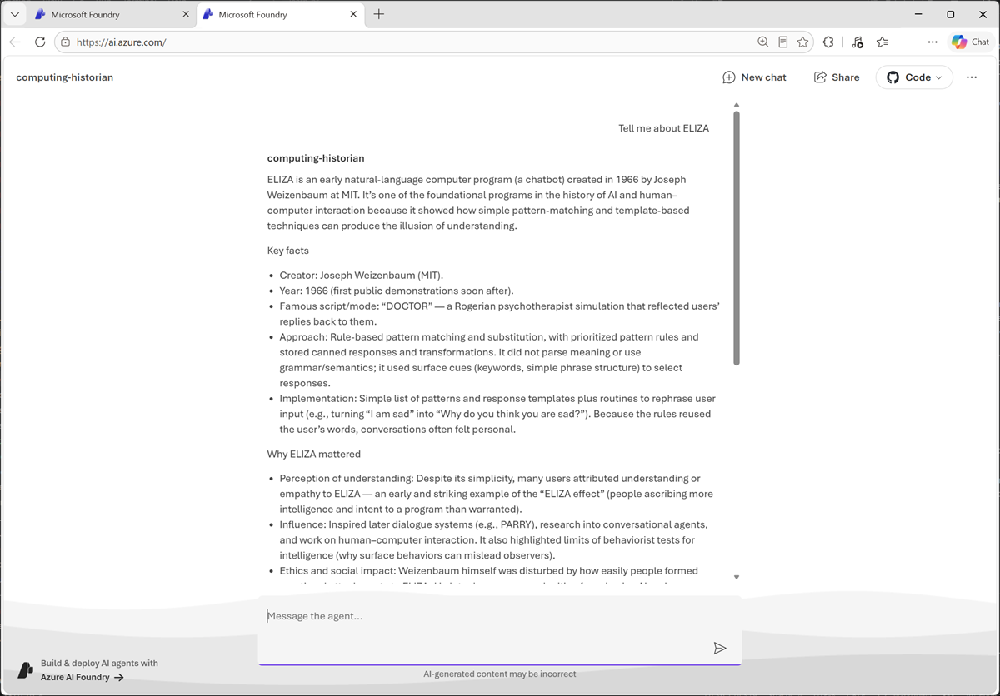

::: zone pivot="video"

>[!VIDEO https://learn-video.azurefd.net/vod/player?id=3a50267c-e99b-43e9-8196-75a9cde0b056]

> [!TIP]
> See the **Text and images** tab for more details!

::: zone-end

::: zone pivot="text"

The **Agents playground** in the Microsoft Foundry portal provides a visual environment in which you can create, configure, and test an agent without writing code. Agents that you create in the playground are *prompt agents*. Their behavior is defined by a model, instructions, and any tools or knowledge sources that you add.

## Create and configure an agent

In the Agents playground, create an agent and give it a unique name. Choose the name carefully because you can't change it later.

Configure the agent by selecting a deployed generative AI model and providing **Instructions** that describe its role, goals, constraints, and preferred response style. The model interprets user prompts, reasons about what to do, and generates responses. Clear, specific instructions help the agent behave consistently. For example, instructions for a computing history agent might require it to explain technical concepts in simple terms, focus on historically significant computers, and acknowledge when information is uncertain.

You can also add **Tools** or **Knowledge** to extend the agent's capabilities. Knowledge sources ground responses in selected data, while action tools enable the agent to perform tasks such as calling an API or running code. Some tools require a connection and authentication details before you can save the agent.

Together, the selected model, instructions, tools, and knowledge define how the agent responds and what it can do.

## Test and refine the agent

Use the chat pane in the playground to test the agent with representative prompts. Continue the conversation with follow-up questions to check whether the agent retains context across multiple turns. You should also try ambiguous or unexpected prompts to identify gaps in the instructions and confirm that tools are used only when appropriate.

As you test, refine the instructions and tool configuration, and then repeat your tests. You can use the playground's tracing and evaluation features to inspect tool calls and assess response quality. Playground evaluations can incur consumption-based charges, so select only the evaluation metrics you need.

When you're satisfied with your changes, save the configuration to create an immutable version of the agent. Further changes are saved as a new version, which makes it possible to compare behavior and return to a previous configuration. Unsaved changes are temporary and can be lost when you leave the portal.

## Use the agent

When you create a prompt agent in the Foundry portal, it's automatically assigned an *identity* and an *endpoint*. Client applications can connect to the endpoint to invoke the agent, and it can use its own identity to be authenticated by external resources when using its tools to access knowledge or perform actions.

To see how your agent looks and behaves in a web application, you can use the built-in *preview* interface; which uses the endpoint to call the agent based on your prompts.

::: zone-end
