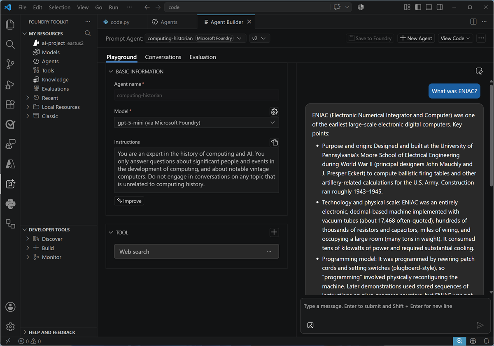
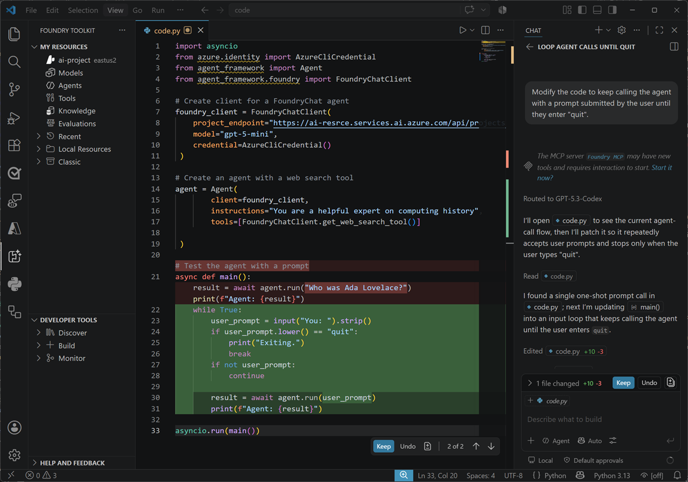

::: zone pivot="video"

>[!VIDEO https://learn-video.azurefd.net/vod/player?id=2a3b49ae-17a1-4c9c-89b8-38db842156b1]

> [!TIP]
> See the **Text and images** tab for more details!

::: zone-end

::: zone pivot="text"

Visual Studio Code provides a familiar development environment for building agents that use Microsoft Foundry. You can work visually with the **Foundry Toolkit** extension, write agent code with the Foundry SDK or Microsoft Agent Framework, and use GitHub Copilot to help you develop and test your solution.

## Use the Foundry Toolkit

The Foundry Toolkit extension connects Visual Studio Code to your Foundry projects and resources. It provides tools for creating, managing, testing, and deploying agents without requiring you to leave the editor.

The agent builder provides a visual interface in which you can configure an agent's model, instructions, and tools. You can then enter prompts in the chat pane and review the responses while you refine the agent.



For code-based agents and workflows, the toolkit can also help you create projects from templates, test and debug them locally, inspect traces, and deploy them as hosted agents in Foundry.

## Develop agents with code

Developing an agent in code gives you direct control over its definition and lifecycle. Two common approaches are to create a prompt agent with Foundry Agent Service or to build an agent with an SDK like the Microsoft Agent Framework, and host it in a container in Foundry.

### Create a prompt agent with Foundry Agent Service

The Foundry SDK provides an `AIProjectClient` for working with the assets in a Foundry project. You can use the client's agent operations to create a named, versioned prompt agent that is persisted in Foundry Agent Service.

The following example authenticates with Microsoft Entra ID, connects to a Foundry project, and creates a version of an agent. The agent definition specifies a deployed model, instructions, and a web search tool. The code then obtains an OpenAI-compatible client that is bound to the agent and uses it to send a prompt.

```python
from azure.identity import DefaultAzureCredential
from azure.ai.projects import AIProjectClient
from azure.ai.projects.models import PromptAgentDefinition, WebSearchTool

# Create client to call Foundry API
project = AIProjectClient(
    endpoint="https://ai-resrce.services.ai.azure.com/api/projects/ai-project", # Project endpoint
    credential=DefaultAzureCredential())

# Create an agent with a web search tool
agent = project.agents.create_version(
    agent_name="computinghistorycode",
    definition=PromptAgentDefinition(
        model="gpt-5-mini",
        instructions="You are a helpful expert on computing history",
        tools=[WebSearchTool()]))

# Test the agent with a prompt
openai_client = project.get_openai_client(agent_name="computinghistorycode")
response = openai_client.responses.create(input="Who was Ada Lovelace?")
print(response.output_text)
```

Because the agent is stored as a versioned asset in Foundry, other applications can refer to the agent by name and use its managed definition. Changes to its model, instructions, or tools can be captured in subsequent versions.

### Create an agent with Microsoft Agent Framework

**Microsoft Agent Framework** is an open-source development framework for building agents and multi-agent workflows in Python or .NET. It provides consistent abstractions for defining agents, adding tools, managing conversations, and orchestrating more complex agent behavior.

The next example uses `FoundryChatClient` to connect to a model deployed in a Foundry project. The application defines the agent's instructions and tools, and Agent Framework handles the interaction with the Foundry Responses endpoint.

```python
import asyncio
from azure.identity import AzureCliCredential
from agent_framework import Agent
from agent_framework.foundry import FoundryChatClient

# Create client for a FoundryChat agent
foundry_client = FoundryChatClient(
    project_endpoint="https://ai-resrce.services.ai.azure.com/api/projects/ai-project", # Project endpoint
    model="gpt-5-mini",
    credential=AzureCliCredential()
 )

# Create an agent with a web search tool
agent = Agent(
        client=foundry_client,
        instructions="You are a helpful expert on computing history",
        tools=[FoundryChatClient.get_web_search_tool()]

 )

# Test the agent with a prompt
async def main():
    result = await agent.run("Who was Ada Lovelace?")
    print(f"Agent: {result}")

asyncio.run(main())
```

In this approach, the agent definition exists in the application and is created when the code runs. This *ephemeral agent* pattern is useful when you want the definition and its lifecycle to remain with your application code. To make a code-based agent available through a persistent, managed endpoint in Foundry, you can package and deploy it as a **hosted agent**. Foundry Toolkit provides development and deployment support for this workflow.

## Develop with GitHub Copilot

Visual Studio Code also integrates with **GitHub Copilot**, which can help you understand, create, and modify your agent code. In Copilot Chat, you can collaborate with coding agents that inspect your workspace, propose an approach, edit files, run commands, and respond to build or test results.



For example, you can ask Copilot to add a tool to an agent, improve its instructions, create tests, or investigate an unexpected response. Copilot shows the changes it makes so that you can review them, run the agent, and test its responses before accepting the changes into your codebase. You remain responsible for validating that the resulting agent behaves securely and as intended.

::: zone-end
