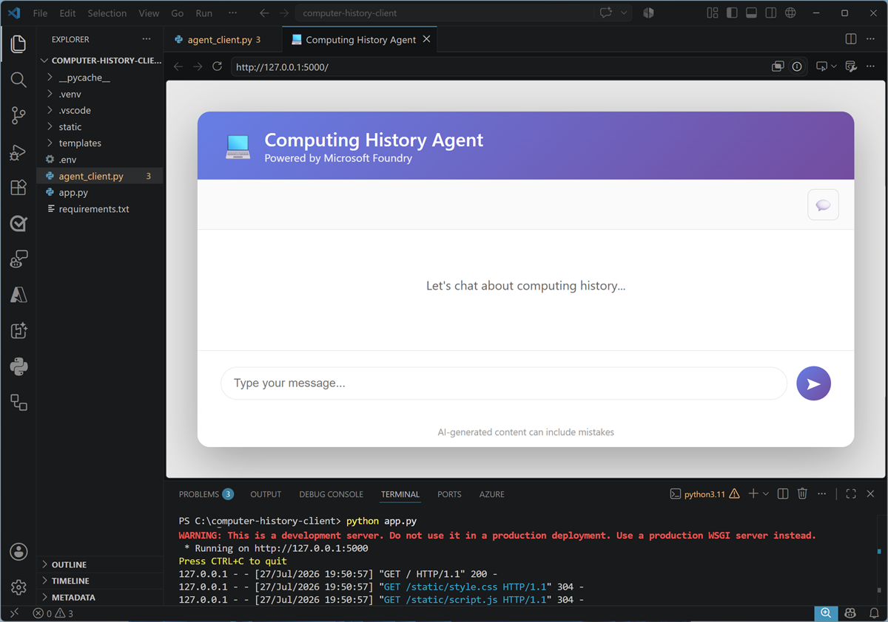

::: zone pivot="video"

>[!VIDEO https://learn-video.azurefd.net/vod/player?id=22fefc51-41ab-40f3-86be-720fec92956e]

> [!TIP]
> See the **Text and images** tab for more details!

::: zone-end

::: zone pivot="text"

An agent in Microsoft Foundry encapsulates the model, instructions, and tools that it needs to perform tasks. To make the agent available to users, you can build a client application that submits prompts to the agent and processes its responses.

## Connect to an agent

A running agent in Foundry provides an endpoint that supports the OpenAI Responses protocol. Applications can connect to this endpoint by using the OpenAI SDK, and users or application identities with appropriate permissions can authenticate by using Microsoft Entra ID.

For example, you might develop a web application for the Computing History agent; which enables users to submit prompts to the agent.



The client application can include any user experience or application logic that your scenario requires. Regardless of its design, the core interaction with the agent follows the same pattern:

1. Authenticate and create a client for the agent endpoint.
1. Submit the user's prompt by using the Responses API.
1. Process the response and present it to the user or another application component.

## Use the OpenAI SDK

The following Python example uses `DefaultAzureCredential` to obtain a Microsoft Entra access token and creates an `OpenAI` client configured for the agent's endpoint. It then submits a prompt through `client.responses.create` and prints the agent's text response.

```python
from azure.identity import DefaultAzureCredential, get_bearer_token_provider
from openai import OpenAI

# Get an OpenAI client for the agent
token = get_bearer_token_provider(
    DefaultAzureCredential(), 
    "https://ai.azure.com/.default")

client = OpenAI(
    api_key=token,
    base_url="https://ai-resrce.services.ai.azure.com/api/projects/ai-project/agents/computinghistorycode/endpoint/protocols/openai",
    default_query={"api-version": "v1"}) 

# Submit a prompt to the agent and print the response
response = client.responses.create(
    input="Who was Grace Hopper?")

print(response.output_text)
```

`DefaultAzureCredential` supports multiple credential sources, enabling the same application code to authenticate in local development and in a hosted environment. The authenticated identity must have permission to use the Foundry project and agent.

The Responses API provides a consistent way for applications and services to interact with models and agents. By exposing agents through an OpenAI-compatible endpoint, Foundry enables you to use familiar SDK patterns while the agent's model, instructions, and tools remain managed in Foundry.

::: zone-end
