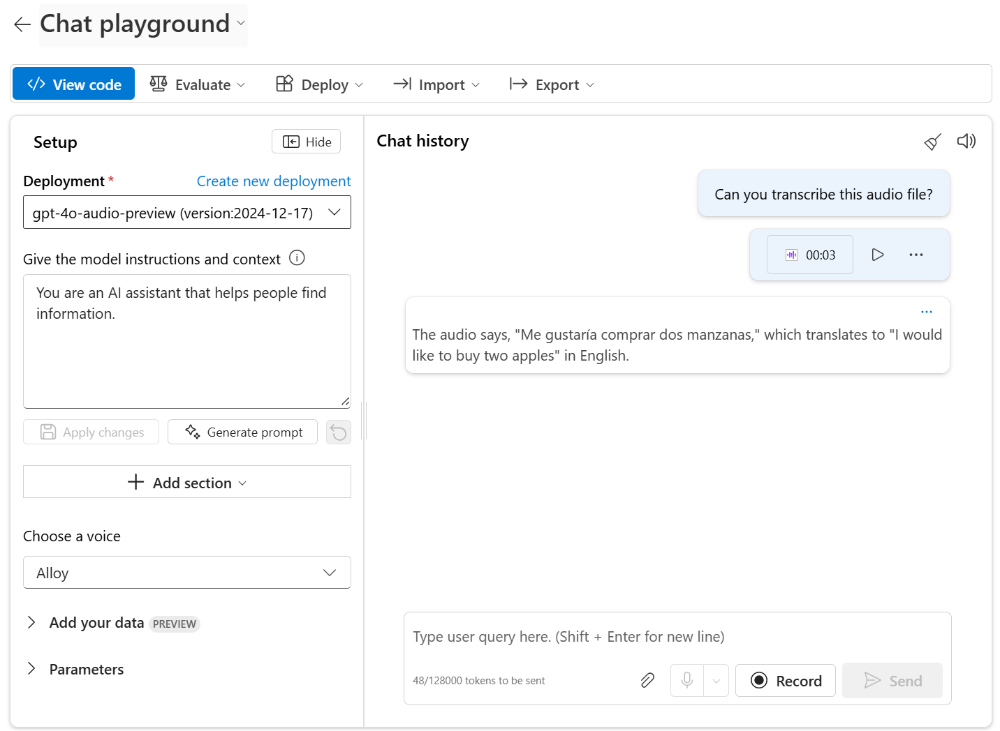

To handle prompts that include audio, you need to deploy a *multimodal* generative AI model - in other words, a model that supports not only text-based input, but audio-based input as well. Multimodal models available in Azure AI Foundry include (among others):

- Microsoft **Phi-4-multimodal-instruct**
- OpenAI **gpt-4o**
- OpenAI **gpt-4o-mini**

> [!TIP]
> To learn more about available models in Azure AI Foundry, see the **[Model catalog and collections in Azure AI Foundry portal](/azure/ai-foundry/how-to/model-catalog-overview)** article in the Azure AI Foundry documentation.

## Testing multimodal models with audio-based prompts

After deploying a multimodal model, you can test it in the chat playground in Azure AI Foundry portal. Some models allow you to include audio attachments in the playground, either by uploading a file or recording a message.

In the chat playground, you can upload a local audio file and add text to the message to elicit a response from a multimodal model.
