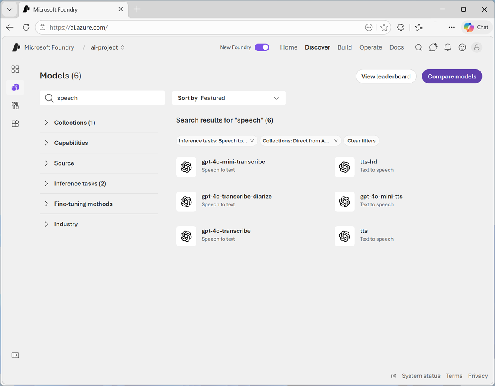

Microsoft Foundry Models is a model catalog that includes generative AI models from multiple providers. Different models have different capabilities, and are optimized for different use-cases.

To find a suitable model, you can use the filter and search features in the Microsoft Foundry Portal.

When it comes to speech-capable models, there are two common use-cases to consider:

- Generative AI models that can transcribe speech to text.
- Generative AI models that can synthesize text to speech.

Microsoft Foundry provides models that support both of these use-cases, including specialized speech-capable models from the **gpt-4o** family of OpenAI models.

> [!TIP]
> To learn more about available models in Microsoft Foundry, see the **[Microsoft Foundry Models overview](/azure/foundry/concepts/foundry-models-overview?azure-portal=true)** article in the Microsoft Foundry documentation.
