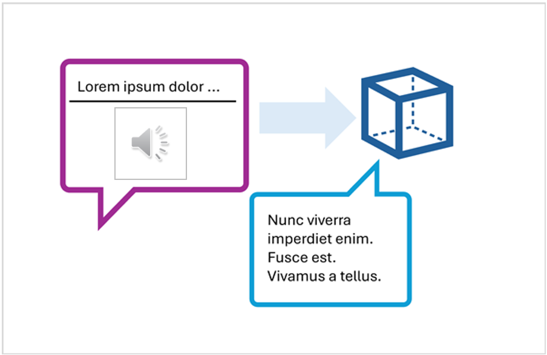

To develop a client app that engages in audio-based chats with a multimodal model, you can use the same basic techniques used for text-based chats. You require a connection to the endpoint where the model is deployed, and you use that endpoint to submit prompts that consists of messages to the model and process the responses.

The key difference is that prompts for an audio-based chat include multi-part user messages that contain both a *text* content item and an *audio* content item.



The JSON representation of a prompt that includes a multi-part user message looks something like this:

```json
{ 
    "messages": [ 
        { "role": "system", "content": "You are a helpful assistant." }, 
        { "role": "user", "content": [  
            { 
                "type": "text", 
                "text": "Transcribe this audio:" 
            },
            { 
                "type": "audio_url",
                "audio_url": {
                    "url": "https://....."
                }
            }
        ] } 
    ]
} 
```

The audio content item can be:

- A URL to an audio file in a web site.
- Binary audio data

When using binary data to submit a local audio file, the **audio_url** content takes the form of a base64 encoded value in a data URL format:

```json
{
    "type": "audio_url",
    "audio_url": {
       "url": "data:audio/mp3;base64,<binary_audio_data>"
    }
}
```

Depending on the model type, and where you deployed it, you can use Microsoft Azure AI Model Inference or OpenAI APIs to submit audio-based prompts. These libraries also provide language-specific SDKs that abstract the underlying REST APIs.

In the exercise that follows in this module, you can use the Python or .NET SDK for the Azure AI Model Inference API and the OpenAI API to develop an audio-enabled chat application.
