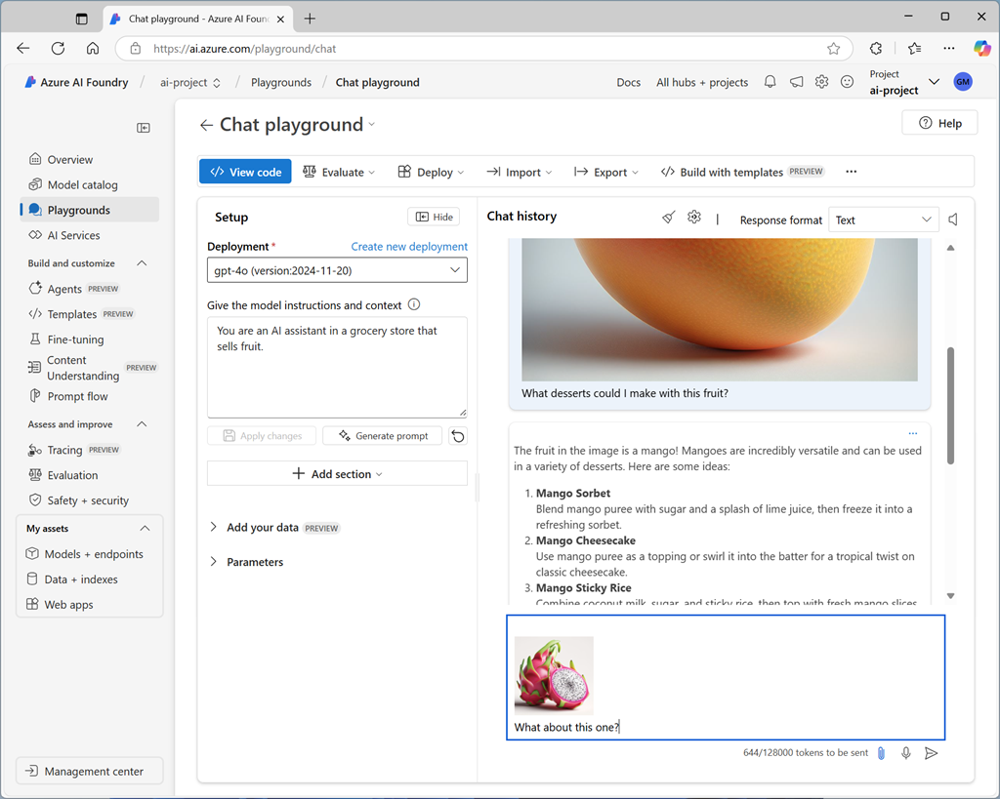

To handle prompts that include images, you need to deploy a *multimodal* generative AI model - in other words, a model that supports not only text-based input, but image-based (and in some cases, audio-based) input as well. Multimodal models available in Microsoft Foundry include (among others):

- Microsoft **Phi-4-multimodal-instruct**
- OpenAI **gpt-4o**
- OpenAI **gpt-4o-mini**

> [!TIP]
> To learn more about available models in Microsoft Foundry, see the **[Model catalog and collections in Microsoft Foundry portal](/azure/ai-foundry/how-to/model-catalog-overview)** article in the Microsoft Foundry documentation.

## Testing multimodal models with image-based prompts

After deploying a multimodal model, you can test it in the chat playground in Microsoft Foundry portal.

In the chat playground, you can upload an image from a local file and add text to the message to elicit a response from a multimodal model.

