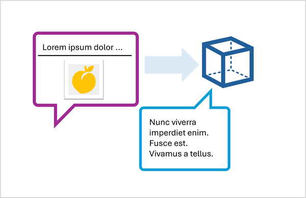

To develop a client app that engages in vision-based chats with a multimodal model, you can use the same basic techniques used for text-based chats. You require a connection to the endpoint where the model is deployed, and you use that endpoint to submit prompts that consists of messages to the model and process the responses.

The key difference is that prompts for a vision-based chat include multi-part user messages that contain both a *text* (or *audio* where supported) content item and an *image* content item.



The JSON representation of a prompt that includes a multi-part user message looks something like this:

```json
{ 
    "messages": [ 
        { "role": "system", "content": "You are a helpful assistant." }, 
        { "role": "user", "content": [  
            { 
                "type": "text", 
                "text": "Describe this picture:" 
            },
            { 
                "type": "image_url",
                "image_url": {
                    "url": "https://....."
                }
            }
        ] } 
    ]
} 
```

The image content item can be:

- A URL to an image file in a web site.
- Binary image data

When using binary data to submit a local image file, the **image_url** content takes the form of a base64 encoded value in a data URL format:

```json
{
    "type": "image_url",
    "image_url": {
       "url": "data:image/jpeg;base64,<binary_image_data>"
    }
}
```

Depending on the model type, and where you deployed it, you can use Microsoft Azure AI Model Inference or OpenAI APIs to submit vision-based prompts. These libraries also provide language-specific SDKs that abstract the underlying REST APIs.

In the exercise that follows in this module, you can use the Python or .NET SDK for the Azure AI Model Inference API and the OpenAI API to develop a vision-enabled chat application.
