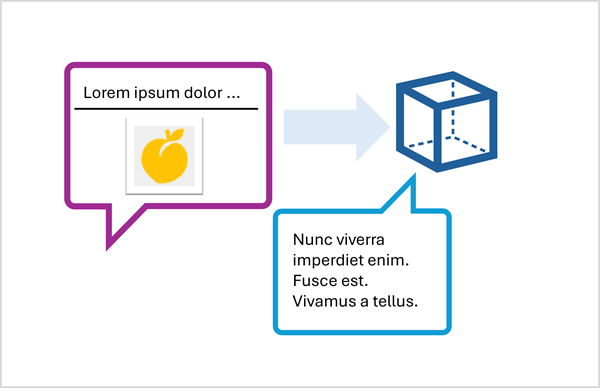

To develop a client app that engages in vision-based chats with a multimodal model, you can use the same basic techniques used for text-based chats. You require a connection to the endpoint where the model is deployed, and you use that endpoint to submit prompts that consists of messages to the model and process the responses.

The key difference is that prompts for a vision-based chat include multi-part user messages that contain both a *text* content item and an *image* content item.



## Submitting an image-based prompt using the *Responses* API

To include an image in a prompt using the *Responses* API, specify a URL for a web-based image file, or load a local image and encode its data in Base64 format and submit a URL in the format  `data:image/jpeg;base64,{image_data}` (replacing "jpeg" with "png" pr other formats as appropriate).

The following Python example shows how to submit an image in a prompt using the *Responses* API:

```python
# Read the image data from a local file
image_path = Path("dragon-fruit.jpeg")
image_format = "jpeg"
with open(image_path, "rb") as image_file:
    image_data = base64.b64encode(image_file.read()).decode("utf-8")

data_url = f"data:image/{image_format};base64,{image_data}" # You can also use a web URL

# Send the image data in a prompt to the model
response = client.responses.create(
    model="gpt-4.1",
    input=[
        {"role": "developer", "content": "You are an AI assistant for chefs planning recipes."},
        {"role": "user", "content": [  
            { "type": "input_text", "text": "What desserts could I make with this?"},
            { "type": "input_image", "image_url": data_url}
        ] } 
    ]
)
print(response.output_text)
```

## Submitting an image-based prompt using the *ChatCompletions* API

When using the Azure OpenAI endpoint to submit prompts to models that don;t support the *Responses* API, you can use the *CatCompletions* API; like this:

```python
# Read the image data from a local file
image_path = Path("orange.jpeg")
image_format = "jpeg"
with open(image_path, "rb") as image_file:
    image_data = base64.b64encode(image_file.read()).decode("utf-8")

data_url = f"data:image/{image_format};base64,{image_data}" # You can also use a web URL

# Send the image data in a prompt to the model
response = client.chat.completions.create(
    model="Phi-4-multimodal-instruct",
    messages=[
        {"role": "system", "content": "You are an AI assistant for chefs planning recipes."},
        { "role": "user", "content": [  
            { "type": "text", "text": "What can I make with this fruit?"},
            { "type": "image_url", "image_url": {"url": data_url}}
        ] }
    ]
)
print(response.choices[0].message.content)

```
