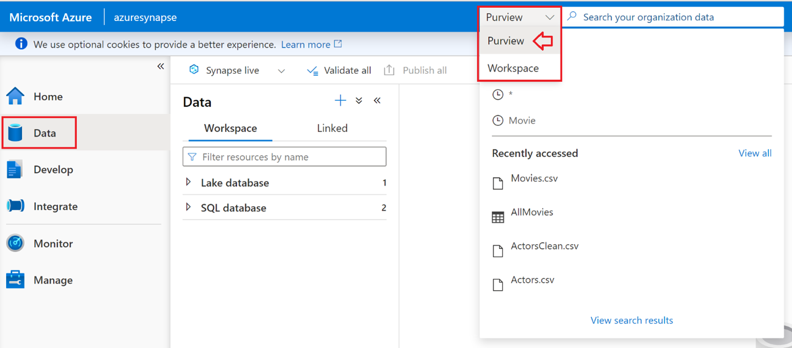
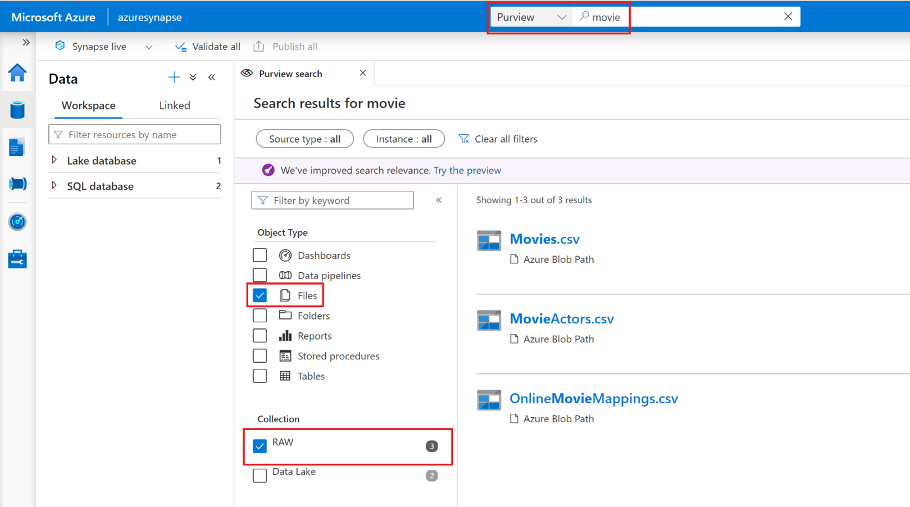
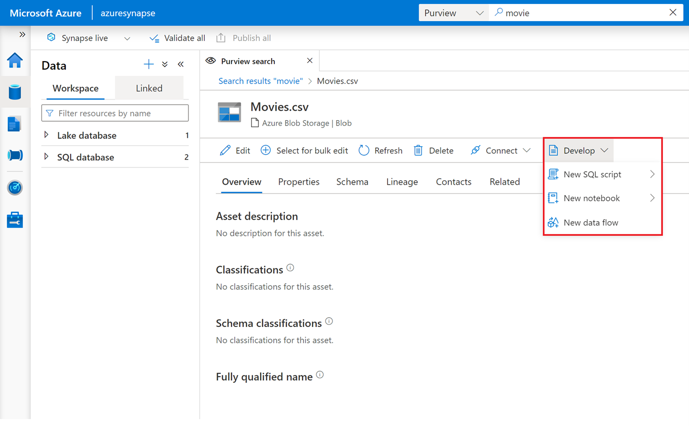
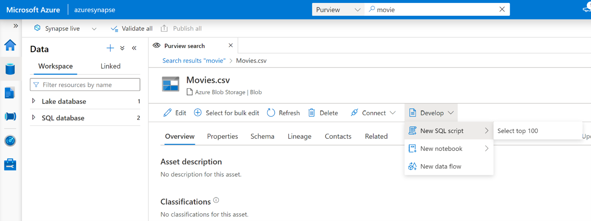
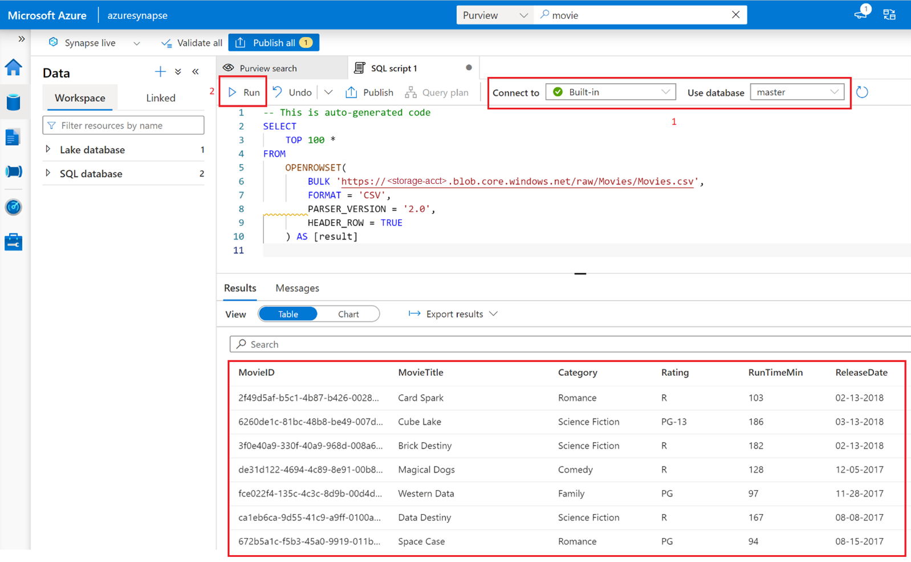
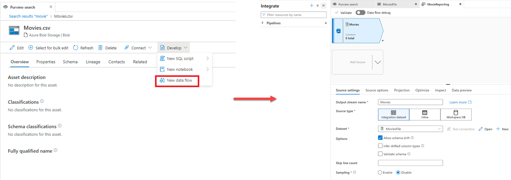

Microsoft Purview can be integrated directly into Azure Synapse. If Azure Synapse Studio is massively deployed in your organization, you can get the data catalog experience directly in Azure Synapse Studio.

This integrated experience allows you to discover Microsoft Purview assets, interact with them through Synapse capabilities, and push lineage information to Microsoft Purview.

>[!NOTE]
>To connect an Microsoft Purview Account to a Synapse workspace, you need 2 types of permissions. You need a contributor role in Synapse workspace from Azure portal identity and access management (IAM). You also need access to that Microsoft Purview Account. For more information, see [Microsoft Purview permissions](/azure/purview/catalog-permissions).

Let’s imagine you need to find and understand some assets before working with them in pipelines or notebooks. From Azure Synapse Studio, you can easily query your Microsoft Purview data catalog.

In Azure Synapse Studio, from the **Data** blade on the left, select **Purview** in the dropdown next to the search bar.

Search for the asset that exists in Purview. Imagine you're looking for movie files. Enter the keyword **movie** in the search bar, and fine tune your search by selecting **Files** as the object type and **Raw** as the collection.

Select the first asset “Movies.csv” to get asset details. Because you are in Azure Synapse Studio, you can also leverage Azure Synapse capabilities.

For instance, you can use Azure Synapse serverless to query your assets. Select **Develop**, **New SQL Script** and **Select top 100**.

Double check you're connected to your serveless instance and select **Run** to execute the script and get an overview of your data.

After reviewing data, you can use the asset, for example, adding to a new dataflow in Azure Synapse. 

>[!NOTE]
>See [Connect an Microsoft Purview Account](/azure/synapse-analytics/catalog-and-governance/quickstart-connect-azure-purview) for detailed information about integrating Microsoft Purview into Azure Synapse Analytics.