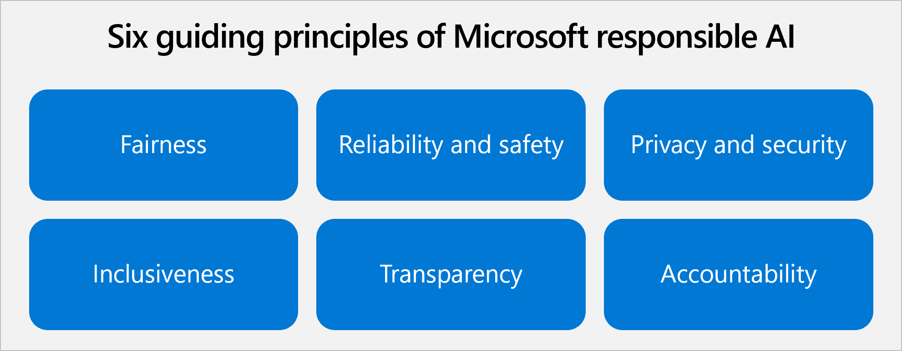

In the last unit, we discussed some of the societal implications of AI. We touched on the responsibility of businesses, governments, NGOs, and academic researchers to anticipate and mitigate unintended consequences of AI technology. As organizations consider these responsibilities, more are creating internal policies and practices to guide their AI efforts.

At Microsoft, we've recognized six principles that we believe should guide AI development and use: fairness, reliability and safety, privacy and security, inclusiveness, transparency, and accountability. For us, these principles are the cornerstone of a responsible and trustworthy approach to AI, especially as intelligent technology becomes more prevalent in the products and services we use every day.

> [!div class="mx-imgBorder"]
> 

## Fairness

AI systems should treat everyone fairly and avoid affecting similarly situated groups of people in different ways. For example, when AI systems provide guidance on medical treatment, loan applications, or employment, they should make the same recommendations to everyone with similar symptoms, financial circumstances, or professional qualifications.

To ensure fairness in your AI system, you should:

* **Understand the scope, spirit, and potential uses of the AI system** by asking questions such as, how is the system intended to work? Who is the system designed to work for? Will the system work for everyone equally? How can it harm others?
* **Attract a diverse pool of talent.** Ensure the design team reflects the world in which we live by including team members that have different backgrounds, experiences, education, and perspectives.
* **Identify bias in datasets** by evaluating where the data came from, understanding how it was organized, and testing to ensure it's represented. Bias can be introduced at every stage in creation, from collection to modeling to operation. The Responsible AI Dashboard, available at the Resources section, includes a feature to help with this task.
* **Identify bias in machine learning algorithms** by applying tools and techniques that improve the transparency and intelligibility of models. When using prebuilt models, such as those delivered by Azure OpenAI Service, consider that Microsoft and OpenAI are working to avoid biases. However, users should still be especially cautious with the results provided by the model.
* **Leverage human review and domain expertise.** Train employees to understand the meaning and implications of AI results, especially when AI is used to inform consequential decisions about people. Decisions that use AI should always be paired with human review. Include relevant subject matter experts in the design process and in deployment decisions. An example would be including a consumer credit subject matter expert for a credit scoring AI system. You should use AI as a copilot, that is, an assisting tool that helps you do your job better and faster but requires some degree of supervising.
* **Research and employ best practices, analytical techniques, and tools** from other institutions and enterprises to help detect, prevent, and address bias in AI systems.

## Reliability and safety

To build trust, it's critical that AI systems operate reliably, safely, and consistently under normal circumstances and in unexpected conditions. These systems should be able to operate as they were originally designed, respond safely to unanticipated conditions, and resist harmful manipulation. It's also important to be able to verify that these systems are behaving as intended under actual operating conditions. How they behave and the variety of conditions they can handle reliably and safely largely reflects the range of situations and circumstances that developers anticipate during design and testing.

To ensure reliability and safety in your AI system, you should:

* **Develop processes for auditing AI systems** to evaluate the quality and suitability of data and models, monitor ongoing performance, and verify that systems are behaving as intended based on established performance measures.
* **Provide detailed explanation of system operation** including design specifications, information about training data, training failures that occurred and potential inadequacies with training data, and the inferences and significant predictions generated.
* **Design for unintended circumstances** such as accidental system interactions, the introduction of malicious data, or cyberattacks.
* **Involve domain experts** in the design and implementation processes, especially when using AI to help make consequential decisions about people.
* **Conduct rigorous testing** during AI system development and deployment to ensure that systems can respond safely to unanticipated circumstances, don’t have unexpected performance failures, and don’t evolve in unexpected ways. AI systems involved in high-stakes scenarios that affect human safety or large populations should be tested both in lab and real-world scenarios.
* **Evaluate when and how an AI system should seek human input** for impactful decisions or during critical situations. Consider how an AI system should transfer control to a human in a manner that is meaningful and intelligible. Design AI systems to ensure humans have the necessary level of input on highly impactful decisions.
* **Develop a robust feedback mechanism** for users to report performance issues so that you can resolve them quickly.

## Privacy and security

As AI becomes more prevalent, protecting privacy and securing important personal and business information is becoming more critical and complex. With AI, privacy and data security issues require especially close attention because access to data is essential for AI systems to make accurate and informed predictions and decisions about people.

To ensure privacy and security in your AI system, you should:

* **Comply with relevant data protection, privacy, and transparency laws** by investing resources in developing compliance technologies and processes or working with a technology leader during the development of AI systems. Develop processes to continually check that the AI systems are satisfying all aspects of these laws.
* **Design AI systems to maintain the integrity of personal data** so that they can only use personal data during the time it’s required and for the defined purposes that have been shared with customers. Delete inadvertently collected personal data or data that is no longer relevant to the defined purpose.
* **Protect AI systems from bad actors** by designing AI systems in accordance with secure development and operations foundations, using role-based access, and protecting personal and confidential data that is transferred to third parties. Design AI systems to identify abnormal behaviors and to prevent manipulation and malicious attacks.
* **Design AI systems with appropriate controls** for customers to make choices about how and why their data is collected and used.
* **Ensure your AI system maintains anonymity** by taking into account how the system removes personal identification from data.
* **Conduct privacy and security reviews** for all AI systems.
* **Research and implement industry best practices** for tracking relevant information about customer data, accessing and using that data, and auditing access and use.

## Inclusiveness

At Microsoft, we firmly believe everyone should benefit from intelligent technology, meaning it must incorporate and address a broad range of human needs and experiences. For the 1 billion people with disabilities around the world, AI technologies can be a game-changer. AI can improve access to education, government services, employment, information, and a wide range of other opportunities. Intelligent solutions such as real-time speech to text transcription, visual recognition services, and predictive text functionality are already empowering people with hearing, visual, and other impairments.

> [!div class="mx-imgBorder"]
> 

To ensure inclusiveness in your AI system, you should:

* **Comply with laws regarding accessibility and inclusiveness** that mandate the procurement of accessible technology.
* **Use the Inclusive 101 Guidebook**, available in the resources section of this module, to help system developers understand and address potential barriers in a product environment that could unintentionally exclude people.
* **Have people with disabilities test your systems** to help you figure out whether the system can be used as intended by the broadest possible audience.
* **Consider commonly used accessibility standards** to help ensure your system is accessible for people of all abilities.

## Transparency

Underlying the preceding values are two foundational principles that are essential for ensuring the effectiveness of the rest: transparency and accountability. It's critical that people understand how AI systems come to conclusions when they're used to inform decisions that have an effect on people's lives. For example, a bank might use an AI system to decide whether a person is creditworthy, or a company might use an AI system to determine the most qualified candidates to hire.

A crucial part of transparency is what we refer to as intelligibility, or the useful explanation of the behavior of AI systems and their components. Improving intelligibility requires that stakeholders comprehend how and why they function so that they can identify potential performance issues, safety and privacy concerns, biases, exclusionary practices, or unintended outcomes. We also believe that people who use AI systems should be honest and forthcoming about when, why, and how they choose to deploy them.

To ensure transparency in your AI system, you should:

* **Share key characteristics of datasets** to help developers understand if a specific dataset is appropriate for their use case.
* **Improve model intelligibility** by applying simpler models and generating intelligible explanations of the model’s behavior. For this task, you can use the Responsible AI Dashboard, available at the resources section.
* **Train employees on how to interpret AI outputs** and ensure that they remain accountable for making consequential decisions based on the results.

## Accountability

The people who design and deploy AI systems must be accountable for how their systems operate. Organizations should draw upon industry standards to develop accountability norms. These norms can ensure that AI systems aren't the final authority on any decision that impacts people's lives and that humans maintain meaningful control over otherwise highly autonomous AI systems.

To ensure accountability in your AI system, you should:

* **Set up internal review boards** to provide oversight and guidance on the responsible development and deployment of AI systems. They can also help with tasks like defining best practices for documenting and testing AI systems during development or providing guidance for sensitive cases.
* **Ensure your employees are trained** to use and maintain the solution in a responsible and ethical manner and understand when the solution may require extra technical support.
* **Keep humans with requisite expertise in the loop** by reporting to them and involving them in decisions about model execution. When automation of decisions is required, ensure they're able to inspect, identify, and resolve challenges with model output and execution.
* **Put in place a clear system of accountability and governance** to conduct remediation or correction activities if models are seen as behaving in an unfair or potentially harmful manner.

We recognize that every individual, company, and region has their own beliefs and standards that should be reflected in their AI journey. We share our perspective with you as you consider developing your own guiding principles.

These principles provide a general idea of what we should do when developing and using AI. However, they need to be reflected on a more practical level. Next, let's explore how these principles can be ensured with an AI governance system.
