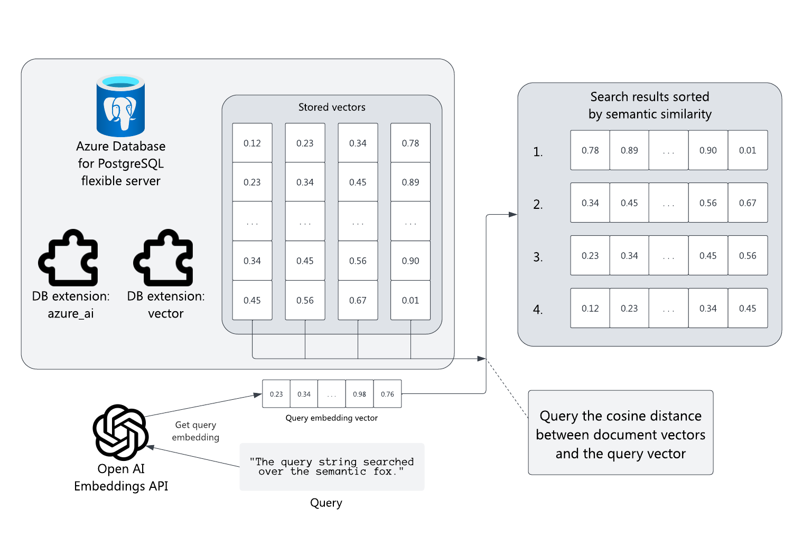

Semantic search augments standard keyword search with semantic similarity. This similarity means a query for "sunny" could match the text "bright natural light" even though there's no lexical overlap longer than one letter. Instead of character similarity, semantic search uses embedding vectors produced by artificial intelligence (AI) to measure query and document similarity, providing more relevant search results.

This module shows how to enable semantic search in Azure Database for PostgreSQL flexible server and how to use Azure OpenAI to generate vector embeddings.

## Scenario

Suppose you work at a company that manages vacation property listings. You want to let customers search and book listings online. One challenge is the many different words people use to describe the same thing. You have limited resources to develop and maintain keyword lists as descriptions change and properties come and go, and manual keyword entry is error-prone. You want to provide relevant search results without manual keyword lists.

## Learning objectives

You get an overview of semantic search, embeddings, and vector databases. Then, you enable the `pgvector` and `azure_ai` extensions. With these extensions, you'll execute a semantic search over vector columns generated from Azure OpenAI embeddings using the `azure_ai` extension. Lastly, you write a search function that receives a query string, generates embeddings for that query, and executes a semantic search against the database.

By the end of this session, you're able to execute semantic searches using an Azure Database for PostgreSQL flexible server database against vector embeddings generated by Azure OpenAI.
