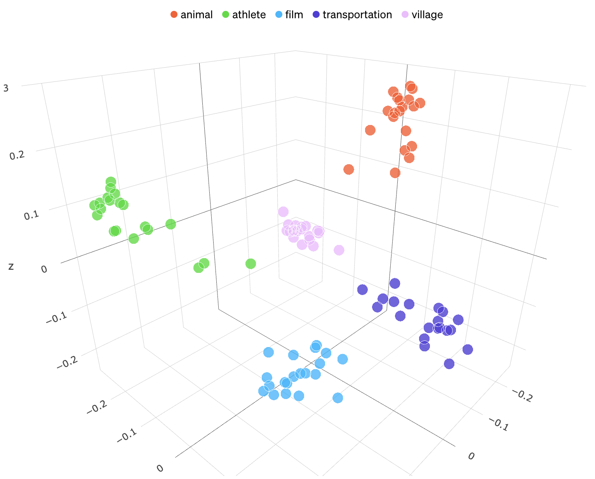

Let's go over the fundamentals of semantic search: how it differs from standard lexical search, what a vector embedding is, and what vector databases do.

## What is semantic search?

Standard lexical search, or keyword search, queries documents by matching characters. For example, the query "light" matches the text "bright light" because the characters `light` appear in the document.

Lexical search can be augmented with fuzzy matching, for example the query "lights" could still match the text "bright light" or the mispelling "lihgts" due to being one character off (a missing `s`, or swapping the `g` and `h`). While fuzzy matching and other techniques like [stemming](https://en.wikipedia.org/wiki/Stemming) are helpful, this falls short of matching synonyms, or other semantically similar language: different phrasing, slang, technical vocabulary, etc. To provide the most relevant search results with lexical search, authors need to embed keywords in metadata or the text itself (which can be an awkward user experience).

Enter **semantic search**. Semantic search doesn't use character similarity. Instead, it uses numeric representations of the concepts in words and phrases. These numeric representations are called embedding vectors or simply **embeddings**.

If two embeddings are numerically similar, then they are also semantically similar. This is more general than testing keyword overlap, because it's less sensitive to precise keyword selection or phrasing.

To perform a semantic search, first generate the query's embedding vector. Then, compare that vector against a database of vectors. The embeddings closest to the query embedding are the documents most semantically similar to the query.

Most relational database use cases don't involve storing *n*-dimensional vectors and computing the numeric distance between them. Efficient semantic search requires **vector database** functionality.

DIAGRAM:

* Show some documents, going through the model, to become vectors in the db
* Show the query, going through the model, becoming a query embedding vector
* Show the query vector vs the db vectors, returning similarity

## Embeddings

An **embedding** is a numerical representation of semantics. Embeddings are represented as *n*-dimensional vectors: arrays of *n* numbers. Each dimension represents some semantic quality as determined by the embedding model.

*insert diagram like this from the OpenAI blog post (can we just reuse it?):* 

If two embedding vectors point in similar directions, they represent similar concepts such as "cat" and "feline". If they point away from each other, they represent opposite concepts such as "sad" and "happy". The embedding model structure and training data determine what is considered similar and different.

Embeddings can apply to text as well as any kind of data such as images or audio. The key part is transforming data into *n*-dimensional embedding vectors based on some model or function. The numerical similarity of embeddings proxies the semantic similarity of their corresponding data.

The numerical similarity of two *n*-dimensional vectors `v1` and `v2` is given by their [dot product](https://en.wikipedia.org/wiki/Dot_product), written `v1·v2`. To compute the dot product, multiply each dimension's values pair-wise, then sum the result:

```
dot_product(v1, v2) = SUM(
  v1[0] * v2[0] +
  v1[1] * v2[1],
  ...,
  v1[n-1] * v2[n-1],
  v1[n] * v2[n]
)
```

Because the embeddings are unit vectors (vectors of length one) the dot product is equal to the vectors' [cosine similary](https://en.wikipedia.org/wiki/Cosine_similarity), a value between -1 (exactly opposite directions) and 1 (exactly the same direction). Vectors with a cosine similarity of zero are orthogonal: semantically unrelated.

We can visualize *n*-dimensional spaces by projecting them to 3-dimensional space using [principal component analysis](https://en.wikipedia.org/wiki/Principal_component_analysis) (PCA). PCA is a standard technique to reduce vector dimensions. The result is a simplified, but visualizable projection of the *n*-dimensional space.

The following image from OpenAI visualizes embeddings. Embeddings were generated from input documents with 2048 dimensions. Using PCA, the 2048 dimensions were projected down to 3 dimensions. Each resulting 3D vector is represented as a point in space and colored by category. Rendering these points as a 3D scatterplot shows that articles with the same category form clusters in space.



Source: [OpenAI: Introducing text and code embeddings](https://openai.com/blog/introducing-text-and-code-embeddings)

Given these definitions, performing a semantic search of a query against a collection of document embeddings is straightforward mathematically:

1. Generate the query embedding using a language model.
2. Take the dot product of the query embedding against each document's pre-calculated embedding. 
3. Sort the dot products, which are numbers from -1 to 1.
4. The most relevant (semantically similar) documents have the highest scores. The least relevant (semantically different) documents have the lowest scores.

While simple mathematically, this is neither a simple nor performant query in a relational database. To store and process this kind of vector similarity query, use a **vector database**.

## Vector databases

A vector database optimizes for the storage and calculation of many-dimensional vectors, such as embeddings. In particular, vector databases provide fast and accurate dot-product calculations to execute a vector similarity query.

Vector similarity searches have several use cases:

- find images similar to the embedding of the query image
- find documents semantically similar to the query text
- find products with similar features and ratings for a recommendation system

Semantic search queries the vector database for the similarity of the query embedding to each stored embedding. Applications can then fetch the data corresponding to the embeddings.

There are many native vector databases as well as database extensions to choose from. The following Azure services can help you meet your vector database needs:

- [Azure PostgreSQL Server pgvector Extension](/azure/postgresql/flexible-server/how-to-use-pgvector)
- [Azure Cosmos DB Vector Database Extension](/azure/cosmos-db/introduction)
- [Azure AI Search](/azure/search/search-what-is-azure-search)
