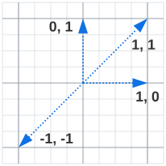

Recall that to run a semantic search, we need embedding vectors stored in a vector database. Azure Database for PostgreSQL Flexible Server can be used as a vector database with the `pgvector` extension.

DIAGRAM:

- Show an Azure Database for PostgreSQL flexible server
- Show a `pgvector` extension icon alongside it
- Show two vector column examples `[1,2,3]`, `[4,5,6]`

## Introduction to `pgvector`

The open-source [`pgvector` extension](https://github.com/pgvector/pgvector) provides vector storage & similarity querying for PostgreSQL. Once enabled, you can create `vector` columns to store embeddings alongside other columns.

```sql
/* Enable the extension. */
CREATE EXTENSION pgvector;

/* Create a table containing a 3d vector. */
CREATE TABLE documents (id bigserial PRIMARY KEY, embedding vector(3));

/* Create some sample data. */
INSERT INTO documents (embedding) VALUES
	('[1,2,3]'),
	('[2,1,3]'),
	('[4,5,6]');
```

You can also add a vector column to an existing table:

```sql
ALTER TABLE documents ADD COLUMN embedding vector(3);
```

Once you have some vector data, you can see it alongside normal table data:

```
# SELECT * FROM documents;
 id | embedding
----+-----------
  1 | [1,2,3]
  2 | [2,1,3]
  3 | [4,5,6]
(3 rows)
```

The `pgvector` extension supports several languages, such as [.NET](https://github.com/pgvector/pgvector-dotnet), [Python](https://github.com/pgvector/pgvector-python), [Java](https://github.com/pgvector/pgvector-java), and many others. See their [GitHub repositories](https://github.com/orgs/pgvector/repositories?type=all) for more.

To insert a document with vector `[1, 2, 3]` using Npgsql in C#, run code like this:

```c#
var sql = "INSERT INTO documents (embedding) VALUES ($1)";
await using (var cmd = new NpgsqlCommand(sql, conn))
{
    var embedding = new Vector(new float[] { 1, 2, 3 });
    cmd.Parameters.AddWithValue(embedding);
    await cmd.ExecuteNonQueryAsync();
}
```

## Insert and update vectors

Once a table has a vector column, rows can be added with vector values as previously noted.

```sql
INSERT INTO documents (embedding) VALUES ('[1,2,3]');
```

You can also load vectors in bulk using the `COPY` statement (see [full example](https://github.com/pgvector/pgvector-python/blob/master/examples/bulk_loading.py) in Python):

```sql
COPY documents (embedding) FROM STDIN WITH (FORMAT BINARY);
```

Vector columns can be updated like normal columns:

```sql
UPDATE documents SET embedding = '[1,1,1]' where id = 1;
```

## Perform a cosine distance search

The `pgvector` extension provides the `v1 <=> v2` operator to calculate the cosine distance between vectors `v1` and `v2`. The result is a number between 0 and 2, where 0 means "semantically identical" (no distance) and 2 means "semantically opposite" (maximum distance).

You can see the terms cosine **distance** and **similarity**. Recall that cosine similarity is a number between -1 and 1, where -1 means "semantically opposite" and 1 means "semantically identical." Note that `similarity = 1 - distance`.

The upshot is that a query ordered by distance ascending returns the least distant (most similar) results first. A query ordered by similarity descending returns the most similar (least distant) first.

Here are some vectors and their distances and similarities to illustrate the concepts. You can compute this calculation yourself by running something like:

```sql
SELECT '[1,1]' <=> '[-1,-1]';
```

Consider these vectors:



Their similarities and distances are:

| v1       | V2         | distance | similarity |
| -------- | ---------- | -------- | ---------- |
| `[1, 1]` | `[1, 1]`   | 0        | 1          |
| `[1, 1]` | `[-1, -1]` | 2        | -1         |
| `[1, 0]` | `[0, 1]`   | 1        | 0          |

To get the documents in order of closeness to the vector `[2, 3, 4]`, run this query:

```sql
SELECT
	*,
	embedding <=> '[2,3,4]' AS distance
FROM documents
ORDER BY distance;
```

Results:

```
 id | embedding |      distance
----+-----------+-----------------------
  3 | [4,5,6]   | 0.0053884541273605535
  1 | [1,2,3]   |  0.007416666029069763
  2 | [2,1,3]   |   0.05704583272761632
(3 rows)
```

The document with `id=3` is the most similar to the query, followed shortly by `id=1`, and lastly by `id=2`.

To return the top `X` most similar documents, add a `LIMIT X` clause to the `SELECT` query. For example, to get the most similar document:

```sql
SELECT
	*,
	embedding <=> '[2,3,4]' AS distance
FROM documents
ORDER BY distance
LIMIT 1;
```

Results:

```
 id | embedding |       distance
----+-----------+-----------------------
  3 | [4,5,6]   | 0.0053884541273605535
(1 row)
```
