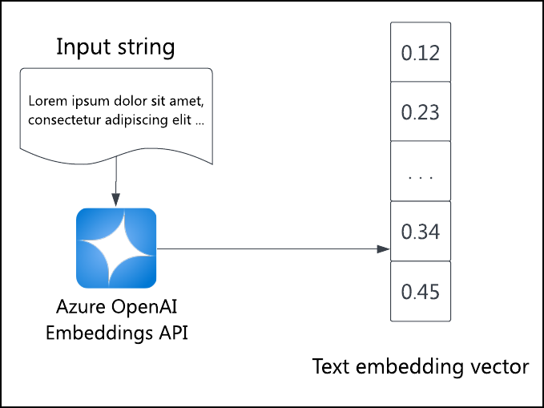

To run a semantic search, you must compare the query embedding with the embeddings of the searched items. The `azure_ai` extension for Azure Database for PostgreSQL - Flexible Server integrates with Azure OpenAI to generate embedding vectors.



## Introduction to `azure_ai` and Azure OpenAI

The [Azure Database for PostgreSQL flexible extension for Azure AI](/azure/postgresql/flexible-server/generative-ai-azure-overview) provides user-defined functions to integrate with Azure AI services including [Azure OpenAI](/azure/ai-services/openai/overview) and [Azure Cognitive Services](https://azure.microsoft.com/products/ai-services/cognitive-search/).

The [Azure OpenAI Embeddings API](/azure/ai-services/openai/reference#embeddings) generates an embedding vector of the input text. Use this API to set the embeddings for all items being searched. The `azure_ai` extension's `azure_openai` schema makes it easy to call the API from SQL to generate embeddings, whether to initialize item embeddings or create a query embedding on the fly. These embeddings can then be used to perform vector similarity search, or in other words, semantic search.

## Using the `azure_ai` extension with Azure OpenAI

To call the Azure OpenAI Embeddings API from PostgreSQL, you need to enable & configure the `azure_ai` extension, grant access to Azure OpenAI, and deploy an Azure OpenAI model. For more information, see the [Azure OpenAI on Azure Database for PostgreSQL Flexible Server documentation](/azure/postgresql/flexible-server/generative-ai-azure-openai).

Once the environment is ready and the extension is allow-listed, run this SQL:

```sql
/* Enable the extension. */
CREATE EXTENSION azure_ai;
```

You also need to configure your OpenAI service resource's [endpoint & access key](/azure/ai-services/openai/how-to/create-resource):

```sql
SELECT azure_ai.set_setting('azure_openai.endpoint', '{your-endpoint-url}');
SELECT azure_ai.set_setting('azure_openai.subscription_key', '{your-api-key}}');
```

Once `azure_ai` and Azure OpenAI are configured, fetching and storing embeddings is a simple matter of calling a function in the SQL query. Assuming a table `listings` with a `description` column and a `listing_vector` column, you can generate and store the embedding for all listings with the following query. Replace `{your-deployment-name}` with the **Deployment name** from the Azure OpenAI Studio for the model you created.

```sql
UPDATE listings
SET listing_vector = azure_openai.create_embeddings('{your-deployment-name}', description, max_attempts => 5, retry_delay_ms => 500)
WHERE listing_vector IS NULL;
```

The `listing_vector` vector column must have the same number of dimensions as the language model produces.

To see a document embedding, run the following query:

```sql
SELECT listing_vector FROM listings LIMIT 1;
```

The result is a vector of floating point numbers. You can run `\x` first to make the output more readable.

## Generate a query embedding dynamically

Once you have embeddings for the documents you want to search, you can run a semantic search query. To do so, you also need to generate an embedding for the query text.

The `azure_openai` schema of the `azure_ai` extension lets you generate embeddings within SQL. For example, to find the top three listings whose text is most semantically similar to the query "Find me places in a walkable neighborhood," run the following SQL:

```sql
SELECT id, description FROM listings
ORDER BY listing_vector <=> azure_openai.create_embeddings('{your-deployment-name}', 'Find me places in a walkable neighborhood.')::vector
LIMIT 3;
```

The `<=>` operator calculates the *cosine distance* between the two vectors, the semantic similarity metric. The closer the vectors, the more semantically similar; the further the vectors, the more semantically different.

The `::vector` operator converts the generated embeddings to PostgreSQL vector arrays.

The query returns the top three listing IDs and descriptions, ranked from less to more different (more to less similar).
