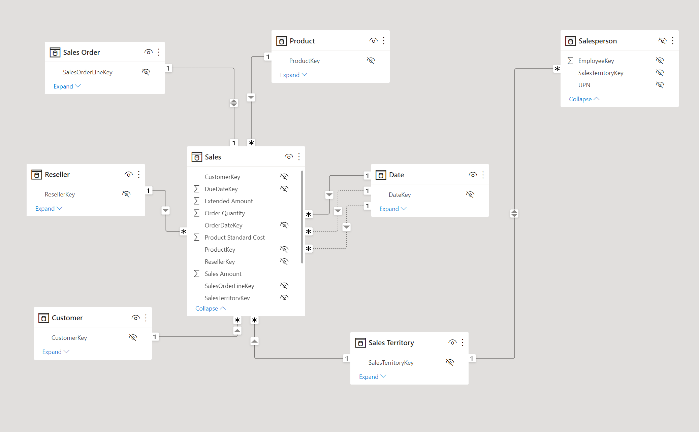
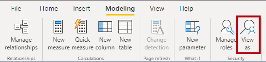

As a data modeler, you set up RLS by creating one or more roles. A role has a unique name in the model, and it usually includes one or more rules. Rules enforce filters on model tables by using Data Analysis Expressions (DAX) filter expressions.

> [!NOTE]
> By default, a data model has no roles. A data model without roles means that users (who have permission to query the data model) have access to all model data.

> [!TIP]
> It's possible to define a role that includes no rules. In this case, the role provides access to all rows of all model tables. This role set up would be suitable for an admin user who is allowed to view all data.

You can create, validate, and manage roles in Power BI Desktop. For Azure Analysis Services or SQL Server Analysis Services models, you can create, validate, and manage roles by using SQL Server Data Tools (SSDT).

You can also create and manage roles by using SQL Server Management Studio (SSMS), or by using a third-party tool, like [Tabular Editor](https://tabulareditor.com/).

To gain a better understanding of how RLS restricts access to data, watch the following animated image.


## Apply star schema design principles

We recommend you apply [star schema](/power-bi/guidance/star-schema) design principles to produce a model comprising dimension and fact tables. It’s common to set up Power BI to enforce rules that filter dimension tables, allowing [model relationships](/power-bi/transform-model/desktop-relationships-understand) to efficiently propagate those filters to fact tables.

The following image is the model diagram of the Adventure Works sales analysis data model. It shows a star schema design comprising a single fact table named **Sales**. The other tables are dimension tables that support the analysis of sales measures by date, sales territory, customer, reseller, order, product, and salesperson. Notice the model relationships connecting all tables. These relationships propagate filters (directly or indirectly) to the **Sales** table.

[](../media/model-diagram-star-schema.png#lightbox)

This model design supports examples presented in this unit.

## Define rules

Rule expressions are evaluated within row context. Row context means the expression is evaluated for each row using the column values of that row. When the expression returns TRUE, the user can “see” the row.

> [!TIP]
> To learn more about row context, work through the [Add calculated tables and columns to Power BI Desktop models](/training/modules/dax-power-bi-add-calculated-tables/) module. While this module describes adding model calculations, it includes a unit that introduces and describes row context.

You can define rules that are either static or dynamic.

### Static rules

Static rules use DAX expressions that refer to constants.

Consider the following rule applied to the **Region** table that restricts data access to Midwest sales.

```dax

'Region'[Region] = "Midwest"

```

The following steps explain how Power BI enforces the rule. It:

1. Filters the **Region** table, resulting in one visible row (for Midwest).

2. Uses the model relationship to propagate the **Region** table filter to the **State** table, resulting in 14 visible rows (the Midwest region comprise 14 states).

3. Uses the model relationship to propagate the **State** table filter to the **Sales** table, resulting in thousands of visible rows (the sales facts for the states that belong to the Midwest region).

The simplest static rule that you can create restricts access to all table rows. Consider the following rule applied to the **Sales Details** table (not depicted in the model diagram).

```dax

FALSE()

```

This rule ensures users can't access any table data. It could be useful when salespeople are allowed to see aggregated sales results (from the **Sales** table) but not order-level details.

Defining static rules is simple and effective. Consider using them when you need to create only a few of them, as might be the case at Adventure Works where there are only six US regions. However, be aware of disadvantages: setting up static rules can involve significant effort to create and set up. It would also require you to update and republish the dataset when new regions are onboarded.

If there are many rules to set up and you anticipate adding new rules in the future, consider creating dynamic rules instead.

### Dynamic rules

Dynamic rules use specific DAX functions that return environmental values (as opposed to constants). Environmental values are returned from three specific DAX functions:

- [USERNAME](/dax/username-function-dax) or [USERPRINCIPALNAME](/dax/userprincipalname-function-dax) – Returns the Power BI authenticated user as a text value.

- [CUSTOMDATA](/dax/customdata-function-dax) - Returns the **CustomData** property passed in the connection string. Non-Power BI reporting tools that connect to the dataset by using a connection string can set this property, like Microsoft Excel.

> [!NOTE]
> Be aware that the USERNAME function returns the user in the format of DOMAIN\username when used in Power BI Desktop. However, when used in the Power BI service, it returns the format of the user's User Principal Name (UPN), like username@adventureworks.com. Alternatively, you can use the USERPRINCIPALNAME function, which always returns the user in the user principal name format.

Consider a revised model design that now includes the (hidden) **AppUser** table. Each row of the **AppUser** table describes a username and region. A model relationship to the **Region** table propagates filters from the **AppUser** table.


The following rule applied to the **AppUser** table restricts data access to the region(s) of the authenticated user.

```dax

'AppUser'[UserName] = USERPRINCIPALNAME()

```

Defining dynamic rules is simple and effective when a model table stores username values. They allow you to enforce a data-driven RLS design. For example, when salespeople are added to, or removed from, the **AppUser** table (or are assigned to different regions), this design approach just works.

## Validate roles

When you create roles, it’s important to test them to ensure they apply the correct filters. For data models created in Power BI Desktop, there’s the **View as** function that allows you to see the report when different roles are enforced, and different username values are passed.



## Set up role mappings

Role mappings must be set up in advance of users accessing Power BI content. Role mapping involves assigning Azure Active Directory (Azure AD) security objects to roles. Security objects can be user accounts or security groups.

> [!TIP]
> When possible, it’s a good practice to map roles to security groups. That way, there will be fewer mappings, and you can delegate the group membership management to the network administrators.

For Power BI Desktop developed models, role mapping is typically done in the Power BI service. For Azure Analysis Services or SQL Server Analysis Services models, role mapping is typically done in SSMS.

For more information about setting up RLS, see:

- [Row-level security (RLS) with Power BI](/power-bi/enterprise/service-admin-rls)

- [Row-level security (RLS) guidance in Power BI Desktop](/power-bi/guidance/rls-guidance)

## Use single sign-on (SSO) for DirectQuery sources

When your data model has DirectQuery tables and their data source supports SSO, the data source can enforce data permissions. This way, the database enforces RLS, and Power BI datasets and reports honor the data source security.

Consider that Adventure Works has an Azure SQL Database for their sales operations that resides in the same tenant as Power BI. The database enforces RLS to control access to rows in various database tables. You can create a DirectQuery model that connects to this database without roles and publish it to the Power BI service. When you set the data source credentials in the Power BI service, you [enable SSO](/power-bi/connect-data/service-azure-sql-database-with-direct-connect). When report consumers open Power BI reports, Power BI passes their identity to the data source. The data source then enforces RLS based on the identity of the report consumer.


For information about Azure SQL Database RLS, see [Row-level security](/sql/relational-databases/security/row-level-security).

> [!NOTE]
> Calculated tables and calculated columns that reference a DirectQuery table from a data source with SSO authentication aren’t supported in the Power BI service.

For more information about data sources that support SSO, see [Single sign-on (SSO) for DirectQuery sources](/power-bi/connect-data/power-bi-data-sources).