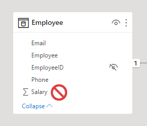
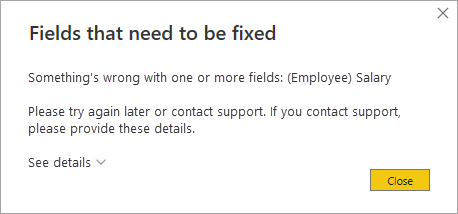

As a data modeler, you can consider restricting user access to Power BI model objects. Object-level security (OLS) can restrict access to specific tables and columns, and their metadata. Typically, you apply OLS to secure objects that store sensitive data, like employee personal data.

When Power BI enforces OLS, not only does it restrict access to tables and columns, but it can also secure metadata. When you secure metadata, it’s not possible to retrieve information about secured tables and columns by using [Dynamic Management Views (DMVs)](/analysis-services/instances/use-dynamic-management-views-dmvs-to-monitor-analysis-services).

> [!IMPORTANT]
> Tabular models can hide tables and columns (and other objects) by using a [perspective](/analysis-services/tabular-models/perspectives-ssas-tabular). A perspective defines viewable subsets of model objects to help provide a specific focus for report authors. Perspectives are intended to reduce the complexity of a model, helping report authors find resources of interest. However, perspectives aren’t a security feature because they don’t secure objects. A user can still query a table or column even when it’s not visible to them.

Consider an example at Adventure Works. This organization has a data warehouse dimension table named **DimEmployee**. The table includes columns that store employee name, phone, email address, and salary. While general report consumers can see employee name and contact details, they must not be able to see salary values. Only senior Human Resources staff are permitted to see salary values. So, the data modeler used OLS to grant access to the salary column only to specific Human Resources staff.

OLS is a feature inherited from Azure Analysis Services (AAS) and SQL Server Analysis Services (SSAS). The feature is available in Power BI Premium to provide backward compatibility for models migrated to Power BI. For this reason, it’s not possible to completely set up OLS in Power BI Desktop.

## Set up OLS

To set up OLS, you start by creating roles. You can create roles in Power BI Desktop in the same way you do when setting up RLS. Next, you need to add OLS rules to the roles. This capability isn’t supported by Power BI Desktop, so you’ll need to take a different approach.

You add OLS rules to a Power BI Desktop model by using an [XML for Analysis (XMLA) endpoint](/power-bi/enterprise/service-premium-connect-tools). XMLA endpoints are available with Power BI Premium, and they provide access to the Analysis Services engine in the Power BI service. The read/write endpoint supports dataset management, application lifecycle management, advanced data modeling, and more. You can use XMLA endpoint-enabled APIs for scripting, such as [Tabular Model Scripting Language (TMSL)](/analysis-services/tmsl/tabular-model-scripting-language-tmsl-reference) or the [PowerShell SqlServer module](https://www.powershellgallery.com/packages/SqlServer/). Or you can use a client tool, like SSMS. There are third-party tool options too, like [Tabular Editor](https://tabulareditor.github.io/), which is an open-source tool for creating, maintaining, and managing models.

By default, all model tables and columns aren’t restricted. You can set them to **None** or **Read**. When set to **None**, users associated with the role can’t access the object. When set to **Read**, users associated with the role can access the object. When you’re restricting specific columns, ensure the table isn’t set to **None**.

Once you’ve added the OLS rules, you can publish the model to the Power BI service. Use the same process for RLS to map accounts and security groups to the roles.

## Considerations

In a Power BI report, when a user doesn’t have permission to access a table or column, they'll receive an error message. The message will inform them that the object doesn’t exist.

Consider carefully whether OLS is the right solution for your project. When a user opens a Power BI report that queries a restricted object (for them), the error message could be confusing and will result in a negative experience. To them, it looks like the report is broken. A better approach might be to create a separate set of models or reports for the different report consumer requirements.

## Restrictions

There are restrictions to be aware of when implementing OLS.

You can’t mix RLS and OLS in the same role. If you need to apply RLS and OLS in the same model, create separate roles dedicated to each type. Also, you can’t set table-level security if it breaks a relationship chain. For example, if there are relationships between tables A and B, and B and C, you can't secure table B. If table B is secured, a query on table A can't transit the relationships between table A and B, and B and C. In this case, you could set up a separate relationship between tables A and C.

However, model relationships that reference a secured column will work, providing that the column’s table isn’t secured.

Lastly, while it isn’t possible to secure measures, a measure that references secured objects is automatically restricted.

For more information, see [Object-level security](/analysis-services/tabular-models/object-level-security).
