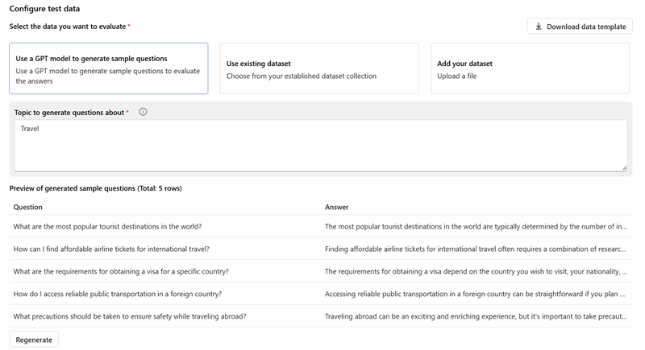

Automated evaluations in Azure AI Foundry portal enable you to assess the quality and content safety performance of models, datasets, or prompt flows.

## Evaluation data

To evaluate a model, you need a dataset of prompts and responses (and optionally, expected responses as "ground truth"). You can compile this dataset manually or use the output from an existing application; but a useful way to get started is to use an AI model to generate a set of prompts and responses related to a specific subject. You can then edit the generated prompts and responses to reflect your desired output, and use them as ground truth to evaluate the responses from another model.

## Evaluation metrics

Automated evaluation enables you to choose which *evaluators* you want to assess your model's responses, and which metrics those evaluators should calculate. There are evaluators that help you measure:

- **AI Quality**: The quality of your model's responses are measured by using AI models to evaluate them for metrics like *coherence* and *relevance* and by using standard NLP metrics like F1 score, BLEU, METEOR, and ROUGE based on ground truth (in the form of expected response text)
- **Risk and safety**: evaluators that assess the responses for content safety issues, including violence, hate, sexual content, and content related to self-harm.
